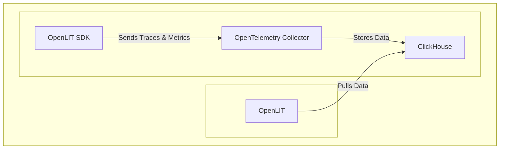

<div align="center">


#### Observability, Evaluations, Guardrails, Prompts, Vault, Playground

# Open Source Platform for AI Engineering

**[Documentation](https://docs.openlit.io/) | [Quickstart](-getting-started-with-llm-observability) | [Python SDK](https://github.com/openlit/openlit/tree/main/sdk/python) | [Typescript SDK](https://github.com/openlit/openlit/tree/main/sdk/typescript) |**

**[Roadmap](#️-roadmap) | [Feature Request](https://github.com/openlit/openlit/issues/new?assignees=&labels=%3Araised_hand%3A+Up+for+Grabs%2C+%3Arocket%3A+Feature&projects=&template=feature-request.md&title=%5BFeat%5D%3A) | [Report a Bug](https://github.com/openlit/openlit/issues/new?assignees=&labels=%3Abug%3A+Bug%2C+%3Araised_hand%3A+Up+for+Grabs&projects=&template=bug.md&title=%5BBug%5D%3A)**

[](https://openlit.io/)
[](https://github.com/openlit/openlit/blob/main/LICENSE)
[](https://pepy.tech/project/openlit)
[](https://github.com/openlit/openlit/pulse)
[](https://github.com/openlit/openlit/graphs/contributors)

[](https://join.slack.com/t/openlit/shared_invite/zt-2etnfttwg-TjP_7BZXfYg84oAukY8QRQ)
[](https://twitter.com/openlit_io)
</div>

---

<https://github.com/user-attachments/assets/6909bf4a-f5b4-4060-bde3-95e91fa36168>

**OpenLIT** allows you to simplify your AI development workflow, especially for Generative AI and LLMs. It streamlines essential tasks like experimenting with LLMs, organizing and versioning prompts, and securely handling API keys. With just one line of code, you can enable **OpenTelemetry-native** observability, offering full-stack monitoring that includes LLMs, vector databases, and GPUs. This enables developers to confidently build AI features and applications, transitioning smoothly from testing to production.

This project proudly follows and maintains the [Semantic Conventions](https://github.com/open-telemetry/semantic-conventions/tree/main/docs/gen-ai) with the OpenTelemetry community, consistently updating to align with the latest standards in Observability.

## ⚡ Features


- 📈 **Analytics Dashboard**: Monitor your AI application's health and performance with detailed dashboards that track metrics, costs, and user interactions, providing a clear view of overall efficiency.

- 🔌 **OpenTelemetry-native Observability SDKs**: Vendor-neutral SDKs to send traces and metrics to your existing observability tools.

- 💲 **Cost Tracking for Custom and Fine-Tuned Models**: Tailor cost estimations for specific models using custom pricing files for precise budgeting.

- 🐛 **Exceptions Monitoring Dashboard**: Quickly spot and resolve issues by tracking common exceptions and errors with a dedicated monitoring dashboard.

- 💭 **Prompt Management**: Manage and version prompts using Prompt Hub for consistent and easy access across applications.

- 🔑 **API Keys and Secrets Management**: Securely handle your API keys and secrets centrally, avoiding insecure practices.

- 🎮 **Experiment with different LLMs**: Use OpenGround to explore, test and compare various LLMs side by side.

## 🚀 Getting Started with LLM Observability



### Step 1: Deploy OpenLIT Stack

1. Git Clone OpenLIT Repository

   Open your command line or terminal and run:

   ```shell
   git clone git@github.com:openlit/openlit.git
   ```

2. Self-host using Docker
  
   Deploy and run OpenLIT with the following command:

   ```shell
   docker compose up -d
   ```

> For instructions on installing in Kubernetes using Helm, refer to the [Kubernetes Helm installation guide](https://docs.openlit.io/latest/installation#kubernetes).

### Step 2: Install OpenLIT SDK

Open your command line or terminal and run:

```bash
pip install openlit
```

> For instructions on using the TypeScript SDK, visit the [TypeScript SDK Installation guide](https://github.com/openlit/openlit/tree/main/sdk/typescript#-installation).

### Step 3: Initialize OpenLIT in your Application

Integrate OpenLIT into your AI applications by adding the following lines to your code.

```python
import openlit

openlit.init()
```

Configure the telemetry data destination as follows:

| Purpose                            | Parameter/Environment Variable                   | For Sending to OpenLIT    |
| ---------------------------------- | ------------------------------------------------ | ------------------------- |
| Send data to an HTTP OTLP endpoint | `otlp_endpoint` or `OTEL_EXPORTER_OTLP_ENDPOINT` | `"http://127.0.0.1:4318"` |
| Authenticate telemetry backends    | `otlp_headers` or `OTEL_EXPORTER_OTLP_HEADERS`   | Not required by default   |

> 💡 Info: If the `otlp_endpoint` or `OTEL_EXPORTER_OTLP_ENDPOINT` is not provided, the OpenLIT SDK will output traces directly to your console, which is recommended during the development phase.

#### Example

---

<details>
  <summary>Initialize using Function Arguments</summary>

  Add the following two lines to your application code:
  
  ```python
  import openlit
  
  openlit.init(
    otlp_endpoint="http://127.0.0.1:4318", 
  )
  ```

</details>

---

<details>

  ---

  <summary>Initialize using Environment Variables</summary>
  
  Add the following two lines to your application code:

  ```python
  import openlit

  openlit.init()
  ```
  
  Then, configure the your OTLP endpoint using environment variable:

  ```env
  export OTEL_EXPORTER_OTLP_ENDPOINT = "http://127.0.0.1:4318"
  ```

</details>

---

### Step 4: Visualize and Optimize

With the Observability data now being collected and sent to OpenLIT, the next step is to visualize and analyze this data to get insights into your AI application's performance, behavior, and identify areas of improvement.

Just head over to OpenLIT at `127.0.0.1:3000` on your browser to start exploring. You can login using the default credentials:

- **Email**: `user@openlit.io`
- **Password**: `openlituser`


## 🛣️ Roadmap

We are dedicated to continuously improving OpenLIT. Here's a look at what's been accomplished and what's on the horizon:

| Feature                                                                                                                           | Status        |
| --------------------------------------------------------------------------------------------------------------------------------- | ------------- |
| [OpenTelemetry-native Observability SDK for Tracing and Metrics](https://github.com/openlit/openlit/tree/text-upgrade/sdk/python) | ✅ Completed   |
| [OpenTelemetry-native GPU Monitoring](https://docs.openlit.io/latest/features/gpu)                                                | ✅ Completed   |
| [Exceptions and Error Monitoring](https://docs.openlit.io/latest/features/exceptions)                                             | ✅ Completed   |
| [Prompt Hub for Managing and Versioning Prompts](https://docs.openlit.io/latest/features/prompt-hub)                              | ✅ Completed   |
| [OpenGround for Testing and Comparing LLMs](https://docs.openlit.io/latest/features/openground)                                   | ✅ Completed   |
| [Vault for Central Management of LLM API Keys and Secrets](https://docs.openlit.io/latest/features/vault)                         | ✅ Completed   |
| [Cost Tracking for Custom Models](https://docs.openlit.io/latest/features/pricing)                                                | ✅ Completed   |
| [Real-Time Guardrails Implementation](https://docs.openlit.io/latest/features/guardrails)                                         | ✅ Completed   |
| [Programmatic Evaluation for LLM Response](https://docs.openlit.io/latest/features/evaluations)                                   | ✅ Completed   |
| [Auto-Evaluation Metrics Based on Usage](https://github.com/openlit/openlit/issues/470)                                           | 🔜 Coming Soon |
| [Human Feedback for LLM Events](https://github.com/openlit/openlit/issues/471)                                                    | 🔜 Coming Soon |
| [Dataset Generation Based on LLM Events](https://github.com/openlit/openlit/issues/472)                                           | 🔜 Coming Soon |
| [Search over Traces]()                                                                                                            | 🔜 Coming Soon |

## 🌱 Contributing

Whether it's big or small, we love contributions 💚. Check out our [Contribution guide](./CONTRIBUTING.md) to get started

Unsure where to start? Here are a few ways to get involved:

- Join our [Slack](https://join.slack.com/t/openlit/shared_invite/zt-2etnfttwg-TjP_7BZXfYg84oAukY8QRQ) or [Discord](https://discord.gg/rjvTm6zd) community to discuss ideas, share feedback, and connect with both our team and the wider OpenLIT community.

Your input helps us grow and improve, and we're here to support you every step of the way.

[](https://www.producthunt.com/posts/openlit?embed=true&utm_source=badge-featured&utm_medium=badge&utm_souce=badge-openlit)
<a href="https://fazier.com/launches/openlit-2" target="_blank" rel="noopener noreferrer"></a>

## 💚 Community & Support

Connect with OpenLIT community and maintainers for support, discussions, and updates:

- 🌟 If you like it, Leave a star on our [GitHub](https://github.com/openlit/openlit/)
- 🌍 Join our [Slack](https://join.slack.com/t/openlit/shared_invite/zt-2etnfttwg-TjP_7BZXfYg84oAukY8QRQ) or [Discord](https://discord.gg/CQnXwNT3) community for live interactions and questions.
- 🐞 Report bugs on our [GitHub Issues](https://github.com/openlit/openlit/issues) to help us improve OpenLIT.
- 𝕏 Follow us on [X](https://twitter.com/openlit_io) for the latest updates and news.

## License

OpenLIT is available under the [Apache-2.0 license](LICENSE).


## Getting started with taskfile

### Installing Task

#### Using package managers:

```bash
# macOS
brew install go-task

# Windows (Chocolatey)
choco install go-task

# Linux
sh -c "$(curl --location https://taskfile.dev/install.sh)" -- -d

```

### just Ask task

```bash
➜  openlit task
task: [default] task --list
task: Available tasks for this project:
* build-and-run:       Build Docker images
* default:             Display available tasks
* destroy:             Stop and remove Docker containers, networks, and volumes
* logs:                Logs Docker
* start:               Run Docker containers
* stop:                Stop Docker containers
```
