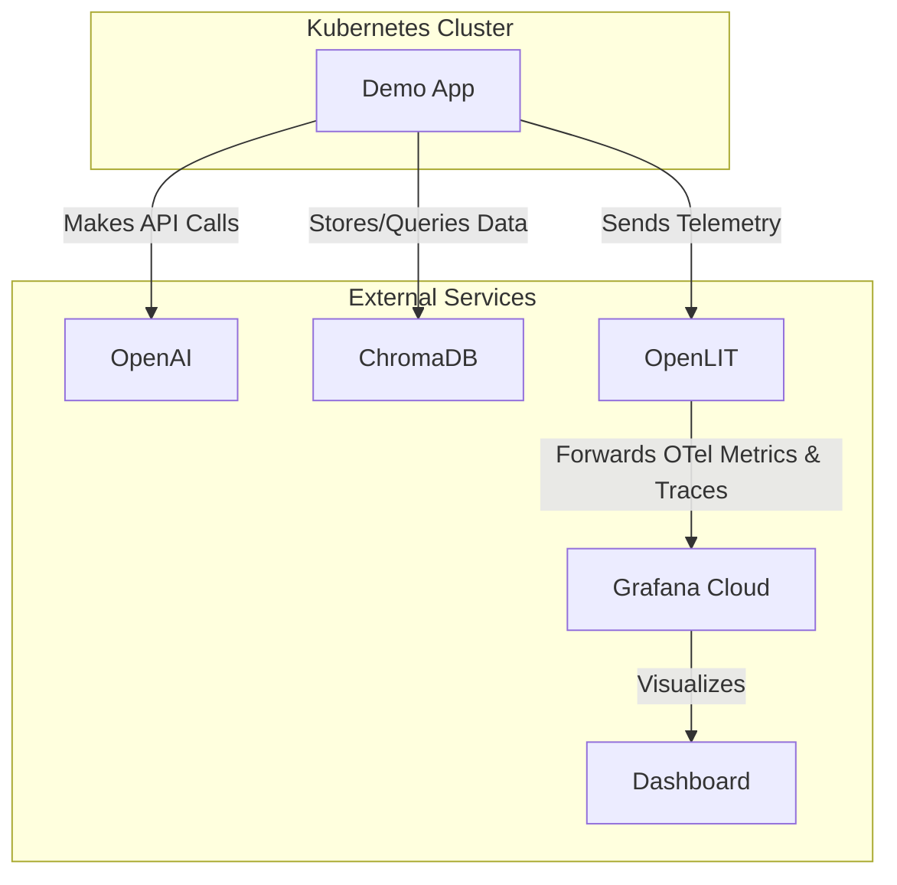

# AI Observability Demo

This repository contains a demo application that showcases AI observability using OpenLIT, OpenAI, and ChromaDB. The application makes API calls to OpenAI and performs vector database operations while being monitored by OpenLIT.

## Architecture



## Prerequisites

- Kubernetes cluster
- kubectl configured to access your cluster
- Access to OpenAI API
- Access to Grafana Cloud (for observability)

## Configuration

### 1. Set up Secrets

Create a Kubernetes secret with the following values:

```yaml
apiVersion: v1
kind: Secret
metadata:
  name: demo-app
type: Opaque
data:
  OTEL_EXPORTER_OTLP_ENDPOINT: <base64-encoded-grafana-otlp-endpoint>
  OTEL_EXPORTER_OTLP_HEADERS: <base64-encoded-grafana-otlp-headers>
  OPENAI_API_KEY: <base64-encoded-openai-api-key>
```

To encode your values in base64, you can use:
```bash
echo -n "your-value" | base64
```

Replace the following placeholders:
- `<base64-encoded-grafana-otlp-endpoint>`: Your Grafana Cloud OTLP endpoint (base64 encoded)
- `<base64-encoded-grafana-otlp-headers>`: Your Grafana Cloud OTLP headers (base64 encoded)
- `<base64-encoded-openai-api-key>`: Your OpenAI API key (base64 encoded)

### 2. Deploy the Application

Apply the Kubernetes manifests in the following order:

```bash
# Apply the secret
kubectl apply -f kubernetes/secret.yaml

# Apply the configmap
kubectl apply -f kubernetes/configmap.yaml

# Apply the deployment
kubectl apply -f kubernetes/deployment.yaml
```

## Application Details

The demo application performs the following operations in a loop:

1. Makes an OpenAI API call to GPT-3.5-turbo to generate a short story
2. Makes an OpenAI API call to GPT-4 to get information about Grafana
3. Performs vector database operations using ChromaDB:
   - Adds documents to the collection
   - Queries the collection
   - Deletes documents from the collection

The application runs these operations every hour (3600 seconds) and is instrumented with OpenLIT for observability.

## Monitoring

The application sends telemetry data to Grafana Cloud. You can monitor:
- API call latencies
- Token usage
- Vector database operations
- Error rates
- And more...

## Troubleshooting

To check the status of the deployment:
```bash
kubectl get pods
```

To view the logs:
```bash
kubectl logs -f <pod-name>
```

To restart the deployment (if you make changes to the ConfigMap):
```bash
kubectl rollout restart deployment demo-app
```

## Security Notes

- Never commit your actual API keys or secrets to version control
- Always use base64 encoding for sensitive values in Kubernetes secrets
- Regularly rotate your API keys and secrets
- Use appropriate RBAC permissions in your Kubernetes cluster

## Contributing

Feel free to submit issues and enhancement requests! 
