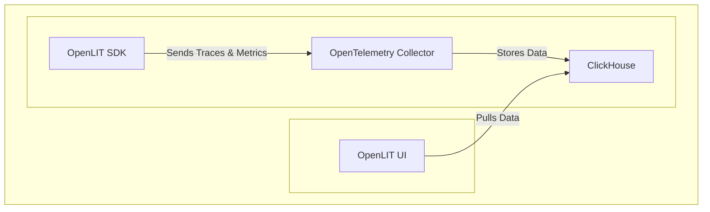

<div align="center">
<h1>
OpenTelemetry-native Observability & Evals for LLMs</h1>

**[Documentation](https://docs.openlit.io/) | [Quickstart](#-getting-started) | [Python SDK](https://github.com/openlit/openlit/tree/main/sdk/python)**

[](https://github.com/openlit/openlit)
[](https://github.com/openlit/openlit/blob/main/LICENSE)
[](https://pepy.tech/project/openlit)
[](https://github.com/openlit/openlit/pulse)
[](https://github.com/openlit/openlit/graphs/contributors)

[](https://join.slack.com/t/openlit/shared_invite/zt-2etnfttwg-TjP_7BZXfYg84oAukY8QRQ)
[](https://twitter.com/openlit_io)

</div>


OpenLIT is an **OpenTelemetry-native** GenAI and LLM Application Observability tool. It's designed to make the integration process of observability into GenAI projects as easy as pie – literally, with just **a single line of code**. Whether you're working with popular LLM Libraries such as OpenAI and HuggingFace or leveraging vector databases like ChromaDB, OpenLIT ensures your applications are monitored seamlessly, providing critical insights to improve performance and reliability.

This project proudly follows the [Semantic Conventions](https://github.com/open-telemetry/semantic-conventions/tree/main/docs/gen-ai) of the OpenTelemetry community, consistently updating to align with the latest standards in observability.

## What is LIT?
`LIT` stands for **Learning and Inference Tool**, which is a visual and interactive tool designed for understanding AI models and visualizing data. The term `LIT` was introduced by [Google](https://developers.google.com/machine-learning/glossary#learning-interpretability-tool-lit).

## ⚡ Features
- **Advanced Monitoring of LLM and VectorDB Performance**: OpenLIT offers automatic instrumentation that generates traces and metrics, providing insights into the performance and costs of your LLM and VectorDB usage. This helps you analyze how your applications perform in different environments, such as production, enabling you to optimize resource ussage and scale efficiently.
- **Cost Tracking for Custom and Fine-Tuned Models**: OpenLIT enables you to tailor cost tracking for specific models by using a custom JSON file. This feature allows for precise budgeting and ensures that cost estimations are perfectly aligned with your project needs.
- **OpenTelemetry-native & vendor-neutral SDKs**: OpenLIT is built with native support for OpenTelemetry, making it blend seamlessly with your projects. This vendor-neutral approach reduces barriers to integration, making OpenLIT an intuitive part of your software stack rather than an additional complexity.

## 🚀 Getting Started



### Step 1: Deploy OpenLIT Stack

1. Git Clone OpenLIT Repository
   ```shell
   git clone git@github.com:openlit/openlit.git
   ```

2. Start Docker Compose
   ```shell
   docker-compose up -d
   ```

### Step 2: Install OpenLIT SDK

Open your command line or terminal and run:

```bash
pip install openlit
```

### Step 3: Initialize OpenLIT in your Application
Integrating the OpenLIT into LLM applications is straightforward. Start monitoring for your LLM Application with just **two lines of code**: 

```python
import openlit

openlit.init()
```

To forward telemetry data to an HTTP OTLP endpoint, such as the OpenTelemetry Collector, set the `otlp_endpoint` parameter with the desired endpoint. Alternatively, you can configure the endpoint by setting the `OTEL_EXPORTER_OTLP_ENDPOINT` environment variable as recommended in the OpenTelemetry documentation.

> 💡 Info: If you dont provide `otlp_endpoint` function argument or set the `OTEL_EXPORTER_OTLP_ENDPOINT` environment variable, The OpenLIT SDK directs the trace directly to your console, which can be useful during development.

To send telemetry to OpenTelemetry backends requiring authentication, set the `otlp_headers` parameter with its desired value. Alternatively, you can configure the endpoint by setting the `OTEL_EXPORTER_OTLP_HEADERS` environment variable as recommended in the OpenTelemetry documentation.

#### Example

---

<details>
  <summary>Initialize using Function Arguments</summary>

  Add the following two lines to your application code:
  
  ```python
  import openlit
  
  openlit.init(
    otlp_endpoint="http://127.0.0.1:4318", 
  )
  ```

</details>

---

<details>

  ---

  <summary>Initialize using Environment Variables</summary>
  
  Add the following two lines to your application code:

  ```python
  import openlit

  openlit.init()
  ```
  
  Then, configure the your OTLP endpoint using environment variable:

  ```env
  export OTEL_EXPORTER_OTLP_ENDPOINT = "http://127.0.0.1:4318"
  ```
</details>

---

### Step 4: Visualize and Optimize!
With the LLM Observability data now being collected and sent to OpenLIT, the next step is to visualize and analyze this data to get insights into your LLM application's performance, behavior, and identify areas of improvement.

Just head over to OpenLIT UI at `127.0.0.1:3000` on your browser to start exploring. You can login using the default credentials
  - **Email**: `user@openlit.io`
  - **Password**: `openlituser`


## 🌱 Contributing

Whether it's big or small, we love contributions 💚. Check out our [Contribution guide](../../CONTRIBUTING.md) to get started

Unsure where to start? Here are a few ways to get involved:

- Join our [Slack channel](https://join.slack.com/t/openlit/shared_invite/zt-2etnfttwg-TjP_7BZXfYg84oAukY8QRQ) to discuss ideas, share feedback, and connect with both our team and the wider OpenLIT community.

Your input helps us grow and improve, and we're here to support you every step of the way.

## 💚 Community & Support

Connect with the OpenLIT community and maintainers for support, discussions, and updates:

- 🌟 If you like it, Leave a star on our [GitHub](https://github.com/openlit/openlit/)
- 🌍 Join our [Slack](https://join.slack.com/t/openlit/shared_invite/zt-2etnfttwg-TjP_7BZXfYg84oAukY8QRQ) Community for live interactions and questions.
- 🐞 Report bugs on our [GitHub Issues](https://github.com/openlit/openlit/issues) to help us improve OpenLIT.
- 𝕏 Follow us on [X](https://twitter.com/openlit_io) for the latest updates and news.

## License

OpenLIT is available under the [Apache-2.0 license](LICENSE).

## Visualize! Analyze! Optimize!

Join us on this voyage to reshape the future of AI Observability. Share your thoughts, suggest features, and explore contributions. Engage with us on [GitHub](https://github.com/openlit/openlit) and be part of OpenLIT's community-led innovation.
