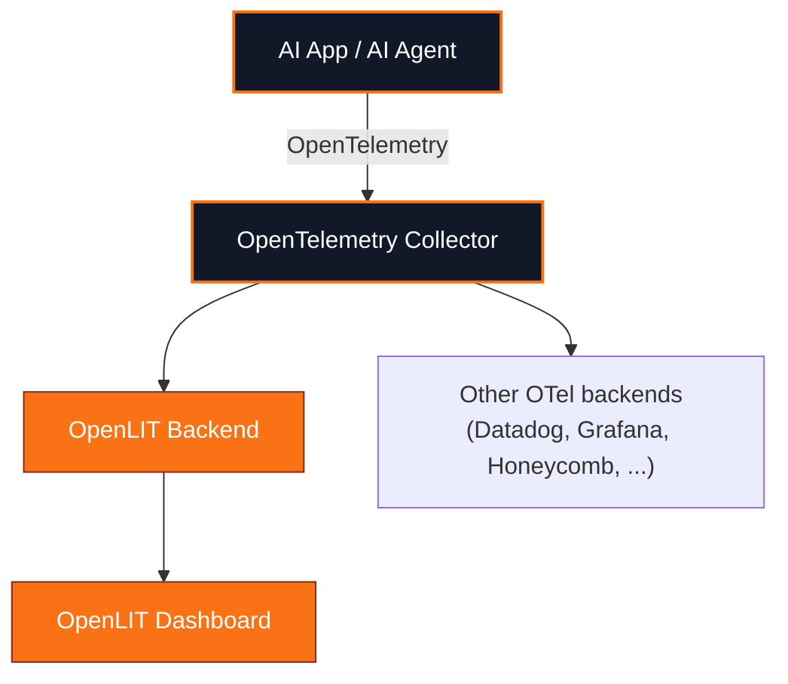
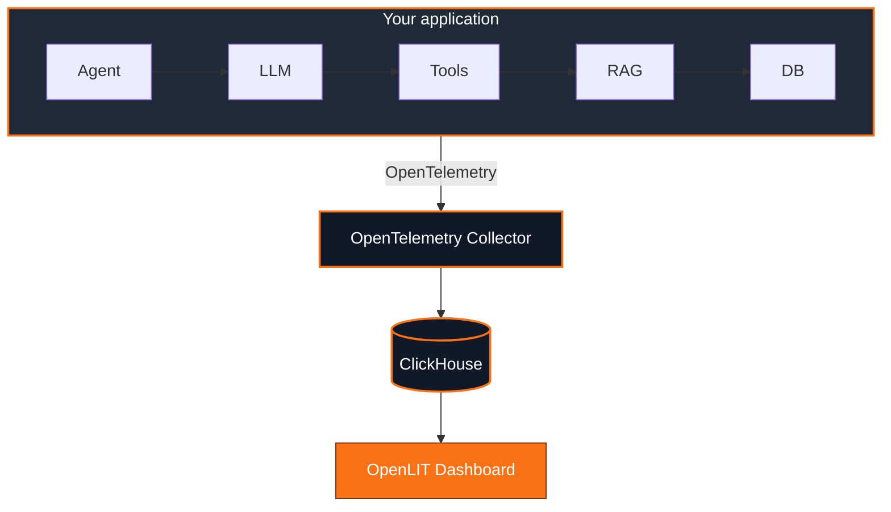
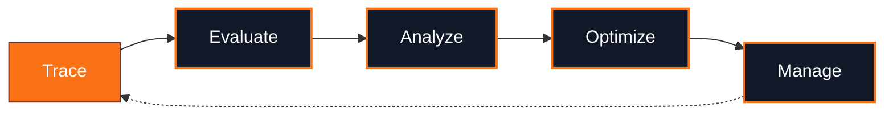
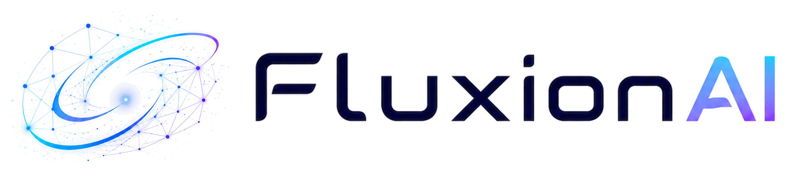

<div align="center">


# Open-source observability & evaluation for AI agents

**Trace, evaluate, debug, and optimize AI applications and coding agents with OpenTelemetry.**

<a href="https://docs.openlit.io/latest/features/agent-observability">
  
</a>

<p>
<a href="https://github.com/openlit/openlit/stargazers"><b>⭐ Star</b></a>&nbsp;&nbsp;&nbsp;&nbsp;
<a href="#-get-started-in-5-minutes"><b>🚀 Quickstart</b></a>&nbsp;&nbsp;&nbsp;&nbsp;
<a href="https://docs.openlit.io/"><b>📚 Docs</b></a>
</p>

[](https://docs.openlit.io/)
[](https://github.com/openlit/openlit/blob/main/LICENSE)
[](https://pepy.tech/project/openlit)
[](https://join.slack.com/t/openlit/shared_invite/zt-2etnfttwg-TjP_7BZXfYg84oAukY8QRQ)
[](https://twitter.com/openlit_io)

**[Documentation](https://docs.openlit.io/) · [Quickstart](https://docs.openlit.io/) · [Examples](https://github.com/openlit/openlit/tree/main/examples) · [Join Slack](https://join.slack.com/t/openlit/shared_invite/zt-2etnfttwg-TjP_7BZXfYg84oAukY8QRQ)**

</div>

---

## See what your AI agents are actually doing

AI applications are no longer just LLM calls.

A production agent can involve:


```mermaid
flowchart TD
    U([User]) --> A[AI Agent]
    A --> L[LLM calls]
    A --> T[Tool calls]
    A --> R[Retrieval]
    A --> M[Memory]
    A --> S[Sub-agents]
    A --> P[Prompts]
    A --> C[Code changes]
    L & T & R & M & S & P & C --> E{{Evaluation}}
    E --> O[["Cost / Quality / Errors"]]

    style U fill:#F97316,stroke:#7C2D12,color:#fff
    style A fill:#111827,stroke:#F97316,stroke-width:2px,color:#fff
    style E fill:#111827,stroke:#F97316,stroke-width:2px,color:#fff
    style O fill:#F97316,stroke:#7C2D12,color:#fff
```

**OpenLIT gives you visibility across the entire workflow.**

Trace every LLM call, tool invocation, prompt, agent step, token, cost, error, and evaluation — using OpenTelemetry.

---

## ⚡ Get started in 5 minutes

### 1. Start OpenLIT

```bash
git clone https://github.com/openlit/openlit.git
cd openlit

docker compose up -d
```

Open:

```text
http://127.0.0.1:3000
```

### 2. Install the SDK

Python:

```bash
pip install openlit
```

TypeScript:

```bash
npm install openlit
```

### 3. Instrument your application

Python:

```python
import openlit

openlit.init()
```

That's it.

OpenLIT automatically instruments supported LLM providers, frameworks, vector databases, and other AI infrastructure and exports OpenTelemetry traces and metrics.

### 4. Send telemetry

By default, configure the OTLP endpoint:

```bash
export OTEL_EXPORTER_OTLP_ENDPOINT="http://127.0.0.1:4318"
```

Or:

```python
import openlit

openlit.init(
    otlp_endpoint="http://127.0.0.1:4318"
)
```

Open your dashboard and start exploring your AI application's traces, metrics, costs, and performance.

---

# 🤖 Observe Claude Code, Cursor & Codex

AI coding agents are powerful — but understanding what they actually did can be difficult.

OpenLIT gives you an OpenTelemetry-native view of coding-agent sessions.

Install the CLI:

### macOS / Linux

```bash
curl -fsSL https://raw.githubusercontent.com/openlit/openlit/main/cli/scripts/install.sh | sh
```

### Windows

```powershell
iwr -useb https://raw.githubusercontent.com/openlit/openlit/main/cli/scripts/install.ps1 | iex
```

Configure OpenLIT:

```bash
openlit configure --endpoint http://127.0.0.1:4318
```

Install coding-agent instrumentation:

```bash
openlit coding install --vendor=all
```

Or install individual integrations:

```bash
openlit coding install --vendor=cursor
openlit coding install --vendor=claude-code
openlit coding install --vendor=codex
```

Check your installation:

```bash
openlit doctor
```

Now OpenLIT can capture:


```mermaid
flowchart LR
    S([Coding Agent Session]) --> P[User prompt]
    S --> L[LLM calls]
    S --> T[Tool calls]
    T --> T1[File reads]
    T --> T2[File edits]
    T --> T3[Shell commands]
    T --> T4[Search]
    S --> SA[Sub-agent activity]
    S --> TU[Token usage]
    S --> CO[Cost]
    S --> CI[Code impact]

    style S fill:#111827,stroke:#F97316,stroke-width:2px,color:#fff
    style T fill:#111827,stroke:#F97316,stroke-width:2px,color:#fff
```

Explore the resulting sessions in the **Coding Agents** dashboard.

---

# 🔍 What OpenLIT gives you

## Traces

Understand exactly what happened during an AI request.

<p>
         
</p>

All represented using OpenTelemetry.

---

## 💰 AI cost observability

Track the cost of your AI applications across:

<p>
     
</p>

Support custom pricing for custom and fine-tuned models.

---

## 🧪 AI evaluations

Automatically evaluate LLM and agent outputs using LLM-as-a-Judge evaluations.

Built-in evaluation types include:

<p>
          
</p>

Use evaluations to move from:

**"The agent produced an answer."**

to:

**"The agent produced a good answer."**

---

## 🐛 Debug production AI

Find the requests that matter.

Investigate:

<p>
      
</p>

Go from:

> `Something went wrong.`

to a fully traced root cause:


```mermaid
flowchart TD
    A[Agent] --> P[Prompt] --> L1[LLM] --> T[Tool call] --> R[Retrieval] --> L2[LLM] --> E([Error])

    style E fill:#DC2626,stroke:#7F1D1D,color:#fff
    style A fill:#111827,stroke:#F97316,stroke-width:2px,color:#fff
```

---

# 📸 See OpenLIT in action

<table>
<tr>
<td width="33%" align="center">
<br/>
<sub><b>Traces</b> — full agent conversation, spans &amp; cost</sub>
</td>
<td width="33%" align="center">
<br/>
<sub><b>Evaluations</b> — hallucination, bias &amp; toxicity checks</sub>
</td>
<td width="33%" align="center">
<br/>
<sub><b>Connectors</b> — plug in ClickHouse, Tempo, Loki, Prometheus &amp; more</sub>
</td>
</tr>
<tr>
<td width="33%" align="center">
<br/>
<sub><b>Prompt Hub</b> — versioned, centrally managed prompts</sub>
</td>
<td width="33%" align="center">
<br/>
<sub><b>Rule Engine</b> — conditional rules on trace attributes</sub>
</td>
<td width="33%" align="center">
<br/>
<sub><b>Dashboards</b> — cost, latency &amp; usage charts at a glance</sub>
</td>
</tr>
</table>

---

# 🧠 Prompt management

Use **Prompt Hub** to:

<p>
    
</p>

Example:

```python
prompt = openlit.prompts.get(
    "customer-support"
)
```

Keep prompt management separate from application code while maintaining version control and observability.

---

# ⚙️ Rule Engine

Define runtime rules based on trace attributes.

Use rules to dynamically control:

<p>
   
</p>

Example:

```text
IF
  environment = production
  AND
  model = expensive-model

THEN
  run cost evaluation
  + retrieve production prompt
```

---

# 🔌 OpenTelemetry-native

OpenLIT is built around **OpenTelemetry**, rather than creating a proprietary telemetry format.

Your telemetry can flow through the OpenTelemetry ecosystem:


```mermaid
flowchart TD
    A["AI App / AI Agent"] -->|OpenTelemetry| C[OpenTelemetry Collector]
    C --> B[OpenLIT Backend]
    C --> O["Other OTel backends<br/>(Datadog, Grafana, Honeycomb, ...)"]
    B --> D[OpenLIT Dashboard]

    style A fill:#111827,stroke:#F97316,stroke-width:2px,color:#fff
    style C fill:#111827,stroke:#F97316,stroke-width:2px,color:#fff
    style B fill:#F97316,stroke:#7C2D12,color:#fff
    style D fill:#F97316,stroke:#7C2D12,color:#fff
```

This means you can integrate OpenLIT into an existing OpenTelemetry architecture instead of replacing it.

---

# 🧩 70+ integrations

OpenLIT auto-instruments a growing ecosystem of AI providers, frameworks, vector databases, and GPU infrastructure with a single line of code. Click any badge to view its integration guide.

**LLM Providers**

<a href="https://docs.openlit.io/latest/sdk/integrations/openai"></a> <a href="https://docs.openlit.io/latest/sdk/integrations/ollama"></a> <a href="https://docs.openlit.io/latest/sdk/integrations/anthropic"></a> <a href="https://docs.openlit.io/latest/sdk/integrations/deepseek"></a> <a href="https://docs.openlit.io/latest/sdk/integrations/gpt4all"></a> <a href="https://docs.openlit.io/latest/sdk/integrations/cohere"></a> <a href="https://docs.openlit.io/latest/sdk/integrations/mistral"></a> <a href="https://docs.openlit.io/latest/sdk/integrations/github-models"></a> <a href="https://docs.openlit.io/latest/sdk/integrations/vllm"></a> <a href="https://docs.openlit.io/latest/sdk/integrations/azure-openai"></a> <a href="https://docs.openlit.io/latest/sdk/integrations/azure-ai-inference"></a> <a href="https://docs.openlit.io/latest/sdk/integrations/huggingface"></a> <a href="https://docs.openlit.io/latest/sdk/integrations/bedrock"></a> <a href="https://docs.openlit.io/latest/sdk/integrations/vertexai"></a> <a href="https://docs.openlit.io/latest/sdk/integrations/google-ai-studio"></a> <a href="https://docs.openlit.io/latest/sdk/integrations/groq"></a> <a href="https://docs.openlit.io/latest/sdk/integrations/nvidia-nim"></a> <a href="https://docs.openlit.io/latest/sdk/integrations/xai"></a> <a href="https://docs.openlit.io/latest/sdk/integrations/elevenlabs"></a> <a href="https://docs.openlit.io/latest/sdk/integrations/ai21"></a> <a href="https://docs.openlit.io/latest/sdk/integrations/together"></a> <a href="https://docs.openlit.io/latest/sdk/integrations/digitalocean"></a> <a href="https://docs.openlit.io/latest/sdk/integrations/digitalocean-gradient"></a> <a href="https://docs.openlit.io/latest/sdk/integrations/assemblyai"></a> <a href="https://docs.openlit.io/latest/sdk/integrations/featherless"></a> <a href="https://docs.openlit.io/latest/sdk/integrations/reka"></a> <a href="https://docs.openlit.io/latest/sdk/integrations/krutrim"></a> <a href="https://docs.openlit.io/latest/sdk/integrations/titan-ml"></a> <a href="https://docs.openlit.io/latest/sdk/integrations/sarvam"></a> <a href="https://docs.openlit.io/latest/sdk/integrations/premai"></a> <a href="https://docs.openlit.io/latest/sdk/integrations/replicate"></a> <a href="https://docs.openlit.io/latest/sdk/integrations/oci"></a>

**Vector & Data Stores**

<a href="https://docs.openlit.io/latest/sdk/integrations/chromadb"></a> <a href="https://docs.openlit.io/latest/sdk/integrations/pinecone"></a> <a href="https://docs.openlit.io/latest/sdk/integrations/qdrant"></a> <a href="https://docs.openlit.io/latest/sdk/integrations/milvus"></a> <a href="https://docs.openlit.io/latest/sdk/integrations/astradb"></a> <a href="https://docs.openlit.io/latest/sdk/integrations/psycopg"></a>

**AI Frameworks & Agents**

<a href="https://docs.openlit.io/latest/sdk/integrations/langchain"></a> <a href="https://docs.openlit.io/latest/sdk/integrations/openai-agents"></a> <a href="https://docs.openlit.io/latest/sdk/integrations/litellm"></a> <a href="https://docs.openlit.io/latest/sdk/integrations/crewai"></a> <a href="https://docs.openlit.io/latest/sdk/integrations/llama-index"></a> <a href="https://docs.openlit.io/latest/sdk/integrations/browser-use"></a> <a href="https://docs.openlit.io/latest/sdk/integrations/pydantic"></a> <a href="https://docs.openlit.io/latest/sdk/integrations/dspy"></a> <a href="https://docs.openlit.io/latest/sdk/integrations/ag2"></a> <a href="https://docs.openlit.io/latest/sdk/integrations/haystack"></a> <a href="https://docs.openlit.io/latest/sdk/integrations/mem0"></a> <a href="https://docs.openlit.io/latest/sdk/integrations/guardrails"></a> <a href="https://docs.openlit.io/latest/sdk/integrations/phidata"></a> <a href="https://docs.openlit.io/latest/sdk/integrations/multion"></a> <a href="https://docs.openlit.io/latest/sdk/integrations/julep-ai"></a> <a href="https://docs.openlit.io/latest/sdk/integrations/letta"></a> <a href="https://docs.openlit.io/latest/sdk/integrations/crawl4ai"></a> <a href="https://docs.openlit.io/latest/sdk/integrations/firecrawl"></a> <a href="https://docs.openlit.io/latest/sdk/integrations/dynamiq"></a> <a href="https://docs.openlit.io/latest/sdk/integrations/controlflow"></a> <a href="https://docs.openlit.io/latest/sdk/integrations/swarmzero"></a> <a href="https://docs.openlit.io/latest/sdk/integrations/langgraph"></a> <a href="https://docs.openlit.io/latest/sdk/integrations/strands"></a> <a href="https://docs.openlit.io/latest/sdk/integrations/google-adk"></a> <a href="https://docs.openlit.io/latest/sdk/integrations/claude-agent-sdk"></a> <a href="https://docs.openlit.io/latest/sdk/integrations/vercel-ai"></a> <a href="https://docs.openlit.io/latest/sdk/integrations/agent-framework"></a> <a href="https://docs.openlit.io/latest/sdk/integrations/smolagents"></a>

**Governance & Protocols**

<a href="https://docs.openlit.io/latest/sdk/integrations/agent-governance-toolkit"></a> <a href="https://docs.openlit.io/latest/sdk/integrations/mcp"></a>

**GPU Monitoring**

<a href="https://docs.openlit.io/latest/sdk/integrations/nvidia-gpu"></a> <a href="https://docs.openlit.io/latest/sdk/integrations/amd-gpu"></a> <a href="https://docs.openlit.io/latest/sdk/integrations/intel-gpu"></a>

See the complete integration list in the [documentation](https://docs.openlit.io/).

---

# 🛠️ SDKs

OpenLIT provides OpenTelemetry-native SDKs for:

### Python

```bash
pip install openlit
```

[Python SDK →](https://github.com/openlit/openlit/tree/main/sdk/python)

### TypeScript

```bash
npm install openlit
```

[TypeScript SDK →](https://github.com/openlit/openlit/tree/main/sdk/typescript)

### Go

[Go SDK →](https://github.com/openlit/openlit/tree/main/sdk/go)

---

# 🏗️ Architecture

OpenLIT is designed to run in your infrastructure.

A typical deployment looks like:


```mermaid
flowchart TD
    subgraph App["Your application"]
        direction LR
        Agent --> LLM --> Tools --> RAG --> DB
    end
    App -->|OpenTelemetry| Collector[OpenTelemetry Collector]
    Collector --> CH[(ClickHouse)]
    CH --> Dash[OpenLIT Dashboard]

    style App fill:#1F2937,stroke:#F97316,stroke-width:2px,color:#fff
    style Collector fill:#111827,stroke:#F97316,stroke-width:2px,color:#fff
    style CH fill:#111827,stroke:#F97316,stroke-width:2px,color:#fff
    style Dash fill:#F97316,stroke:#7C2D12,color:#fff
```

---

# 🔐 Self-hosted by default

Run OpenLIT inside your own infrastructure using Docker or Kubernetes.

Your telemetry stays under your control.

```bash
docker compose up -d
```

For Kubernetes, see the [installation documentation](https://docs.openlit.io/latest/openlit/installation#kubernetes).

---

# 🚀 From trace to optimization

Observability is only the beginning.

OpenLIT is designed around a continuous AI engineering loop:


```mermaid
flowchart LR
    T[Trace] --> E[Evaluate] --> A[Analyze] --> O[Optimize] --> M[Manage] -.-> T

    style T fill:#F97316,stroke:#7C2D12,color:#fff
    style E fill:#111827,stroke:#F97316,stroke-width:2px,color:#fff
    style A fill:#111827,stroke:#F97316,stroke-width:2px,color:#fff
    style O fill:#111827,stroke:#F97316,stroke-width:2px,color:#fff
    style M fill:#111827,stroke:#F97316,stroke-width:2px,color:#fff
```

The goal is simple:

> **Make AI systems observable, measurable, debuggable, and continuously improvable.**

---

# 🌎 Community

OpenLIT is open source and built with the AI engineering community.

Join us:

* [GitHub](https://github.com/openlit/openlit)
* [Documentation](https://docs.openlit.io/)
* [Slack](https://join.slack.com/t/openlit/shared_invite/zt-2etnfttwg-TjP_7BZXfYg84oAukY8QRQ)
* [X / Twitter](https://twitter.com/openlit_io)

If OpenLIT is useful to you, **please consider giving the repository a ⭐**.

It helps other AI engineers discover the project.

---

# 🤝 Contributing

Contributions are welcome.

You can contribute by:

* fixing bugs
* adding integrations
* improving documentation
* creating examples
* improving SDKs
* adding evaluations
* building dashboards
* reporting issues
* sharing OpenLIT with other developers

Check the repository's issues for opportunities to contribute.

---

# 📄 License

OpenLIT is licensed under the Apache License 2.0.

See [LICENSE](https://github.com/openlit/openlit/blob/main/LICENSE) for details.

---

# 🙇 Acknowledgments

## Sponsors

### Silver

<p>
<a href="https://fluxionai.world/register?source=github&campaign=github-openlit&promo=OPENLIT" target="_blank">
  
</a>
</p>

### Bronze

<p>
<a href="https://www.testmuai.com/?utm_medium=sponsor&utm_source=openlit" target="_blank">
  
</a>
</p>

## Deployment partners

<p>
<a href="https://www.digitalocean.com/">
  
</a>
&nbsp;&nbsp;&nbsp;&nbsp;
<a href="https://www.hostg.xyz/aff_c?offer_id=815&aff_id=243668&url_id=6792">
  
</a>
</p>

---

# 💻 Contributors

Everyone who has contributed code to [openlit/openlit](https://github.com/openlit/openlit), the same list shown on [openlit.io/about-us](https://openlit.io/about-us).

<table>
<tr>
<td align="center" valign="top"><a href="https://github.com/Achanandhi-M"><br/><sub>Achanandhi-M</sub></a></td>
<td align="center" valign="top"><a href="https://github.com/Aftabbs"><br/><sub>Aftabbs</sub></a></td>
<td align="center" valign="top"><a href="https://github.com/AIRobotNic"><br/><sub>AIRobotNic</sub></a></td>
<td align="center" valign="top"><a href="https://github.com/Akaban"><br/><sub>Akaban</sub></a></td>
<td align="center" valign="top"><a href="https://github.com/akiseleva-dev"><br/><sub>akiseleva-dev</sub></a></td>
<td align="center" valign="top"><a href="https://github.com/Alex3k"><br/><sub>Alex3k</sub></a></td>
<td align="center" valign="top"><a href="https://github.com/AmadNaseem"><br/><sub>AmadNaseem</sub></a></td>
<td align="center" valign="top"><a href="https://github.com/AmanAgarwal041"><br/><sub>AmanAgarwal041</sub></a></td>
</tr>
<tr>
<td align="center" valign="top"><a href="https://github.com/amanagarwal042"><br/><sub>amanagarwal042</sub></a></td>
<td align="center" valign="top"><a href="https://github.com/AmirF194"><br/><sub>AmirF194</sub></a></td>
<td align="center" valign="top"><a href="https://github.com/amoha-enwithai"><br/><sub>amoha-enwithai</sub></a></td>
<td align="center" valign="top"><a href="https://github.com/Anai-Guo"><br/><sub>Anai-Guo</sub></a></td>
<td align="center" valign="top"><a href="https://github.com/andrei-trandafir"><br/><sub>andrei-trandafir</sub></a></td>
<td align="center" valign="top"><a href="https://github.com/aniketwaghh"><br/><sub>aniketwaghh</sub></a></td>
<td align="center" valign="top"><a href="https://github.com/artur-nohup"><br/><sub>artur-nohup</sub></a></td>
<td align="center" valign="top"><a href="https://github.com/bajrangostwal"><br/><sub>bajrangostwal</sub></a></td>
</tr>
<tr>
<td align="center" valign="top"><a href="https://github.com/Barry2llen"><br/><sub>Barry2llen</sub></a></td>
<td align="center" valign="top"><a href="https://github.com/Bassel-Elwakil"><br/><sub>Bassel-Elwakil</sub></a></td>
<td align="center" valign="top"><a href="https://github.com/benmezger"><br/><sub>benmezger</sub></a></td>
<td align="center" valign="top"><a href="https://github.com/BetterAndBetterII"><br/><sub>BetterAndBetterII</sub></a></td>
<td align="center" valign="top"><a href="https://github.com/bvjebin"><br/><sub>bvjebin</sub></a></td>
<td align="center" valign="top"><a href="https://github.com/Calvin-Huang"><br/><sub>Calvin-Huang</sub></a></td>
<td align="center" valign="top"><a href="https://github.com/cbirkhold"><br/><sub>cbirkhold</sub></a></td>
<td align="center" valign="top"><a href="https://github.com/chaizhenhua"><br/><sub>chaizhenhua</sub></a></td>
</tr>
<tr>
<td align="center" valign="top"><a href="https://github.com/CherishCai"><br/><sub>CherishCai</sub></a></td>
<td align="center" valign="top"><a href="https://github.com/cherrycove"><br/><sub>cherrycove</sub></a></td>
<td align="center" valign="top"><a href="https://github.com/chibuike-okpara"><br/><sub>chibuike-okpara</sub></a></td>
<td align="center" valign="top"><a href="https://github.com/chocoHacks33"><br/><sub>chocoHacks33</sub></a></td>
<td align="center" valign="top"><a href="https://github.com/chris-araki"><br/><sub>chris-araki</sub></a></td>
<td align="center" valign="top"><a href="https://github.com/ChrisBlaa"><br/><sub>ChrisBlaa</sub></a></td>
<td align="center" valign="top"><a href="https://github.com/chriskhanhtran"><br/><sub>chriskhanhtran</sub></a></td>
<td align="center" valign="top"><a href="https://github.com/citizen204"><br/><sub>citizen204</sub></a></td>
</tr>
<tr>
<td align="center" valign="top"><a href="https://github.com/cooleryu"><br/><sub>cooleryu</sub></a></td>
<td align="center" valign="top"><a href="https://github.com/danchev"><br/><sub>danchev</sub></a></td>
<td align="center" valign="top"><a href="https://github.com/danilbogdan"><br/><sub>danilbogdan</sub></a></td>
<td align="center" valign="top"><a href="https://github.com/dbirks"><br/><sub>dbirks</sub></a></td>
<td align="center" valign="top"><a href="https://github.com/Dheeraj-Bhaskaruni"><br/><sub>Dheeraj-Bhaskaruni</sub></a></td>
<td align="center" valign="top"><a href="https://github.com/didlawowo"><br/><sub>didlawowo</sub></a></td>
<td align="center" valign="top"><a href="https://github.com/dogxii"><br/><sub>dogxii</sub></a></td>
<td align="center" valign="top"><a href="https://github.com/ebarkhordar"><br/><sub>ebarkhordar</sub></a></td>
</tr>
<tr>
<td align="center" valign="top"><a href="https://github.com/eragon512"><br/><sub>eragon512</sub></a></td>
<td align="center" valign="top"><a href="https://github.com/ericcurtin"><br/><sub>ericcurtin</sub></a></td>
<td align="center" valign="top"><a href="https://github.com/ethanknights"><br/><sub>ethanknights</sub></a></td>
<td align="center" valign="top"><a href="https://github.com/fazd"><br/><sub>fazd</sub></a></td>
<td align="center" valign="top"><a href="https://github.com/FBISiri"><br/><sub>FBISiri</sub></a></td>
<td align="center" valign="top"><a href="https://github.com/feiiiiii5"><br/><sub>feiiiiii5</sub></a></td>
<td align="center" valign="top"><a href="https://github.com/fpreiss"><br/><sub>fpreiss</sub></a></td>
<td align="center" valign="top"><a href="https://github.com/giulio-leone"><br/><sub>giulio-leone</sub></a></td>
</tr>
<tr>
<td align="center" valign="top"><a href="https://github.com/Goutham-Annem"><br/><sub>Goutham-Annem</sub></a></td>
<td align="center" valign="top"><a href="https://github.com/Gthejesraj"><br/><sub>Gthejesraj</sub></a></td>
<td align="center" valign="top"><a href="https://github.com/guyrosin"><br/><sub>guyrosin</sub></a></td>
<td align="center" valign="top"><a href="https://github.com/GVengelen"><br/><sub>GVengelen</sub></a></td>
<td align="center" valign="top"><a href="https://github.com/Gwenn-LR"><br/><sub>Gwenn-LR</sub></a></td>
<td align="center" valign="top"><a href="https://github.com/hagen1778"><br/><sub>hagen1778</sub></a></td>
<td align="center" valign="top"><a href="https://github.com/Henildiyora"><br/><sub>Henildiyora</sub></a></td>
<td align="center" valign="top"><a href="https://github.com/icohangar-ops"><br/><sub>icohangar-ops</sub></a></td>
</tr>
<tr>
<td align="center" valign="top"><a href="https://github.com/ijkbytes"><br/><sub>ijkbytes</sub></a></td>
<td align="center" valign="top"><a href="https://github.com/imran-siddique"><br/><sub>imran-siddique</sub></a></td>
<td align="center" valign="top"><a href="https://github.com/imxinde"><br/><sub>imxinde</sub></a></td>
<td align="center" valign="top"><a href="https://github.com/ishachinniah"><br/><sub>ishachinniah</sub></a></td>
<td align="center" valign="top"><a href="https://github.com/ishanjainn"><br/><sub>ishanjainn</sub></a></td>
<td align="center" valign="top"><a href="https://github.com/jannikmaierhoefer"><br/><sub>jannikmaierhoefer</sub></a></td>
<td align="center" valign="top"><a href="https://github.com/jaysheeldodia"><br/><sub>jaysheeldodia</sub></a></td>
<td align="center" valign="top"><a href="https://github.com/josefonte"><br/><sub>josefonte</sub></a></td>
</tr>
<tr>
<td align="center" valign="top"><a href="https://github.com/JoshKappler"><br/><sub>JoshKappler</sub></a></td>
<td align="center" valign="top"><a href="https://github.com/jpv-costa"><br/><sub>jpv-costa</sub></a></td>
<td align="center" valign="top"><a href="https://github.com/kaspernissen"><br/><sub>kaspernissen</sub></a></td>
<td align="center" valign="top"><a href="https://github.com/Krishnachaitanyakc"><br/><sub>Krishnachaitanyakc</sub></a></td>
<td align="center" valign="top"><a href="https://github.com/kujjwal02"><br/><sub>kujjwal02</sub></a></td>
<td align="center" valign="top"><a href="https://github.com/kuswardhanietidims-svg"><br/><sub>kuswardhanietidims-svg</sub></a></td>
<td align="center" valign="top"><a href="https://github.com/llukito"><br/><sub>llukito</sub></a></td>
<td align="center" valign="top"><a href="https://github.com/luisangelrod"><br/><sub>luisangelrod</sub></a></td>
</tr>
<tr>
<td align="center" valign="top"><a href="https://github.com/manan-tech"><br/><sub>manan-tech</sub></a></td>
<td align="center" valign="top"><a href="https://github.com/mfahadyousaf"><br/><sub>mfahadyousaf</sub></a></td>
<td align="center" valign="top"><a href="https://github.com/mikemikimike"><br/><sub>mikemikimike</sub></a></td>
<td align="center" valign="top"><a href="https://github.com/minimAluminiumalism"><br/><sub>minimAluminiumalism</sub></a></td>
<td align="center" valign="top"><a href="https://github.com/MohanadAbugharbia"><br/><sub>MohanadAbugharbia</sub></a></td>
<td align="center" valign="top"><a href="https://github.com/morgan-coded"><br/><sub>morgan-coded</sub></a></td>
<td align="center" valign="top"><a href="https://github.com/naman-jain-15"><br/><sub>naman-jain-15</sub></a></td>
<td align="center" valign="top"><a href="https://github.com/natez56"><br/><sub>natez56</sub></a></td>
</tr>
<tr>
<td align="center" valign="top"><a href="https://github.com/NaveenKumarReddy8"><br/><sub>NaveenKumarReddy8</sub></a></td>
<td align="center" valign="top"><a href="https://github.com/Nidhin117"><br/><sub>Nidhin117</sub></a></td>
<td align="center" valign="top"><a href="https://github.com/nirogu"><br/><sub>nirogu</sub></a></td>
<td align="center" valign="top"><a href="https://github.com/nitin302"><br/><sub>nitin302</sub></a></td>
<td align="center" valign="top"><a href="https://github.com/Noone9029"><br/><sub>Noone9029</sub></a></td>
<td align="center" valign="top"><a href="https://github.com/noy-solvin"><br/><sub>noy-solvin</sub></a></td>
<td align="center" valign="top"><a href="https://github.com/obielin"><br/><sub>obielin</sub></a></td>
<td align="center" valign="top"><a href="https://github.com/octo-patch"><br/><sub>octo-patch</sub></a></td>
</tr>
<tr>
<td align="center" valign="top"><a href="https://github.com/okaditya84"><br/><sub>okaditya84</sub></a></td>
<td align="center" valign="top"><a href="https://github.com/Oxygen56"><br/><sub>Oxygen56</sub></a></td>
<td align="center" valign="top"><a href="https://github.com/pacocartones"><br/><sub>pacocartones</sub></a></td>
<td align="center" valign="top"><a href="https://github.com/patcher99"><br/><sub>patcher99</sub></a></td>
<td align="center" valign="top"><a href="https://github.com/phueper"><br/><sub>phueper</sub></a></td>
<td align="center" valign="top"><a href="https://github.com/pitonic"><br/><sub>pitonic</sub></a></td>
<td align="center" valign="top"><a href="https://github.com/pragnyanramtha"><br/><sub>pragnyanramtha</sub></a></td>
<td align="center" valign="top"><a href="https://github.com/pratiksinghchauhan"><br/><sub>pratiksinghchauhan</sub></a></td>
</tr>
<tr>
<td align="center" valign="top"><a href="https://github.com/praveen5959"><br/><sub>praveen5959</sub></a></td>
<td align="center" valign="top"><a href="https://github.com/psbuilds"><br/><sub>psbuilds</sub></a></td>
<td align="center" valign="top"><a href="https://github.com/RinZ27"><br/><sub>RinZ27</sub></a></td>
<td align="center" valign="top"><a href="https://github.com/RitwijParmar"><br/><sub>RitwijParmar</sub></a></td>
<td align="center" valign="top"><a href="https://github.com/ron-42"><br/><sub>ron-42</sub></a></td>
<td align="center" valign="top"><a href="https://github.com/roy-tong"><br/><sub>roy-tong</sub></a></td>
<td align="center" valign="top"><a href="https://github.com/rudimk"><br/><sub>rudimk</sub></a></td>
<td align="center" valign="top"><a href="https://github.com/saivedant169"><br/><sub>saivedant169</sub></a></td>
</tr>
<tr>
<td align="center" valign="top"><a href="https://github.com/SelfParody"><br/><sub>SelfParody</sub></a></td>
<td align="center" valign="top"><a href="https://github.com/ShouryaRSharma"><br/><sub>ShouryaRSharma</sub></a></td>
<td align="center" valign="top"><a href="https://github.com/silvercondor"><br/><sub>silvercondor</sub></a></td>
<td align="center" valign="top"><a href="https://github.com/thekishandev"><br/><sub>thekishandev</sub></a></td>
<td align="center" valign="top"><a href="https://github.com/Tyagiquamar"><br/><sub>Tyagiquamar</sub></a></td>
<td align="center" valign="top"><a href="https://github.com/UstatleenKaur"><br/><sub>UstatleenKaur</sub></a></td>
<td align="center" valign="top"><a href="https://github.com/VanshikaMehta18"><br/><sub>VanshikaMehta18</sub></a></td>
<td align="center" valign="top"><a href="https://github.com/VedantMadane"><br/><sub>VedantMadane</sub></a></td>
</tr>
<tr>
<td align="center" valign="top"><a href="https://github.com/wenchun-tw"><br/><sub>wenchun-tw</sub></a></td>
<td align="center" valign="top"><a href="https://github.com/yehia2amer"><br/><sub>yehia2amer</sub></a></td>
<td align="center" valign="top"><a href="https://github.com/zeroshotmind"><br/><sub>zeroshotmind</sub></a></td>
<td align="center" valign="top"><a href="https://github.com/openlit/openlit/blob/main/CONTRIBUTING.md"><br/><sub>You?</sub></a></td>
</tr>
</table>

---

<div align="center">

### Build AI systems you can actually understand.

**⭐ Star OpenLIT on GitHub**

</div>
