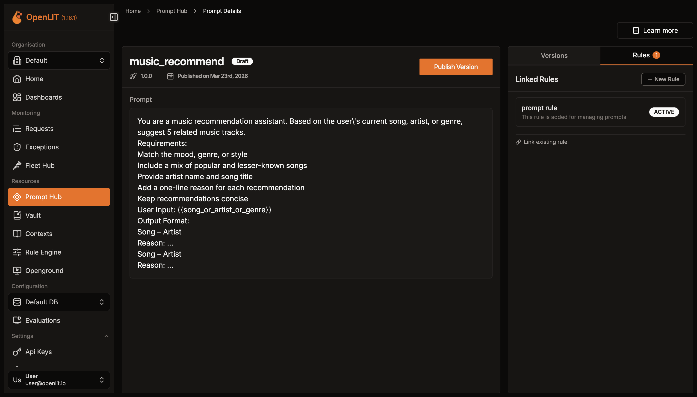
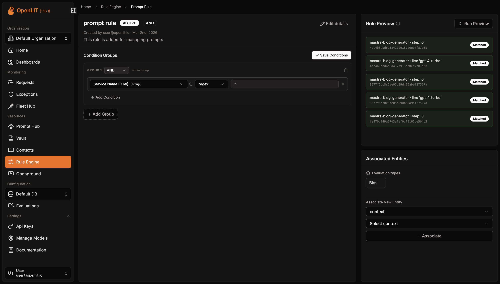
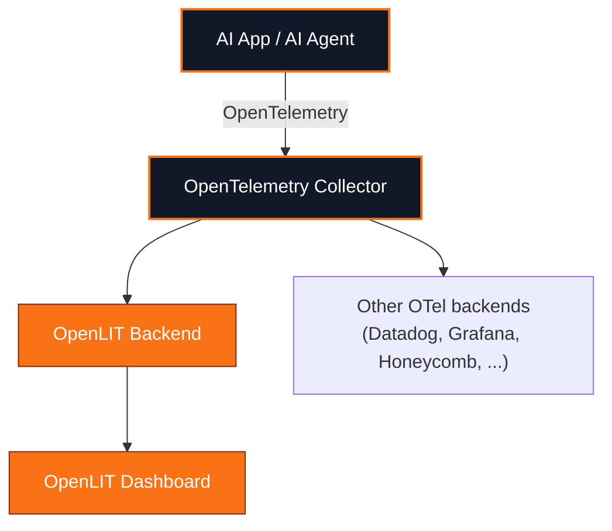
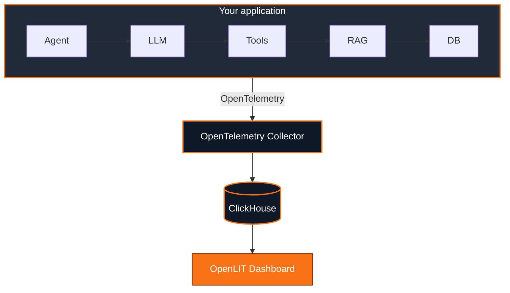
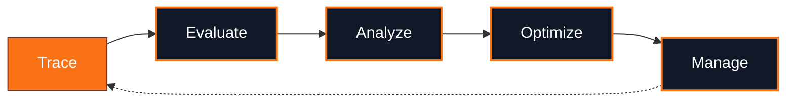

<div align="center">


# Open-source observability & evaluation for AI agents

**Trace, evaluate, debug, and optimize AI applications and coding agents with OpenTelemetry.**

<a href="https://docs.openlit.io/latest/features/agent-observability">
  
</a>

<p>
<a href="https://github.com/openlit/openlit/stargazers"><b>⭐ Star</b></a>&nbsp;&nbsp;&nbsp;&nbsp;
<a href="#-get-started-in-5-minutes"><b>🚀 Quickstart</b></a>&nbsp;&nbsp;&nbsp;&nbsp;
<a href="https://docs.openlit.io/"><b>📚 Docs</b></a>
</p>

[](https://docs.openlit.io/)
[](https://github.com/openlit/openlit/blob/main/LICENSE)
[](https://pepy.tech/project/openlit)
[](https://join.slack.com/t/openlit/shared_invite/zt-2etnfttwg-TjP_7BZXfYg84oAukY8QRQ)
[](https://twitter.com/openlit_io)

**[Documentation](https://docs.openlit.io/) · [Quickstart](https://docs.openlit.io/) · [Examples](https://github.com/openlit/openlit/tree/main/examples) · [Join Slack](https://join.slack.com/t/openlit/shared_invite/zt-2etnfttwg-TjP_7BZXfYg84oAukY8QRQ)**

</div>

---

## See what your AI agents are actually doing

AI applications are no longer just LLM calls.

A production agent can involve:


```mermaid
flowchart TD
    U([User]) --> A[AI Agent]
    A --> L[LLM calls]
    A --> T[Tool calls]
    A --> R[Retrieval]
    A --> M[Memory]
    A --> S[Sub-agents]
    A --> P[Prompts]
    A --> C[Code changes]
    L & T & R & M & S & P & C --> E{{Evaluation}}
    E --> O[["Cost / Quality / Errors"]]

    style U fill:#F97316,stroke:#7C2D12,color:#fff
    style A fill:#111827,stroke:#F97316,stroke-width:2px,color:#fff
    style E fill:#111827,stroke:#F97316,stroke-width:2px,color:#fff
    style O fill:#F97316,stroke:#7C2D12,color:#fff
```

**OpenLIT gives you visibility across the entire workflow.**

Trace every LLM call, tool invocation, prompt, agent step, token, cost, error, and evaluation — using OpenTelemetry.

---

## ⚡ Get started in 5 minutes

### 1. Start OpenLIT

```bash
git clone https://github.com/openlit/openlit.git
cd openlit

docker compose up -d
```

Open:

```text
http://127.0.0.1:3000
```

### 2. Install the SDK

Python:

```bash
pip install openlit
```

TypeScript:

```bash
npm install openlit
```

### 3. Instrument your application

Python:

```python
import openlit

openlit.init()
```

That's it.

OpenLIT automatically instruments supported LLM providers, frameworks, vector databases, and other AI infrastructure and exports OpenTelemetry traces and metrics.

### 4. Send telemetry

By default, configure the OTLP endpoint:

```bash
export OTEL_EXPORTER_OTLP_ENDPOINT="http://127.0.0.1:4318"
```

Or:

```python
import openlit

openlit.init(
    otlp_endpoint="http://127.0.0.1:4318"
)
```

Open your dashboard and start exploring your AI application's traces, metrics, costs, and performance.

---

# 🤖 Observe Claude Code, Cursor & Codex

AI coding agents are powerful — but understanding what they actually did can be difficult.

OpenLIT gives you an OpenTelemetry-native view of coding-agent sessions.

Install the CLI:

### macOS / Linux

```bash
curl -fsSL https://raw.githubusercontent.com/openlit/openlit/main/cli/scripts/install.sh | sh
```

### Windows

```powershell
iwr -useb https://raw.githubusercontent.com/openlit/openlit/main/cli/scripts/install.ps1 | iex
```

Configure OpenLIT:

```bash
openlit configure --endpoint http://127.0.0.1:4318
```

Install coding-agent instrumentation:

```bash
openlit coding install --vendor=all
```

Or install individual integrations:

```bash
openlit coding install --vendor=cursor
openlit coding install --vendor=claude-code
openlit coding install --vendor=codex
```

Check your installation:

```bash
openlit doctor
```

Now OpenLIT can capture:


```mermaid
flowchart LR
    S([Coding Agent Session]) --> P[User prompt]
    S --> L[LLM calls]
    S --> T[Tool calls]
    T --> T1[File reads]
    T --> T2[File edits]
    T --> T3[Shell commands]
    T --> T4[Search]
    S --> SA[Sub-agent activity]
    S --> TU[Token usage]
    S --> CO[Cost]
    S --> CI[Code impact]

    style S fill:#111827,stroke:#F97316,stroke-width:2px,color:#fff
    style T fill:#111827,stroke:#F97316,stroke-width:2px,color:#fff
```

Explore the resulting sessions in the **Coding Agents** dashboard.

---

# 🔍 What OpenLIT gives you

## Traces

Understand exactly what happened during an AI request.

<p>
         
</p>

All represented using OpenTelemetry.

---

## 💰 AI cost observability

Track the cost of your AI applications across:

<p>
     
</p>

Support custom pricing for custom and fine-tuned models.

---

## 🧪 AI evaluations

Automatically evaluate LLM and agent outputs using LLM-as-a-Judge evaluations.

Built-in evaluation types include:

<p>
          
</p>

Use evaluations to move from:

**"The agent produced an answer."**

to:

**"The agent produced a good answer."**

---

## 🐛 Debug production AI

Find the requests that matter.

Investigate:

<p>
      
</p>

Go from:

> `Something went wrong.`

to a fully traced root cause:


```mermaid
flowchart TD
    A[Agent] --> P[Prompt] --> L1[LLM] --> T[Tool call] --> R[Retrieval] --> L2[LLM] --> E([Error])

    style E fill:#DC2626,stroke:#7F1D1D,color:#fff
    style A fill:#111827,stroke:#F97316,stroke-width:2px,color:#fff
```

---

# 📸 See OpenLIT in action

<table>
<tr>
<td width="33%" align="center">
<br/>
<sub><b>Traces</b> — full agent conversation, spans &amp; cost</sub>
</td>
<td width="33%" align="center">
<br/>
<sub><b>Evaluations</b> — hallucination, bias &amp; toxicity checks</sub>
</td>
<td width="33%" align="center">
<br/>
<sub><b>Connectors</b> — plug in ClickHouse, Tempo, Loki, Prometheus &amp; more</sub>
</td>
</tr>
<tr>
<td width="33%" align="center">
<br/>
<sub><b>Prompt Hub</b> — versioned, centrally managed prompts</sub>
</td>
<td width="33%" align="center">
<br/>
<sub><b>Rule Engine</b> — conditional rules on trace attributes</sub>
</td>
<td width="33%" align="center">
<br/>
<sub><b>Dashboards</b> — cost, latency &amp; usage charts at a glance</sub>
</td>
</tr>
</table>

---

# 🧠 Prompt management

Use **Prompt Hub** to:

<p>
    
</p>

Example:

```python
prompt = openlit.prompts.get(
    "customer-support"
)
```

Keep prompt management separate from application code while maintaining version control and observability.

---

# ⚙️ Rule Engine

Define runtime rules based on trace attributes.

Use rules to dynamically control:

<p>
   
</p>

Example:

```text
IF
  environment = production
  AND
  model = expensive-model

THEN
  run cost evaluation
  + retrieve production prompt
```

---

# 🔌 OpenTelemetry-native

OpenLIT is built around **OpenTelemetry**, rather than creating a proprietary telemetry format.

Your telemetry can flow through the OpenTelemetry ecosystem:


```mermaid
flowchart TD
    A["AI App / AI Agent"] -->|OpenTelemetry| C[OpenTelemetry Collector]
    C --> B[OpenLIT Backend]
    C --> O["Other OTel backends<br/>(Datadog, Grafana, Honeycomb, ...)"]
    B --> D[OpenLIT Dashboard]

    style A fill:#111827,stroke:#F97316,stroke-width:2px,color:#fff
    style C fill:#111827,stroke:#F97316,stroke-width:2px,color:#fff
    style B fill:#F97316,stroke:#7C2D12,color:#fff
    style D fill:#F97316,stroke:#7C2D12,color:#fff
```

This means you can integrate OpenLIT into an existing OpenTelemetry architecture instead of replacing it.

---

# 🧩 70+ integrations

OpenLIT auto-instruments a growing ecosystem of AI providers, frameworks, vector databases, and GPU infrastructure with a single line of code. Click any badge to view its integration guide.

**LLM Providers**

<a href="https://docs.openlit.io/latest/sdk/integrations/openai"></a> <a href="https://docs.openlit.io/latest/sdk/integrations/ollama"></a> <a href="https://docs.openlit.io/latest/sdk/integrations/anthropic"></a> <a href="https://docs.openlit.io/latest/sdk/integrations/deepseek"></a> <a href="https://docs.openlit.io/latest/sdk/integrations/gpt4all"></a> <a href="https://docs.openlit.io/latest/sdk/integrations/cohere"></a> <a href="https://docs.openlit.io/latest/sdk/integrations/mistral"></a> <a href="https://docs.openlit.io/latest/sdk/integrations/github-models"></a> <a href="https://docs.openlit.io/latest/sdk/integrations/vllm"></a> <a href="https://docs.openlit.io/latest/sdk/integrations/azure-openai"></a> <a href="https://docs.openlit.io/latest/sdk/integrations/azure-ai-inference"></a> <a href="https://docs.openlit.io/latest/sdk/integrations/huggingface"></a> <a href="https://docs.openlit.io/latest/sdk/integrations/bedrock"></a> <a href="https://docs.openlit.io/latest/sdk/integrations/vertexai"></a> <a href="https://docs.openlit.io/latest/sdk/integrations/google-ai-studio"></a> <a href="https://docs.openlit.io/latest/sdk/integrations/groq"></a> <a href="https://docs.openlit.io/latest/sdk/integrations/nvidia-nim"></a> <a href="https://docs.openlit.io/latest/sdk/integrations/xai"></a> <a href="https://docs.openlit.io/latest/sdk/integrations/elevenlabs"></a> <a href="https://docs.openlit.io/latest/sdk/integrations/ai21"></a> <a href="https://docs.openlit.io/latest/sdk/integrations/together"></a> <a href="https://docs.openlit.io/latest/sdk/integrations/digitalocean"></a> <a href="https://docs.openlit.io/latest/sdk/integrations/digitalocean-gradient"></a> <a href="https://docs.openlit.io/latest/sdk/integrations/assemblyai"></a> <a href="https://docs.openlit.io/latest/sdk/integrations/featherless"></a> <a href="https://docs.openlit.io/latest/sdk/integrations/reka"></a> <a href="https://docs.openlit.io/latest/sdk/integrations/krutrim"></a> <a href="https://docs.openlit.io/latest/sdk/integrations/titan-ml"></a> <a href="https://docs.openlit.io/latest/sdk/integrations/sarvam"></a> <a href="https://docs.openlit.io/latest/sdk/integrations/premai"></a> <a href="https://docs.openlit.io/latest/sdk/integrations/replicate"></a> <a href="https://docs.openlit.io/latest/sdk/integrations/oci"></a>

**Vector & Data Stores**

<a href="https://docs.openlit.io/latest/sdk/integrations/chromadb"></a> <a href="https://docs.openlit.io/latest/sdk/integrations/pinecone"></a> <a href="https://docs.openlit.io/latest/sdk/integrations/qdrant"></a> <a href="https://docs.openlit.io/latest/sdk/integrations/milvus"></a> <a href="https://docs.openlit.io/latest/sdk/integrations/astradb"></a> <a href="https://docs.openlit.io/latest/sdk/integrations/psycopg"></a>

**AI Frameworks & Agents**

<a href="https://docs.openlit.io/latest/sdk/integrations/langchain"></a> <a href="https://docs.openlit.io/latest/sdk/integrations/openai-agents"></a> <a href="https://docs.openlit.io/latest/sdk/integrations/litellm"></a> <a href="https://docs.openlit.io/latest/sdk/integrations/crewai"></a> <a href="https://docs.openlit.io/latest/sdk/integrations/llama-index"></a> <a href="https://docs.openlit.io/latest/sdk/integrations/browser-use"></a> <a href="https://docs.openlit.io/latest/sdk/integrations/pydantic"></a> <a href="https://docs.openlit.io/latest/sdk/integrations/dspy"></a> <a href="https://docs.openlit.io/latest/sdk/integrations/ag2"></a> <a href="https://docs.openlit.io/latest/sdk/integrations/haystack"></a> <a href="https://docs.openlit.io/latest/sdk/integrations/mem0"></a> <a href="https://docs.openlit.io/latest/sdk/integrations/guardrails"></a> <a href="https://docs.openlit.io/latest/sdk/integrations/phidata"></a> <a href="https://docs.openlit.io/latest/sdk/integrations/multion"></a> <a href="https://docs.openlit.io/latest/sdk/integrations/julep-ai"></a> <a href="https://docs.openlit.io/latest/sdk/integrations/letta"></a> <a href="https://docs.openlit.io/latest/sdk/integrations/crawl4ai"></a> <a href="https://docs.openlit.io/latest/sdk/integrations/firecrawl"></a> <a href="https://docs.openlit.io/latest/sdk/integrations/dynamiq"></a> <a href="https://docs.openlit.io/latest/sdk/integrations/controlflow"></a> <a href="https://docs.openlit.io/latest/sdk/integrations/swarmzero"></a> <a href="https://docs.openlit.io/latest/sdk/integrations/langgraph"></a> <a href="https://docs.openlit.io/latest/sdk/integrations/strands"></a> <a href="https://docs.openlit.io/latest/sdk/integrations/google-adk"></a> <a href="https://docs.openlit.io/latest/sdk/integrations/claude-agent-sdk"></a> <a href="https://docs.openlit.io/latest/sdk/integrations/vercel-ai"></a> <a href="https://docs.openlit.io/latest/sdk/integrations/agent-framework"></a> <a href="https://docs.openlit.io/latest/sdk/integrations/smolagents"></a>

**Governance & Protocols**

<a href="https://docs.openlit.io/latest/sdk/integrations/agent-governance-toolkit"></a> <a href="https://docs.openlit.io/latest/sdk/integrations/mcp"></a>

**GPU Monitoring**

<a href="https://docs.openlit.io/latest/sdk/integrations/nvidia-gpu"></a> <a href="https://docs.openlit.io/latest/sdk/integrations/amd-gpu"></a> <a href="https://docs.openlit.io/latest/sdk/integrations/intel-gpu"></a>

See the complete integration list in the [documentation](https://docs.openlit.io/).

---

# 🛠️ SDKs

OpenLIT provides OpenTelemetry-native SDKs for:

### Python

```bash
pip install openlit
```

[Python SDK →](https://github.com/openlit/openlit/tree/main/sdk/python)

### TypeScript

```bash
npm install openlit
```

[TypeScript SDK →](https://github.com/openlit/openlit/tree/main/sdk/typescript)

### Go

[Go SDK →](https://github.com/openlit/openlit/tree/main/sdk/go)

---

# 🏗️ Architecture

OpenLIT is designed to run in your infrastructure.

A typical deployment looks like:


```mermaid
flowchart TD
    subgraph App["Your application"]
        direction LR
        Agent --> LLM --> Tools --> RAG --> DB
    end
    App -->|OpenTelemetry| Collector[OpenTelemetry Collector]
    Collector --> CH[(ClickHouse)]
    CH --> Dash[OpenLIT Dashboard]

    style App fill:#1F2937,stroke:#F97316,stroke-width:2px,color:#fff
    style Collector fill:#111827,stroke:#F97316,stroke-width:2px,color:#fff
    style CH fill:#111827,stroke:#F97316,stroke-width:2px,color:#fff
    style Dash fill:#F97316,stroke:#7C2D12,color:#fff
```

---

# 🔐 Self-hosted by default

Run OpenLIT inside your own infrastructure using Docker or Kubernetes.

Your telemetry stays under your control.

```bash
docker compose up -d
```

For Kubernetes, see the [installation documentation](https://docs.openlit.io/latest/openlit/installation#kubernetes).

---

# 🚀 From trace to optimization

Observability is only the beginning.

OpenLIT is designed around a continuous AI engineering loop:


```mermaid
flowchart LR
    T[Trace] --> E[Evaluate] --> A[Analyze] --> O[Optimize] --> M[Manage] -.-> T

    style T fill:#F97316,stroke:#7C2D12,color:#fff
    style E fill:#111827,stroke:#F97316,stroke-width:2px,color:#fff
    style A fill:#111827,stroke:#F97316,stroke-width:2px,color:#fff
    style O fill:#111827,stroke:#F97316,stroke-width:2px,color:#fff
    style M fill:#111827,stroke:#F97316,stroke-width:2px,color:#fff
```

The goal is simple:

> **Make AI systems observable, measurable, debuggable, and continuously improvable.**

---

# 🌎 Community

OpenLIT is open source and built with the AI engineering community.

Join us:

* [GitHub](https://github.com/openlit/openlit)
* [Documentation](https://docs.openlit.io/)
* [Slack](https://join.slack.com/t/openlit/shared_invite/zt-2etnfttwg-TjP_7BZXfYg84oAukY8QRQ)
* [X / Twitter](https://twitter.com/openlit_io)

If OpenLIT is useful to you, **please consider giving the repository a ⭐**.

It helps other AI engineers discover the project.

---

# 🤝 Contributing

Contributions are welcome.

You can contribute by:

* fixing bugs
* adding integrations
* improving documentation
* creating examples
* improving SDKs
* adding evaluations
* building dashboards
* reporting issues
* sharing OpenLIT with other developers

Check the repository's issues for opportunities to contribute.

---

# 📄 License

OpenLIT is licensed under the Apache License 2.0.

See [LICENSE](https://github.com/openlit/openlit/blob/main/LICENSE) for details.

---

# 🙇 Acknowledgments

This project is proudly supported by:

<p>
<a href="https://www.testmuai.com/?utm_medium=sponsor&utm_source=openlit" target="_blank">
  
</a>
&nbsp;&nbsp;&nbsp;&nbsp;&nbsp;&nbsp;&nbsp;
<a href="https://www.digitalocean.com/">
  
</a>
</p>

---

# 💻 Contributors

<a href="https://github.com/openlit/openlit/graphs/contributors">
  
</a>

---

<div align="center">

### Build AI systems you can actually understand.

**⭐ Star OpenLIT on GitHub**

</div>
