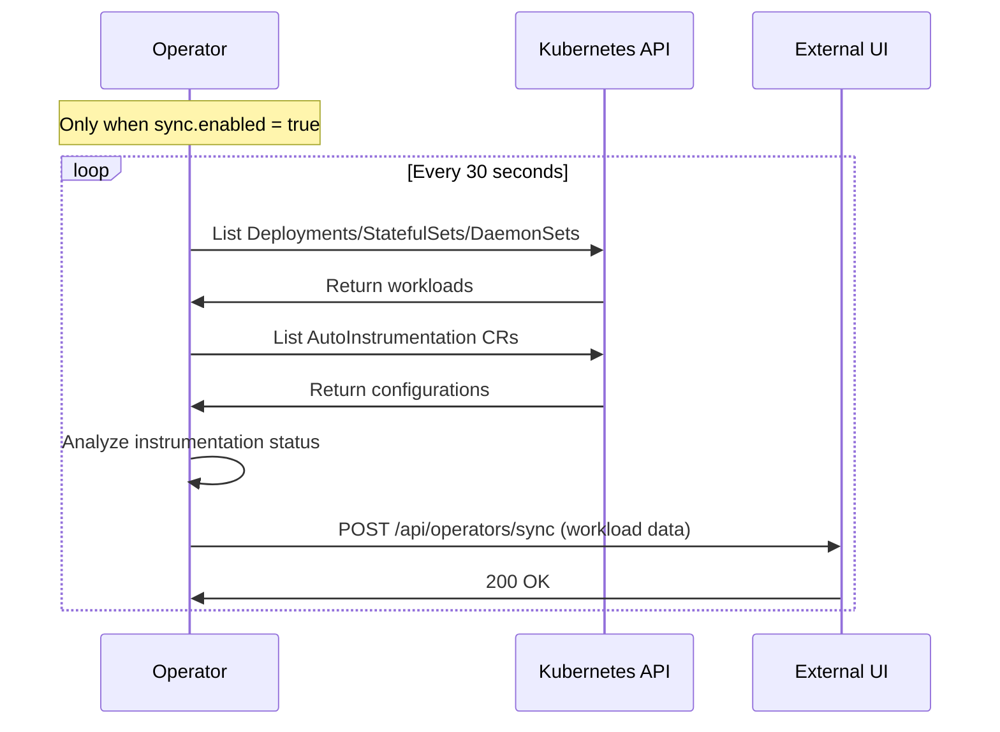
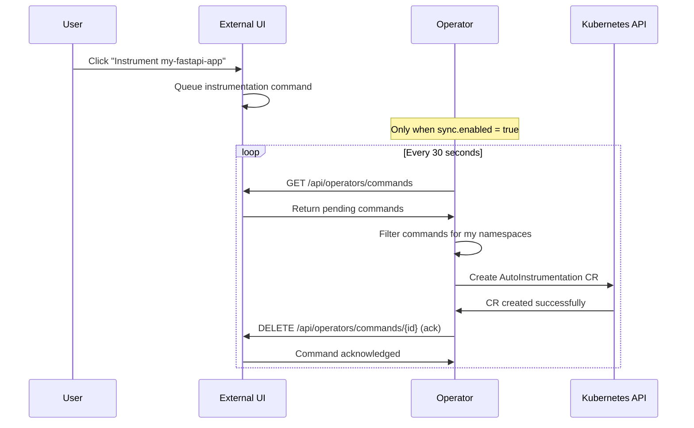

# OpenLIT Operator External Management System

> **⚠️ IMPORTANT**: This is an **optional feature** that does not affect existing operator functionality. Users can continue using the operator exactly as before without any changes.

## 📋 **Table of Contents**
1. [Overview](#overview)
2. [Backward Compatibility](#backward-compatibility)
3. [Architecture](#architecture)
4. [System Components](#system-components)
5. [Data Flow](#data-flow)
6. [Implementation Details](#implementation-details)
7. [Configuration](#configuration)
8. [API Specifications](#api-specifications)
9. [Deployment Guide](#deployment-guide)
10. [User Workflows](#user-workflows)
11. [Security Considerations](#security-considerations)
12. [Multi-Operator Scenarios](#multi-operator-scenarios)
13. [Troubleshooting Guide](#troubleshooting-guide)

---

## 🎯 **Overview**

The External Management System is an **optional add-on** that enables remote management of OpenLIT operators through a web interface. This system allows platform teams to manage multiple customer clusters from a centralized UI while maintaining complete security isolation.

### **Key Benefits**
- **🌐 Centralized Management**: Single UI for multiple customer clusters
- **🔒 Security First**: No inbound access required to customer clusters
- **⚡ Real-time Monitoring**: Live workload discovery and instrumentation status
- **🎯 Zero Impact**: Completely optional - existing workflows unchanged
- **📈 Scalable**: Supports multiple operators per cluster and multiple clusters per UI

---

## ✅ **Backward Compatibility**

### **Non-Breaking Design Principles**

**✅ Completely Optional**
```yaml
# Default behavior - external UI disabled
sync:
  enabled: false  # Default: false
```

**✅ Graceful Degradation**
```go
// Operator continues normal operation even if external UI is unreachable
if config.ExternalUI.Enabled {
    go externalUISync.Start(ctx)  // Runs in background
}
// Main operator functionality unaffected
```

**✅ No Changes to Existing APIs**
- All existing operator functionality remains identical
- AutoInstrumentation CRs work exactly the same
- Webhook behavior unchanged
- RBAC permissions unchanged (except optional additions)

**✅ Zero Configuration Impact**
```yaml
# Existing users need NO configuration changes
# Their operator deployments continue working as-is
```

### **Migration Path**
1. **Phase 1**: Deploy enhanced operator (external UI disabled by default)
2. **Phase 2**: Optionally enable external UI for specific clusters
3. **Phase 3**: Gradually migrate management workflows to UI (optional)

---

## 🏗️ **Architecture**

### **High-Level Architecture**
```
┌─────────────────────────────────────┐    ┌─────────────────────────────────────┐
│           Customer K8s              │    │        External UI Service          │
│           (Private Network)         │    │        (Internet Accessible)       │
│                                     │    │                                     │
│  ┌───────────────────────────────┐  │    │  ┌───────────────────────────────┐  │
│  │      OpenLIT Operator         │  │    │  │        Web Interface          │  │
│  │      (Enhanced, Optional)     │  │    │  │        (HTML/CSS/JS)          │  │
│  │                               │  │    │  │                               │  │
│  │  ┌─────────────────────────┐  │  │    │  └───────────────────────────────┘  │
│  │  │   Workload Discovery    │  │  │    │                                     │
│  │  │   (Unchanged)           │  │  │    │  ┌───────────────────────────────┐  │
│  │  └─────────────────────────┘  │  │    │  │        REST API Server       │  │
│  │                               │  │    │  │   - Receive workload data     │  │
│  │  ┌─────────────────────────┐  │  │    │  │   - Queue commands            │  │
│  │  │ AutoInstrumentation     │  │  │    │  │   - Serve UI responses        │  │
│  │  │ Management (Unchanged)  │  │  │    │  └───────────────────────────────┘  │
│  │  └─────────────────────────┘  │  │    │                                     │
│  │                               │  │    │  ┌───────────────────────────────┐  │
│  │  ┌─────────────────────────┐  │  │    │  │        Data Storage           │  │
│  │  │  External UI Sync       │  │──┼────┼─►│   - Cluster states            │  │
│  │  │  (NEW - Optional)       │  │  │    │  │   - Workload inventory        │  │
│  │  └─────────────────────────┘  │  │    │  │   - Command queue             │  │
│  └───────────────────────────────┘  │    │  └───────────────────────────────┘  │
└─────────────────────────────────────┘    └─────────────────────────────────────┘
          (No Inbound Access)                        (Internet Accessible)
```

### **Communication Flow**
- **Outbound Only**: Operator initiates all connections to external UI
- **Push Model**: Operator pushes workload discovery data every 30 seconds (when enabled)
- **Pull Model**: Operator pulls pending commands from external UI (when enabled)
- **Stateless**: External UI maintains cluster state; operator executes commands

---

## 🧩 **System Components**

### **1. Enhanced OpenLIT Operator (Backward Compatible)**
**Location**: Customer Kubernetes cluster  
**Changes**: Additive only - new optional modules

**Core Functionality (Unchanged)**:
- Zero-code auto-instrumentation
- AutoInstrumentation CR management
- Webhook-based pod injection
- Multi-provider support

**New Optional Modules**:
```
operator/
├── internal/
│   ├── external/               # NEW - Optional external UI sync
│   │   ├── sync.go              
│   │   ├── client.go            
│   │   └── types.go             
│   ├── discovery/              # NEW - Optional workload discovery
│   │   ├── workloads.go         
│   │   ├── instrumentation.go   
│   │   └── status.go            
│   └── commands/               # NEW - Optional command execution
│       ├── executor.go          
│       └── handlers.go          
```

**Integration Pattern**:
```go
// main.go - Non-breaking integration
func main() {
    // Existing operator initialization (unchanged)
    mgr := setupManager()
    setupWebhooks(mgr)
    setupControllers(mgr)
    
    // NEW - Optional external UI integration
    if config.ExternalUI.Enabled {
        externalUISync := external.NewExternalUISync(config.ExternalUI, mgr.GetClient())
        go externalUISync.Start(ctx)  // Non-blocking
        log.Info("External UI sync enabled")
    }
    
    // Existing operator start (unchanged)
    mgr.Start(ctx)
}
```

### **2. External UI Service**
**Location**: Internet-accessible environment  
**Purpose**: Centralized management interface

**Components**:
```
external-ui-service/
├── main.go                      # HTTP server and routing
├── api/
│   ├── operators.go             # APIs for operator communication
│   ├── ui.go                    # APIs for web interface
│   ├── middleware.go            # Authentication and logging
│   └── types.go                 # Shared data structures
├── storage/
│   ├── memory.go                # In-memory storage implementation
│   ├── interface.go             # Storage abstraction
│   └── models.go                # Data models
├── web/
│   ├── static/
│   │   ├── index.html           # Main dashboard
│   │   ├── styles.css           # UI styling
│   │   └── app.js               # Frontend JavaScript
│   └── templates/
│       └── cluster.html         # Cluster detail views
└── config/
    └── config.go                # Service configuration
```

---

## 🔄 **Data Flow**

### **1. Discovery and Sync (Operator → External UI)**
**Frequency**: Every 30 seconds (when enabled)  
**Direction**: Operator pushes to External UI



**Sync Payload Structure**:
```json
{
  "timestamp": "2024-01-15T10:30:00Z",
  "operator_namespaces": ["production", "staging"],
  "workloads": [
    {
      "name": "my-fastapi-app",
      "namespace": "production",
      "type": "Deployment",
      "replicas": "3/3",
      "status": "Running",
      "labels": {
        "app": "my-fastapi-app",
        "team": "backend",
        "framework": "fastapi",
        "environment": "production"
      },
      "instrumentation": {
        "status": "not_instrumented",
        "matching_configs": [],
        "requires_restart": false
      },
      "created_at": "2024-01-10T08:15:00Z",
      "image": "my-registry/fastapi-app:v1.2.3",
      "ports": [8000]
    }
  ],
  "auto_instrumentations": [
    {
      "name": "backend-team-instrumentation",
      "namespace": "default",
      "selector": {
        "matchLabels": {
          "team": "backend",
          "environment": "production"
        }
      },
      "provider": "openlit",
      "status": "active"
    }
  ]
}
```

### **2. Command Management (External UI → Operator)**
**Frequency**: Every 30 seconds (operator polls when enabled)  
**Direction**: Operator pulls from External UI



**Command Structure**:
```json
{
  "id": "cmd_123456789",
  "type": "create_instrumentation",
  "timestamp": "2024-01-15T10:35:00Z",
  "namespace": "production",
  "workload": "my-fastapi-app",
  "data": {
    "auto_instrumentation_name": "my-fastapi-app-instrumentation",
    "selector": {
      "matchLabels": {
        "app": "my-fastapi-app"
      }
    },
    "provider": "openlit",
    "otlp_endpoint": "http://openlit.openlit.svc.cluster.local:4318"
  }
}
```

---

## 🛠️ **Implementation Details**

### **Operator External Sync Module (Non-Breaking)**

```go
// internal/external/sync.go
type ExternalUISync struct {
    kubeclient       kubernetes.Interface
    autoInstrClient  v1alpha1client.AutoInstrumentationInterface
    externalURL      string
    apiKey           string
    targetNamespaces []string
    syncInterval     time.Duration
    httpClient       *http.Client
    logger           logr.Logger
    enabled          bool  // Key: can be disabled
}

func NewExternalUISync(config ExternalUIConfig, kubeclient kubernetes.Interface) *ExternalUISync {
    return &ExternalUISync{
        enabled:          config.Enabled,  // Respects configuration
        kubeclient:       kubeclient,
        externalURL:      config.Endpoint,
        apiKey:           config.APIKey,
        targetNamespaces: config.TargetNamespaces,
        syncInterval:     config.SyncInterval,
        httpClient: &http.Client{
            Timeout: 30 * time.Second,
            Transport: &http.Transport{
                MaxIdleConns:        10,
                IdleConnTimeout:     90 * time.Second,
                DisableCompression:  false,
            },
        },
        logger: ctrl.Log.WithName("external-ui-sync"),
    }
}

func (s *ExternalUISync) Start(ctx context.Context) error {
    if !s.enabled {
        s.logger.Info("External UI sync disabled, skipping")
        return nil  // Graceful no-op
    }
    
    s.logger.Info("Starting external UI sync", "endpoint", s.externalURL, "interval", s.syncInterval)
    
    ticker := time.NewTicker(s.syncInterval)
    defer ticker.Stop()
    
    // Initial sync with error handling
    if err := s.performSync(ctx); err != nil {
        s.logger.Error(err, "Initial sync failed, continuing anyway")
        // Note: Operator continues running even if external UI fails
    }
    
    for {
        select {
        case <-ctx.Done():
            return ctx.Err()
        case <-ticker.C:
            if err := s.performSync(ctx); err != nil {
                s.logger.Error(err, "Sync cycle failed, will retry")
                // Continue running - external UI issues don't break operator
            }
        }
    }
}

func (s *ExternalUISync) performSync(ctx context.Context) error {
    // Graceful error handling - don't break operator if external UI fails
    defer func() {
        if r := recover(); r != nil {
            s.logger.Error(fmt.Errorf("sync panic: %v", r), "External UI sync panicked, continuing")
        }
    }()
    
    // 1. Discover current workload state
    state, err := s.discoverClusterState(ctx)
    if err != nil {
        return fmt.Errorf("discovery failed: %w", err)
    }
    
    // 2. Push state to external UI (with timeout)
    if err := s.pushClusterState(ctx, state); err != nil {
        return fmt.Errorf("push failed: %w", err)
    }
    
    // 3. Pull and execute commands (with timeout)
    if err := s.pullAndExecuteCommands(ctx); err != nil {
        return fmt.Errorf("command execution failed: %w", err)
    }
    
    return nil
}

// Namespace filtering - only act on assigned namespaces
func (s *ExternalUISync) isMyNamespace(namespace string) bool {
    for _, ns := range s.targetNamespaces {
        if ns == namespace {
            return true
        }
    }
    return false
}
```

### **Workload Discovery Engine**

```go
// internal/discovery/workloads.go
type WorkloadDiscovery struct {
    kubeclient       kubernetes.Interface
    autoInstrClient  v1alpha1client.AutoInstrumentationInterface
    targetNamespaces []string
    logger           logr.Logger
}

func (d *WorkloadDiscovery) DiscoverAll(ctx context.Context) (*ClusterState, error) {
    state := &ClusterState{
        Timestamp:          time.Now(),
        OperatorNamespaces: d.targetNamespaces,
        Workloads:          []WorkloadInfo{},
        AutoInstrumentations: []AutoInstrumentationInfo{},
    }
    
    // Discover workloads in each target namespace
    for _, namespace := range d.targetNamespaces {
        workloads, err := d.discoverNamespace(ctx, namespace)
        if err != nil {
            d.logger.Error(err, "Failed to discover namespace", "namespace", namespace)
            continue // Continue with other namespaces
        }
        state.Workloads = append(state.Workloads, workloads...)
    }
    
    // Get AutoInstrumentation configurations
    autoInstrumentations, err := d.getAutoInstrumentations(ctx)
    if err != nil {
        d.logger.Error(err, "Failed to get AutoInstrumentation CRs")
    } else {
        state.AutoInstrumentations = autoInstrumentations
    }
    
    // Analyze instrumentation status for each workload
    d.analyzeInstrumentationStatus(state)
    
    return state, nil
}

func (d *WorkloadDiscovery) discoverNamespace(ctx context.Context, namespace string) ([]WorkloadInfo, error) {
    var allWorkloads []WorkloadInfo
    
    // Get Deployments
    deployments, err := d.kubeclient.AppsV1().Deployments(namespace).List(ctx, metav1.ListOptions{})
    if err != nil {
        return nil, err
    }
    
    for _, deploy := range deployments.Items {
        workload := d.deploymentToWorkloadInfo(&deploy)
        allWorkloads = append(allWorkloads, workload)
    }
    
    // Get StatefulSets
    statefulsets, err := d.kubeclient.AppsV1().StatefulSets(namespace).List(ctx, metav1.ListOptions{})
    if err != nil {
        return nil, err
    }
    
    for _, sts := range statefulsets.Items {
        workload := d.statefulSetToWorkloadInfo(&sts)
        allWorkloads = append(allWorkloads, workload)
    }
    
    // Get DaemonSets
    daemonsets, err := d.kubeclient.AppsV1().DaemonSets(namespace).List(ctx, metav1.ListOptions{})
    if err != nil {
        return nil, err
    }
    
    for _, ds := range daemonsets.Items {
        workload := d.daemonSetToWorkloadInfo(&ds)
        allWorkloads = append(allWorkloads, workload)
    }
    
    return allWorkloads, nil
}
```

### **External UI Service Implementation**

```go
// main.go
func main() {
    storage := storage.NewMemoryStorage()
    
    r := gin.Default()
    
    // CORS middleware
    r.Use(func(c *gin.Context) {
        c.Header("Access-Control-Allow-Origin", "*")
        c.Header("Access-Control-Allow-Methods", "GET, POST, PUT, DELETE, OPTIONS")
        c.Header("Access-Control-Allow-Headers", "Content-Type, Authorization")
        
        if c.Request.Method == "OPTIONS" {
            c.AbortWithStatus(204)
            return
        }
        
        c.Next()
    })
    
    // Serve static files
    r.Static("/static", "./web/static")
    r.LoadHTMLGlob("web/templates/*")
    
    // Main UI route
    r.GET("/", func(c *gin.Context) {
        c.HTML(200, "index.html", gin.H{
            "title": "OpenLIT Operator Management",
        })
    })
    
    // API routes for operators
    operatorAPI := r.Group("/api/operators")
    operatorAPI.Use(AuthMiddleware())
    {
        operatorAPI.POST("/sync", handleOperatorSync(storage))
        operatorAPI.GET("/commands", handleGetCommands(storage))
        operatorAPI.DELETE("/commands/:id", handleAckCommand(storage))
    }
    
    // API routes for UI
    uiAPI := r.Group("/api/ui")
    {
        uiAPI.GET("/clusters", handleGetClusters(storage))
        uiAPI.GET("/clusters/:apikey/workloads", handleGetWorkloads(storage))
        uiAPI.POST("/clusters/:apikey/instrument", handleCreateInstrumentation(storage))
        uiAPI.POST("/clusters/:apikey/restart", handleRestartWorkload(storage))
    }
    
    port := os.Getenv("PORT")
    if port == "" {
        port = "8080"
    }
    
    log.Printf("Starting server on port %s", port)
    r.Run(":" + port)
}

// api/operators.go
func handleOperatorSync(storage Storage) gin.HandlerFunc {
    return func(c *gin.Context) {
        apiKey := extractAPIKey(c)
        if apiKey == "" {
            c.JSON(401, gin.H{"error": "Invalid or missing API key"})
            return
        }
        
        var syncData ClusterSyncPayload
        if err := c.ShouldBindJSON(&syncData); err != nil {
            c.JSON(400, gin.H{"error": "Invalid JSON payload", "details": err.Error()})
            return
        }
        
        // Update cluster state
        clusterInfo := &ClusterInfo{
            APIKey:               apiKey,
            LastSeen:            time.Now(),
            OperatorNamespaces:  syncData.OperatorNamespaces,
            Workloads:           syncData.Workloads,
            AutoInstrumentations: syncData.AutoInstrumentations,
        }
        
        if err := storage.UpdateCluster(apiKey, clusterInfo); err != nil {
            c.JSON(500, gin.H{"error": "Failed to update cluster state"})
            return
        }
        
        c.JSON(200, gin.H{
            "status": "success",
            "timestamp": time.Now(),
            "workloads_received": len(syncData.Workloads),
        })
    }
}

func handleGetCommands(storage Storage) gin.HandlerFunc {
    return func(c *gin.Context) {
        apiKey := extractAPIKey(c)
        if apiKey == "" {
            c.JSON(401, gin.H{"error": "Invalid or missing API key"})
            return
        }
        
        commands, err := storage.GetPendingCommands(apiKey)
        if err != nil {
            c.JSON(500, gin.H{"error": "Failed to get commands"})
            return
        }
        
        c.JSON(200, gin.H{
            "commands": commands,
            "count": len(commands),
        })
    }
}
```

---

## ⚙️ **Configuration**

### **Operator Configuration (Backward Compatible)**

```yaml
# operator-config.yaml
apiVersion: v1
kind: ConfigMap
metadata:
  name: openlit-operator-config
  namespace: openlit
data:
  config.yaml: |
    # Core operator settings (UNCHANGED)
    operator:
      # Namespaces this operator instance monitors
      target_namespaces: ["production", "staging"]
      
      # AutoInstrumentation settings (UNCHANGED)
      auto_instrumentation:
        default_provider: "openlit"
        default_otlp_endpoint: "http://openlit.openlit.svc.cluster.local:4318"
    
    # NEW - External UI integration (OPTIONAL)
    sync:
      enabled: false  # DEFAULT: disabled for backward compatibility
      endpoint: "https://openlit-management.company.com"
      sync_interval: "30s"
      
      # Retry and timeout settings
      timeout: "30s"
      max_retries: 3
      retry_delay: "5s"
      
      # HTTP client settings
      tls_skip_verify: false
      max_idle_connections: 10
```

### **Enabling External UI (Optional)**

```yaml
# To enable external UI, users must explicitly opt-in:
sync:
  enabled: true  # Explicitly enable
  endpoint: "https://openlit-management.company.com"
  # API key provided via secret
```

```yaml
# external-ui-secret.yaml (ONLY needed if external UI enabled)
apiVersion: v1
kind: Secret
metadata:
  name: external-ui-secret
  namespace: openlit
type: Opaque
data:
  api-key: b2xpdF9ha18xMjM0NTY3ODkwYWJjZGVm  # base64 encoded: olit_ak_1234567890abcdef
```

### **External UI Service Configuration**

```yaml
# external-ui-config.yaml
server:
  port: 8080
  read_timeout: "30s"
  write_timeout: "30s"
  idle_timeout: "60s"

storage:
  type: "memory"  # Options: memory, redis, postgres
  
  # For Redis storage
  redis:
    host: "redis:6379"
    password: ""
    db: 0
    
  # For PostgreSQL storage  
  postgres:
    host: "postgres"
    port: 5432
    database: "openlit_ui"
    username: "postgres"
    password: "secretpass"

clusters:
  max_age: "5m"          # Mark cluster as stale after 5 minutes
  cleanup_interval: "1h"  # Clean up stale data every hour

security:
  # API keys for cluster authentication
  api_keys:
    - key: "olit_ak_1234567890abcdef"
      name: "Acme Corp - Production"
      customer: "Acme Corp"
      environment: "production"
    - key: "olit_ak_fedcba0987654321"
      name: "Acme Corp - Staging" 
      customer: "Acme Corp"
      environment: "staging"

logging:
  level: "info"  # debug, info, warn, error
  format: "json" # json, text
```

---

## 📡 **API Specifications**

### **Operator APIs (Called by Operator)**

#### **POST /api/operators/sync**
Push workload data to external UI.

**Headers:**
- `Authorization: Bearer {api_key}`
- `Content-Type: application/json`

**Request Body:**
```json
{
  "timestamp": "2024-01-15T10:30:00Z",
  "operator_namespaces": ["production", "staging"],
  "workloads": [/* WorkloadInfo objects */],
  "auto_instrumentations": [/* AutoInstrumentationInfo objects */]
}
```

**Response:**
```json
{
  "status": "success",
  "timestamp": "2024-01-15T10:30:01Z",
  "workloads_received": 5
}
```

#### **GET /api/operators/commands**
Get pending commands for this cluster.

**Headers:**
- `Authorization: Bearer {api_key}`

**Response:**
```json
{
  "commands": [
    {
      "id": "cmd_123456789",
      "type": "create_instrumentation",
      "timestamp": "2024-01-15T10:35:00Z",
      "namespace": "production",
      "workload": "my-fastapi-app",
      "data": {/* command-specific data */}
    }
  ],
  "count": 1
}
```

#### **DELETE /api/operators/commands/{id}**
Acknowledge command execution.

**Headers:**
- `Authorization: Bearer {api_key}`

**Response:**
```json
{
  "status": "acknowledged",
  "command_id": "cmd_123456789"
}
```

### **UI APIs (Called by Web Interface)**

#### **GET /api/ui/clusters**
Get all connected clusters.

**Response:**
```json
[
  {
    "name": "Acme Corp - Production",
    "customer": "Acme Corp",
    "environment": "production",
    "last_seen": "2024-01-15T10:30:00Z",
    "namespaces": ["production", "staging"],
    "workload_count": 8,
    "instrumented_count": 3,
    "status": "online"
  }
]
```

#### **GET /api/ui/clusters/{apikey}/workloads**
Get workloads for specific cluster.

**Response:**
```json
{
  "cluster": {
    "name": "Acme Corp - Production",
    "last_seen": "2024-01-15T10:30:00Z"
  },
  "workloads": [/* WorkloadInfo objects */]
}
```

#### **POST /api/ui/clusters/{apikey}/instrument**
Create instrumentation command.

**Request Body:**
```json
{
  "workload": "my-fastapi-app",
  "namespace": "production",
  "selector": {
    "matchLabels": {
      "app": "my-fastapi-app"
    }
  },
  "auto_instrumentation_name": "my-fastapi-app-instrumentation",
  "provider": "openlit"
}
```

**Response:**
```json
{
  "status": "queued",
  "command_id": "cmd_123456789",
  "estimated_execution": "30s"
}
```

---

## 🚀 **Deployment Guide**

### **1. Deploy External UI Service (Optional)**

```bash
# Build the service
git clone https://github.com/openlit/external-ui-service
cd external-ui-service
docker build -t openlit-external-ui:latest .

# Run with Docker
docker run -d \
  --name openlit-external-ui \
  -p 8080:8080 \
  -v $(pwd)/config.yaml:/app/config.yaml \
  openlit-external-ui:latest

# Or deploy to Kubernetes
kubectl apply -f deployments/external-ui-deployment.yaml
```

**External UI Kubernetes Deployment:**
```yaml
apiVersion: apps/v1
kind: Deployment
metadata:
  name: openlit-external-ui
  namespace: openlit-management
spec:
  replicas: 2
  selector:
    matchLabels:
      app: openlit-external-ui
  template:
    metadata:
      labels:
        app: openlit-external-ui
    spec:
      containers:
      - name: external-ui
        image: openlit-external-ui:latest
        ports:
        - containerPort: 8080
        env:
        - name: CONFIG_PATH
          value: "/app/config.yaml"
        volumeMounts:
        - name: config
          mountPath: /app/config.yaml
          subPath: config.yaml
        resources:
          requests:
            memory: "64Mi"
            cpu: "50m"
          limits:
            memory: "128Mi"
            cpu: "100m"
      volumes:
      - name: config
        configMap:
          name: external-ui-config

---
apiVersion: v1
kind: Service
metadata:
  name: openlit-external-ui-service
  namespace: openlit-management
spec:
  selector:
    app: openlit-external-ui
  ports:
  - port: 80
    targetPort: 8080
  type: LoadBalancer

---
apiVersion: networking.k8s.io/v1
kind: Ingress
metadata:
  name: openlit-external-ui-ingress
  namespace: openlit-management
  annotations:
    kubernetes.io/ingress.class: nginx
    cert-manager.io/cluster-issuer: letsencrypt-prod
spec:
  tls:
  - hosts:
    - openlit-management.company.com
    secretName: openlit-external-ui-tls
  rules:
  - host: openlit-management.company.com
    http:
      paths:
      - path: /
        pathType: Prefix
        backend:
          service:
            name: openlit-external-ui-service
            port:
              number: 80
```

### **2. Deploy Enhanced Operator (Backward Compatible)**

```bash
# Existing users: NO CHANGES NEEDED
# Operator works exactly as before

# For external UI (optional):
# Create API key secret
kubectl create secret generic external-ui-secret \
  --from-literal=api-key=olit_ak_1234567890abcdef \
  -n openlit

# Update configuration to enable external UI
kubectl apply -f operator-config-with-external-ui.yaml

# Deploy enhanced operator (backward compatible)
kubectl apply -f enhanced-operator-deployment.yaml
```

**Enhanced Operator Deployment (Backward Compatible):**
```yaml
apiVersion: apps/v1
kind: Deployment
metadata:
  name: openlit-operator
  namespace: openlit
spec:
  replicas: 1
  selector:
    matchLabels:
      app: openlit-operator
  template:
    metadata:
      labels:
        app: openlit-operator
    spec:
      serviceAccountName: openlit-operator
      containers:
      - name: operator
        image: openlit-operator:latest-with-external-ui  # Enhanced version
        command:
        - /operator
        env:
        # External UI environment variables (with defaults for backward compatibility)
        - name: EXTERNAL_UI_ENABLED
          valueFrom:
            configMapKeyRef:
              name: openlit-operator-config
              key: external_ui_enabled
              optional: true  # Optional for backward compatibility
        - name: EXTERNAL_UI_ENDPOINT
          valueFrom:
            configMapKeyRef:
              name: openlit-operator-config
              key: external_ui_endpoint
              optional: true  # Optional for backward compatibility
        - name: EXTERNAL_UI_API_KEY
          valueFrom:
            secretKeyRef:
              name: external-ui-secret
              key: api-key
              optional: true  # Optional for backward compatibility
        - name: TARGET_NAMESPACES
          valueFrom:
            configMapKeyRef:
              name: openlit-operator-config
              key: target_namespaces
        resources:
          requests:
            memory: "64Mi"
            cpu: "50m"
          limits:
            memory: "128Mi"
            cpu: "100m"
        volumeMounts:
        - name: config
          mountPath: /etc/operator/config.yaml
          subPath: config.yaml
      volumes:
      - name: config
        configMap:
          name: openlit-operator-config
```

### **3. Verify Deployment**

```bash
# Check external UI service (if deployed)
curl -I https://openlit-management.company.com
# Should return 200 OK

# Check operator logs
kubectl logs -n openlit -l app=openlit-operator -f
# Should show successful sync messages (if external UI enabled)
# Should show normal operation logs (if external UI disabled)

# Check external UI shows cluster (if enabled)
curl https://openlit-management.company.com/api/ui/clusters
# Should show your cluster in the list (if external UI enabled)
```

---

## 👤 **User Workflows**

### **Existing Users (No Changes)**

1. **Continue as before**: All existing workflows work exactly the same
2. **AutoInstrumentation CRs**: Create and manage as before
3. **kubectl operations**: All commands work unchanged
4. **Monitoring**: Existing observability unchanged

### **New External UI Workflows (Optional)**

#### **Setup Workflow**

1. **Platform Admin**: Deploy external UI service (optional)
2. **Platform Admin**: Generate API key for customer cluster (optional)
3. **Customer Admin**: Enable external UI in operator config (optional)
4. **Customer Admin**: Deploy enhanced operator (backward compatible)
5. **Platform Admin**: Verify cluster appears in external UI within 30 seconds (if enabled)

#### **Daily Management Workflow**

1. **DevOps Engineer**: Opens external UI in browser
2. **View Clusters**: See all connected customer clusters and their status
3. **Select Cluster**: Click on specific cluster to view workloads
4. **Review Workloads**: See instrumentation status for each workload
5. **Take Actions**: Instrument new workloads or manage existing ones

#### **Instrumentation Workflow**

1. **Identify Target**: Find non-instrumented workload in UI
2. **Click "Instrument"**: UI shows instrumentation dialog
3. **Choose Labels**: Select which labels to use for AutoInstrumentation selector
   ```
   Available Labels:
   ☑️ app: my-fastapi-app
   ☐ team: backend  
   ☐ environment: production
   ```
4. **Preview Impact**: UI shows which other workloads would be affected
   ```
   ✅ Will only instrument: my-fastapi-app
   ⚠️ Would also instrument: user-service, auth-service (if team selected)
   ```
5. **Create Configuration**: Generate AutoInstrumentation CR with chosen selectors
6. **Monitor Progress**: Watch operator execute command (30-60 seconds)
7. **Verify Success**: Confirm workload shows as instrumented

---

## 🔄 **Multi-Operator Scenarios**

### **Scenario 1: Team-Based Operator Separation**

```
┌─────────────────────────────────────────────────────────────┐
│                    Customer K8s Cluster                    │
│                                                             │
│  ┌─────────────────────┐    ┌─────────────────────┐        │
│  │   Backend Team      │    │   Frontend Team     │        │     ┌─────────────────┐
│  │   Operator          │    │   Operator          │        │────►│  External UI    │
│  │                     │    │                     │        │     │                 │
│  │ Manages:            │    │ Manages:            │        │     │ Shows:          │
│  │ - backend ns        │    │ - frontend ns       │        │     │ - All namespaces│
│  │ - api ns            │    │ - mobile ns         │        │     │ - Unified view  │
│  │ - auth ns           │    │ - web ns            │        │     │                 │
│  └─────────────────────┘    └─────────────────────┘        │     └─────────────────┘
└─────────────────────────────────────────────────────────────┘
```

**Configuration**:
```yaml
# Backend team operator
operator:
  target_namespaces: ["backend", "api", "auth"]
sync:
  enabled: true  # Optional
  api_key: "olit_ak_backend_team_12345"

# Frontend team operator  
operator:
  target_namespaces: ["frontend", "mobile", "web"]
sync:
  enabled: true  # Optional
  api_key: "olit_ak_frontend_team_67890"
```

**External UI View**:
```
Customer Cluster - Production
├── backend namespace (Backend Team)
│   ├── user-service ✅ Instrumented
│   └── payment-service ❌ Not Instrumented
├── frontend namespace (Frontend Team)  
│   ├── web-app ✅ Instrumented
│   └── mobile-app ❌ Not Instrumented
└── api namespace (Backend Team)
    └── gateway-service ✅ Instrumented
```

### **Scenario 2: Environment-Based Separation**

```
┌─────────────────────────────────────────────────────────────┐
│                    Customer K8s Cluster                    │
│                                                             │
│  ┌─────────────────────┐    ┌─────────────────────┐        │
│  │   Production        │    │   Staging           │        │     ┌─────────────────┐
│  │   Operator          │    │   Operator          │        │────►│  External UI    │
│  │                     │    │                     │        │     │                 │
│  │ Manages:            │    │ Manages:            │        │     │ Shows:          │
│  │ - prod-backend      │    │ - staging-backend   │        │     │ - All envs      │
│  │ - prod-frontend     │    │ - staging-frontend  │        │     │ - Per namespace │
│  │ - prod-api          │    │ - staging-api       │        │     │                 │
│  └─────────────────────┘    └─────────────────────┘        │     └─────────────────┘
└─────────────────────────────────────────────────────────────┘
```

### **Command Routing Logic**

```go
func (s *ExternalUISync) executeRelevantCommands(commands []Command) {
    for _, cmd := range commands {
        // Only execute commands for namespaces I manage
        if s.isMyNamespace(cmd.Namespace) {
            s.logger.Info("Executing command", "command", cmd.ID, "namespace", cmd.Namespace)
            
            if err := s.executeCommand(cmd); err != nil {
                s.logger.Error(err, "Command execution failed", "command", cmd.ID)
                continue
            }
            
            // Acknowledge successful execution
            s.acknowledgeCommand(cmd.ID)
        } else {
            s.logger.Debug("Ignoring command for other namespace", 
                "command", cmd.ID, "namespace", cmd.Namespace)
        }
    }
}
```

### **Conflict Resolution**

**Overlapping Namespace Management**:
- **Prevention**: Validate operator configurations to prevent namespace overlap
- **Detection**: Monitor for duplicate workload reports from multiple operators
- **Resolution**: Implement operator priority or explicit namespace ownership

**Command Ordering**:
- **Idempotent Operations**: Ensure commands can be safely executed multiple times
- **State Reconciliation**: Operators should verify current state before applying changes
- **Error Handling**: Failed commands should be retryable without side effects

---

## 🔧 **Troubleshooting Guide**

### **Common Issues**

**External UI Not Working (Operator Still Works)**:
1. Check if external UI is enabled in config
2. Verify API key validity and network connectivity
3. Review operator logs for external UI sync errors
4. Confirm external UI endpoint accessibility
5. **Note**: Operator continues normal operation even if external UI fails

**Operator Not Syncing (External UI Enabled)**:
1. Check API key validity and network connectivity
2. Verify external UI endpoint accessibility
3. Review operator logs for authentication errors
4. Confirm target namespaces are accessible

**Commands Not Executing**:
1. Verify namespace ownership (operator only acts on its namespaces)
2. Check AutoInstrumentation CR creation permissions
3. Review command format and required fields
4. Monitor command acknowledgment in external UI

**UI Not Showing Clusters**:
1. Confirm API keys are properly configured
2. Check external UI storage and logs
3. Verify cluster heartbeat frequency
4. Review network connectivity from operators

### **Debugging Steps**

```bash
# Check if external UI is enabled
kubectl get configmap openlit-operator-config -n openlit -o yaml | grep external_ui

# Check operator sync status (if external UI enabled)
kubectl logs -n openlit -l app=openlit-operator | grep "external-ui-sync"

# Check operator normal operation (always works)
kubectl logs -n openlit -l app=openlit-operator | grep -E "(controller|webhook)"

# Verify API key configuration (if external UI enabled)
kubectl get secret external-ui-secret -n openlit -o yaml

# Test external UI connectivity (if external UI enabled)
curl -H "Authorization: Bearer $API_KEY" \
  https://external-ui.company.com/api/operators/commands

# Check AutoInstrumentation CRs (always works)
kubectl get autoinstrumentation -A

# Monitor workload changes (always works)
kubectl get pods -A --watch
```

### **Backward Compatibility Verification**

```bash
# Verify existing AutoInstrumentation CRs still work
kubectl apply -f existing-autoinstrumentation.yaml
kubectl get autoinstrumentation

# Verify webhook still instruments pods
kubectl apply -f test-deployment.yaml
kubectl get pods -l app=test-deployment -o yaml | grep -A 10 initContainers

# Verify operator health
kubectl get pods -n openlit -l app=openlit-operator
```

---

## 📝 **Migration Guide**

### **For Existing Users**

**No Action Required**:
- Existing operator deployments continue working unchanged
- All AutoInstrumentation CRs function exactly as before
- Webhook behavior remains identical
- No configuration changes needed

**Optional Migration to Enhanced Operator**:
1. **Update operator image** to enhanced version (backward compatible)
2. **Keep external UI disabled** (default behavior)
3. **Verify normal operation** continues unchanged
4. **Optionally enable external UI** later if desired

### **For New Users**

**Standard Deployment**:
- Deploy enhanced operator with external UI disabled (default)
- Use traditional kubectl/YAML workflows
- Optionally enable external UI when ready

**External UI Deployment**:
- Deploy external UI service
- Generate API keys
- Enable external UI in operator config
- Access centralized management interface

---

This external management system provides a powerful optional enhancement to the OpenLIT operator while maintaining complete backward compatibility and zero impact on existing workflows. Users can adopt it at their own pace, and the operator continues to function perfectly even if the external UI is unavailable.
