# Custom Evaluations - Detailed Data Flow Diagrams

## 1. User Creates Custom Evaluation

---

## 2. Automatic Evaluation Execution (Cron)

---

## 3. Manual Evaluation Trigger for Single Trace

---

## 4. Data Storage Structure in ClickHouse

**Key Points:**
- Custom evaluations are stored in the same arrays as built-in ones
- The `evaluation` field contains the custom `evaluationType`
- The `scores` map uses `evaluationType` as the key
- `meta['customEvaluations']` array tracks which custom evals were run
- Backward compatible: queries work for both built-in and custom

---

## 5. Configuration Loading Strategy

---

## 6. Evaluation Result Retrieval & Display

```mermaid
sequenceDiagram
    participant UI as Trace Details UI
    participant API as /api/evaluation/[spanId]
    participant Service as getEvaluationsForSpanId
    participant CH as ClickHouse
    participant ConfigDB as PostgreSQL
    participant Render as UI Renderer
    
    UI->>API: GET /evaluation/{spanId}
    API->>Service: getEvaluationsForSpanId(spanId)
    Service->>CH: Query openlit_evaluation
    
    Note over CH: SELECT evaluationData, scores<br/>WHERE span_id = 'abc-123'
    
    CH-->>Service: Raw Data
    Note over Service: arrayMap transforms data<br/>into evaluations array
    
    Service->>Service: Parse Evaluation Results
    Service->>Service: Group by evaluation type
    
    alt Has Custom Evaluations
        Service->>ConfigDB: Load Custom Config Details
        Note over ConfigDB: For metadata like description,<br/>icon, tooltip info
        ConfigDB-->>Service: Custom Config Metadata
        Service->>Service: Enrich custom eval results
    end
    
    Service-->>API: { data: { evaluations: [...] } }
    API-->>UI: Evaluation Response
    
    UI->>Render: renderEvaluations(data)
    
    loop For Each Evaluation
        Render->>Render: Check if Built-in or Custom
        
        alt Built-in Evaluation
            Render->>UI: Render with Standard Icon
            Note over Render,UI: Toxicity: ☠️<br/>Bias: ⚖️<br/>Hallucination: 👁️
        else Custom Evaluation
            Render->>UI: Render with Custom Badge
            Note over Render,UI: Custom icon + tooltip<br/>showing description
        end
        
        Render->>UI: Display Score Bar (0-1)
        Render->>UI: Display Classification Tag
        Render->>UI: Display Explanation
        Render->>UI: Display Verdict Badge (yes/no)
    end
    
    UI->>UI: Update Evaluation Panel
```

---

## 7. Python Execution Flow Detail

---

## 8. Custom Evaluation Lifecycle States

---

## 9. Error Handling Flow

---

## 10. Metrics & Analytics for Custom Evaluations

---

## Summary

These detailed flow diagrams cover:

1. **User Creation Flow** - How users create and test custom evaluations
2. **Automatic Execution** - How cron jobs process custom evaluations
3. **Manual Trigger** - Single trace evaluation with custom evals
4. **Storage Structure** - How data is organized in ClickHouse
5. **Config Loading** - Strategy for loading and merging configs
6. **Result Retrieval** - How results are fetched and displayed
7. **Python Execution** - Detailed Python-side processing
8. **Lifecycle States** - State machine for custom evaluation configs
9. **Error Handling** - Comprehensive error management strategy
10. **Metrics & Analytics** - Tracking and monitoring custom evaluations

These diagrams provide implementation teams with clear visual references for building the custom evaluations feature.
