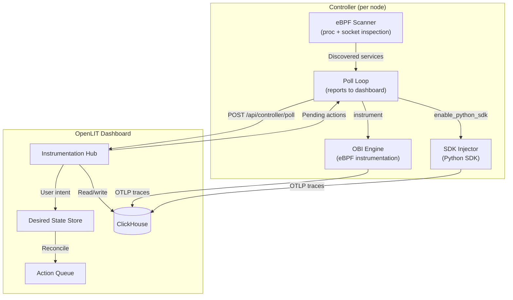
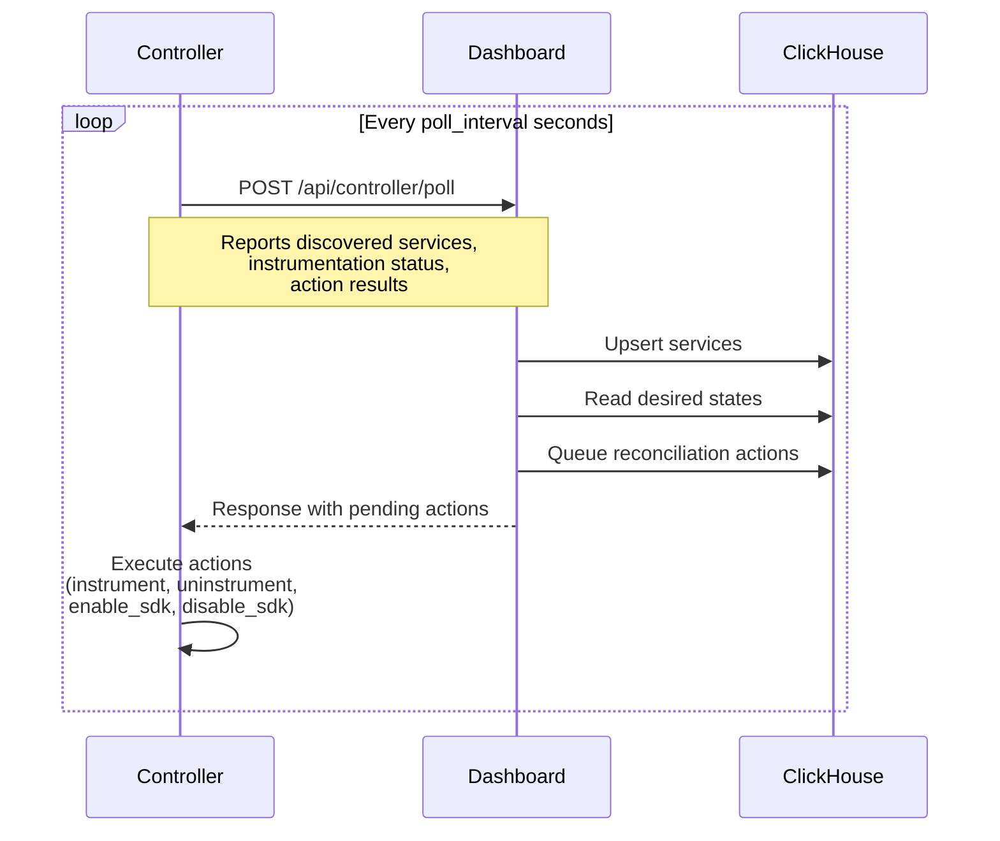

## High-Level Architecture

## Core Components

### Service Discovery

The Controller continuously scans for processes that communicate with known LLM API endpoints. It inspects:

- **Network connections** — Identifies TCP connections to known LLM provider domains (OpenAI, Anthropic, Google AI, AWS Bedrock, etc.)
- **Process metadata** — Extracts PID, executable path, command line, and language runtime
- **Kubernetes metadata** — Resolves pod name, namespace, deployment/daemonset/statefulset ownership
- **Docker metadata** — Reads container name, ID, and labels
- **Workload key** — Generates a stable identifier (e.g., `k8s:namespace:deployment:service`) that persists across pod restarts

### LLM Observability (OBI Engine)

OBI (OpenLIT Binary Instrumentation) uses **eBPF** to intercept LLM API traffic at the kernel level:

1. The Controller tells OBI which processes to instrument
2. OBI attaches eBPF probes to TLS read/write syscalls
3. Captured data is parsed to extract model name, token counts, latency, and errors
4. Traces are sent to the OTLP endpoint in OpenTelemetry format

**Key properties:**
- Zero application overhead (kernel-level interception)
- Works with any language runtime (Python, Node.js, Go, Java, etc.)
- No code changes, no SDK, no sidecar proxies
- Captures traffic that SDKs cannot (e.g., internal library calls)

### Agent Observability (SDK Injector)

For deeper agent framework visibility, the Controller injects the **OpenLIT Python SDK** into running applications:

| Mode | Injection mechanism |
|---|---|
| **Kubernetes** | Patches Deployment/DaemonSet/StatefulSet spec with init container + env vars, triggers rolling update |
| **Docker** | Recreates the container with SDK volume mount + env vars |
| **Linux** | Creates a systemd drop-in that sets `PYTHONPATH` and env vars, then restarts the service |

The injected SDK auto-instruments agent frameworks (LangChain, CrewAI, LangGraph, OpenAI Agents, etc.) and sends spans to the OTLP endpoint.

## Poll-Based Control Loop

The Controller communicates with the OpenLIT dashboard via a **poll-based** control loop:

### Why poll-based?

- Works across NAT, firewalls, and air-gapped environments
- No inbound ports required on the controller
- Dashboard is the single source of truth for desired state
- Simple, resilient, and easy to debug

## Desired State Reconciliation

When a user enables observability for a service, the dashboard stores the **desired state** in a dedicated ClickHouse table. On every poll cycle, the Controller compares the reported state against the desired state and takes corrective action:

| Desired | Current | Action |
|---|---|---|
| `instrumented` | `discovered` | Queue `instrument` action |
| `none` | `instrumented` | Queue `uninstrument` action |
| `enabled` (agent) | `disabled` | Queue `enable_python_sdk` action |
| `none` (agent) | `enabled` | Queue `disable_python_sdk` action |

This reconciliation ensures that:
- **Pod restarts** — New pods are automatically re-instrumented
- **Container recreates** — Docker containers regain their instrumentation
- **Process restarts** — Linux services are re-instrumented via systemd
- **Controller restarts** — The Controller reads desired state from ClickHouse and re-applies it
- **Node failures** — When a node recovers, the Controller on that node reconciles all services

## Security Model

| Concern | Approach |
|---|---|
| **Privileged access** | Required for eBPF probes (`hostPID: true`, `privileged: true` in K8s) |
| **Blast radius** | Controller failure does not affect application behavior — eBPF probes are read-only, SDK injection is reversible |
| **Network** | Controller only makes outbound HTTP calls to the dashboard. No inbound ports |
| **RBAC (K8s)** | Controller needs `get/list/watch` on pods and `update/patch` on deployments/daemonsets for SDK injection |
| **Docker socket** | Required in Docker mode for container inspection and SDK injection |
