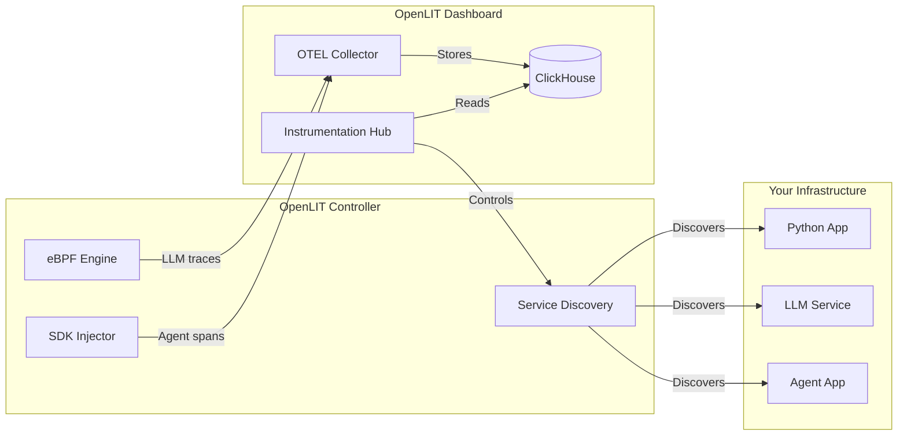

The OpenLIT Controller is a lightweight agent that discovers and instruments AI applications without requiring any code changes, SDK integration, or container image modifications. It runs alongside your applications and uses **eBPF** for LLM Observability and **Python SDK injection** for Agent Observability.

## Why the Controller?

Traditional observability requires adding SDKs to every service — changing code, rebuilding images, and redeploying. The Controller eliminates all of that:

| | SDK approach | Controller approach |
|---|---|---|
| Code changes | Required | None |
| Image rebuild | Required | None |
| Redeploy | Required | None |
| Covers existing apps | No | Yes |
| Agent framework spans | Yes | Yes (via injected SDK) |
| LLM traffic (tokens, cost, latency) | Yes | Yes (via eBPF) |

<Tip>
The Controller and SDKs are complementary. Use the **Controller** for zero-code LLM Observability across all services, and add the **SDK** when you need deeper application-level tracing, evaluations, or guardrails.
</Tip>

## How It Works

The Controller provides two types of observability:

### LLM Observability (eBPF-based)

Uses eBPF to intercept LLM API calls at the network level — no application changes required. Captures:
- Model name, provider, and endpoint
- Token usage (prompt + completion)
- Request latency and error rates
- Cost estimation

### Agent Observability (SDK injection)

Automatically injects the OpenLIT Python SDK into running Python applications to capture:
- Agent framework spans (LangChain, CrewAI, LangGraph, etc.)
- Tool calls and chain-of-thought traces
- Vector database operations

## Deployment Modes

The Controller runs in three modes, auto-detected based on the environment:

| Mode | How it runs | What it discovers |
|---|---|---|
| **Kubernetes** | DaemonSet on every node | Pods, Deployments, DaemonSets, StatefulSets |
| **Docker** | Sidecar container | Docker containers on the same host |
| **Linux** | Systemd service or process | Bare-metal processes on the host |

## Architecture

1. **Service Discovery** — The Controller scans for processes making LLM API calls (OpenAI, Anthropic, Gemini, Bedrock, etc.)
2. **Instrumentation Hub** — Discovered services appear in the OpenLIT dashboard where you can enable/disable observability
3. **LLM Observability** — One-click eBPF instrumentation for LLM traffic metrics
4. **Agent Observability** — One-click SDK injection for agent framework traces
5. **Reconciliation** — The Controller automatically restores your desired state after pod restarts, container recreates, or process restarts

## Getting Started

<CardGroup cols={2}>
  <Card title="Quickstart" href="/latest/controller/quickstart" icon="bolt">
    Get the Controller running in under 5 minutes
  </Card>
  <Card title="Configuration" href="/latest/controller/configuration" icon="gear">
    Customize discovery, polling, endpoints, and more
  </Card>
</CardGroup>
