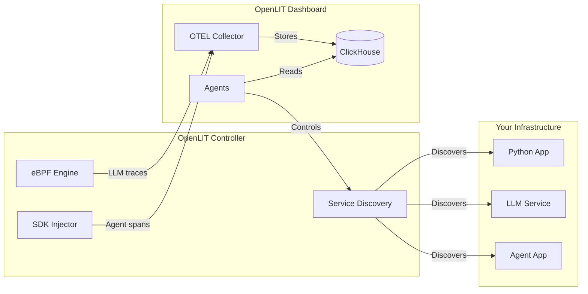

The OpenLIT Controller is a lightweight agent that discovers and instruments AI applications without requiring any code changes, SDK integration, or container image modifications. It runs alongside your applications and uses **eBPF** for LLM Observability and **Python SDK injection** for Agent Observability.

## Why the Controller?

Traditional observability requires adding SDKs to every service — changing code, rebuilding images, and redeploying. The Controller eliminates all of that:

| | SDK approach | Controller approach |
|---|---|---|
| Code changes | Required | None |
| Image rebuild | Required | None |
| Redeploy | Required | None |
| Covers existing apps | No | Yes |
| Agent framework spans | Yes | Yes (via injected SDK) |
| LLM traffic (tokens, cost, latency) | Yes | Yes (via eBPF) |

<Tip>
The Controller and SDKs are complementary. Use the **Controller** for zero-code LLM Observability across all services, and add the **SDK** when you need deeper application-level tracing, evaluations, or guardrails.
</Tip>

## How It Works

The Controller provides two types of observability:

### LLM Observability (eBPF-based)

Uses eBPF to intercept LLM API calls at the network level — no application changes required. Captures:
- Model name, provider, and endpoint
- Token usage (prompt + completion)
- Request latency and error rates
- Cost estimation

### Agent Observability (SDK injection)

Automatically injects the OpenLIT Python SDK into running Python applications to capture:
- Agent framework spans (LangChain, CrewAI, LangGraph, etc.)
- Tool calls and chain-of-thought traces
- Vector database operations

## Deployment Modes

The Controller auto-detects its environment and adapts accordingly:

<CardGroup cols={3}>
  <Card title="Kubernetes" icon="dharmachakra">
    Runs as a **DaemonSet** on every node. Discovers Pods, Deployments, DaemonSets, and StatefulSets. SDK injection triggers rolling updates.
  </Card>
  <Card title="Docker" icon="docker" iconType="brands">
    Runs as a **sidecar container** alongside your services. Discovers containers via the Docker socket. SDK injection recreates the container.
  </Card>
  <Card title="Linux" icon="linux" iconType="brands">
    Runs as a **systemd service** or standalone process. Discovers bare-metal processes on the host. SDK injection uses systemd drop-in files.
  </Card>
</CardGroup>

## Architecture

1. **Service Discovery** — The Controller scans for processes making LLM API calls (OpenAI, Anthropic, Gemini, Bedrock, etc.)
2. **Agents** — Discovered services appear in the OpenLIT dashboard where you can enable/disable observability
3. **LLM Observability** — One-click eBPF instrumentation for LLM traffic metrics
4. **Agent Observability** — One-click SDK injection for agent framework traces
5. **Reconciliation** — The Controller automatically restores your desired state after pod restarts, container recreates, or process restarts

## The Agents Page

The **Agents** page is the dashboard page where you manage all Controller-discovered services. Once the Controller is running, navigate to **Agents** in the OpenLIT sidebar.

### Services view

The main view shows every service the Controller has discovered across your infrastructure:

| Column | Description |
|---|---|
| **Service** | Service name (derived from Kubernetes workload name, Docker container name, or process executable) |
| **Platform** | Kubernetes, Docker, or Linux |
| **LLM Providers** | Detected LLM API connections (OpenAI, Anthropic, Gemini, etc.) |
| **LLM Observability** | Toggle to enable/disable eBPF-based LLM tracing |
| **Agent Observability** | Toggle to enable/disable Python SDK injection (Python services only) |
| **Status** | Current instrumentation state (`Discovered`, `Instrumenting`, `Active`, `Error`) |

### Enabling observability

Click **Enable** next to any service. The Controller will:

1. **LLM Observability** — Attach eBPF probes to intercept LLM API traffic. Takes effect within seconds, no restart required.
2. **Agent Observability** — Inject the OpenLIT Python SDK. In Kubernetes this triggers a rolling update; in Docker the container is recreated; on Linux the systemd service is restarted.

### Disabling observability

Click **Disable** to remove instrumentation:

- **LLM Observability** — eBPF probes are detached immediately. No application restart.
- **Agent Observability** — The injected SDK environment variables are removed. In Kubernetes a rolling update restores the original pod spec. In Docker the container is recreated without the SDK. On Linux the systemd drop-in is removed and the service is restarted.

### Service detail page

Click on a service name to see its detail page:

- **Controller instance** — Which Controller node is managing this service
- **Workload info** — Namespace, deployment name, container image (Kubernetes), container ID (Docker), or PID/executable (Linux)
- **Instrumentation status** — Current state for both LLM and Agent Observability
- **SDK version** — The OpenLIT Python SDK version injected (for Agent Observability)
- **Last seen** — When the Controller last reported this service

### Controller instances

The **Controller** tab shows all running Controller instances with their:

- Node/host name
- Deploy mode (Kubernetes, Docker, Linux)
- Poll interval and last poll time
- Number of services discovered
- Version

## Troubleshooting

| Symptom | Likely cause | Fix |
|---|---|---|
| Service not appearing in the Hub | Controller not running, or service is not making LLM API calls | Check controller logs (`kubectl logs`, `docker logs`, or `journalctl`). The service must have active TCP connections to LLM API endpoints to be discovered. |
| LLM Observability enabled but no traces | eBPF probe failed to attach | Check controller logs for eBPF errors. Ensure the Controller has privileged access and required volume mounts. |
| Agent Observability shows "Error" | SDK injection failed | Check controller logs. For Kubernetes, verify RBAC allows patching deployments. For Docker, verify the Docker socket is mounted. |
| Service keeps reappearing after disable | Desired state mismatch | The Controller reconciles desired state from ClickHouse. If the service reappears, check that the disable action completed successfully in the dashboard. |
| Traces appear but with wrong service name | Service name detection issue | The Controller derives service names from workload metadata. You can override using the `OTEL_SERVICE_NAME` environment variable in your application. |

## Getting Started

<CardGroup cols={2}>
  <Card title="Quickstart" href="/latest/controller/quickstart" icon="bolt">
    Get the Controller running in under 5 minutes
  </Card>
  <Card title="Configuration" href="/latest/controller/configuration" icon="gear">
    Customize discovery, polling, endpoints, and more
  </Card>
</CardGroup>
