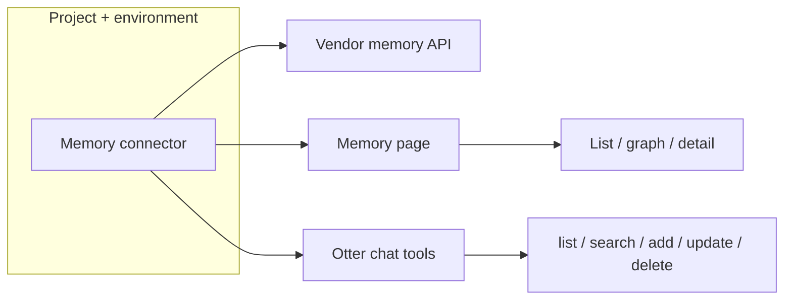

**Memory connectors** attach OpenLIT to external agent memory providers. Use them to browse stored facts, search semantically, add or edit memories, copy between backends, and ask **Otter** questions grounded in connector data.

Add memory connectors from **Configuration → Connectors** (`/connectors`) under the **Memory** category, or directly from the **Memory** page (`/memory`) when no connector exists yet. Connectors are scoped to the current [project](/latest/openlit/organisation/projects) and [environment](/latest/openlit/organisation/environments).

<Info>
Memory connectors use the same atomic registry as [data-source connectors](/latest/openlit/connectors/datasource), but they do not participate in telemetry signal routing. Credentials are encrypted on the connector instance rather than the ClickHouse vault.
</Info>

## Mental model

- **Atomic connectors** — one Mem0 project endpoint, one Zep tenant, one Claude memory store configuration per connector instance.
- **Capability-driven UI** — each vendor advertises supported operations (`list`, `search`, `add`, `update`, `delete`, `feedback`). OpenLIT hides actions the vendor does not support.
- **Filters** — user, session/run, and agent filters are declared per vendor. Some connectors require a session or user before listing memories.
- **Port links** — copying a memory to another connector stores provenance metadata so you can trace copies back to the source.

## Supported memory connectors

| Connector | Default endpoint | What it's for |
| --- | --- | --- |
| **Claude** | `https://api.anthropic.com` | Browse and edit memories in Anthropic Claude memory stores (Managed Agents memory beta) |
| **Mem0** | `https://api.mem0.ai` | Store and search long-term agent memories scoped by user, run, or agent |
| **Zep** | `https://api.getzep.com` | Session memory and knowledge-graph facts for agents |

Self-hosted Mem0 or Zep deployments work when you point the connector at a compatible API URL and supply the same authentication style as the hosted service.

## Capability matrix

| Connector | List | Search | Get | Add | Update | Delete | Feedback | Required filters |
| --- | --- | --- | --- | --- | --- | --- | --- | --- |
| **Claude** | Yes | Yes* | Yes | Yes | Yes | Yes | No | Memory store (session) |
| **Mem0** | Yes | Yes | Yes | Yes | Yes | Yes | Yes | Optional user / run / agent |
| **Zep** | Yes | Yes | Yes | Yes | No | Yes† | No | User; session required for writes |

\* Claude has no dedicated search API — OpenLIT filters listed memories locally for search queries.

† Zep delete targets graph edges/nodes, not an entire session.

## Add a memory connector

<Steps>
  <Step title="Select project and environment">
    Use the header selectors for the target [project](/latest/openlit/organisation/projects) and [environment](/latest/openlit/organisation/environments).
  </Step>
  <Step title="Open Connectors">
    Go to **Configuration → Connectors**, open the **Memory** section in the catalog, and choose **Add connector**.
  </Step>
  <Step title="Pick a vendor">
    Select **Claude**, **Mem0**, or **Zep**.
  </Step>
  <Step title="Configure endpoint and credentials">
    Set the API URL (defaults work for hosted services), optional SSRF toggles for private networks, and the API key. Mem0 also accepts optional organization and project IDs.
  </Step>
  <Step title="Test and save">
    Run a health check, then save. Open **Memory** (`/memory`) and select the connector from the dropdown.
  </Step>
</Steps>

<Tip>
You can also add a connector from the Memory page empty state — **Add memory connector** opens the same add dialog.
</Tip>

## Memory page features

Once a connector is configured, the **Memory** page provides:

| Feature | Description |
| --- | --- |
| **Connector selector** | Switch between memory connectors in the current environment |
| **Filters** | User, session/run, and agent filters when the vendor supports them |
| **Memory list** | Paginated list with search |
| **Detail sheet** | Full memory content, metadata, history, and feedback (when supported) |
| **Graph view** | Relationship visualization for graph-capable vendors (for example Zep) |
| **Write actions** | Add, update, or delete memories when the connector advertises those capabilities |
| **Copy** | Copy selected memories to another write-capable connector in the same environment |
| **Ask Otter** | Natural-language search and Q&A grounded in connector list/search APIs |

## Otter memory tools

When Otter runs on the Memory page or in chat with memory context, it can call connector-backed tools:

| Tool | When available |
| --- | --- |
| `list_memories` | Connector supports `list` |
| `search_memories` | Connector supports `search` |
| `add_memory` | Connector supports `add` |
| `update_memory` | Connector supports `update` |
| `delete_memory` | Connector supports `delete` |

Otter passes required filter arguments (user, session, agent) when the vendor mandates them. Enterprise builds apply the same RBAC and audit hooks as the `/api/memory` routes.

## Authentication

| Connector | Auth style | Notes |
| --- | --- | --- |
| **Claude** | API key (`x-api-key`) | Sends the `agent-memory-2026-07-22` beta header for memory store APIs |
| **Mem0** | Token (`Authorization: Token <apiKey>`) | Works with Mem0 Platform or self-hosted compatible endpoints |
| **Zep** | API key (`Authorization: Api-Key <apiKey>`) | Works with Zep Cloud or self-hosted compatible endpoints |

API keys are stored encrypted on the connector (`enc:v1:…`) and decrypted only server-side for outbound requests.

## Copy between connectors

Use **Copy** on the Memory page to duplicate memories into another write-capable connector in the same project and environment. OpenLIT:

1. Reads the source memory from the origin connector
2. Writes to the destination connector when `add` is supported
3. Stores `metadata.openlit.port` on the destination memory and links the destination connector back to the source for traceability

Copy requires `connectors:update` (or equivalent memory mutation permission in enterprise).

## Security and reliability

- Endpoints validated (`http`/`https` only); credentials in URLs rejected; private/metadata SSRF targets blocked where applicable.
- Secrets encrypted on the connector instance, redacted from errors, never logged.
- Outbound calls use the shared safe-fetch layer with the same SSRF controls as data-source connectors.
- Content limits: memory body up to 20,000 characters; metadata JSON up to 4,000 characters.

## Vendor documentation

<CardGroup cols={3}>
  <Card title="Claude memory" href="https://platform.claude.com/docs/en/managed-agents/memory" icon="book">
    Anthropic Managed Agents memory stores.
  </Card>
  <Card title="Mem0 API" href="https://docs.mem0.ai/api-reference" icon="book">
    Mem0 Platform REST API reference.
  </Card>
  <Card title="Zep SDK" href="https://help.getzep.com/sdk-reference" icon="book">
    Zep Cloud API and graph memory.
  </Card>
</CardGroup>

## Related

<CardGroup cols={2}>
  <Card title="Connectors overview" href="/latest/openlit/connectors/overview" icon="plug">
    Shared connector registry and project scope.
  </Card>
  <Card title="Data-source connectors" href="/latest/openlit/connectors/datasource" icon="database">
    Tempo, Loki, Prometheus, Jaeger, and ClickHouse.
  </Card>
  <Card title="Otter (AI Copilot)" href="/latest/openlit/chat" icon="message">
    Chat with Otter across OpenLIT surfaces.
  </Card>
  <Card title="Environments" href="/latest/openlit/organisation/environments" icon="layer-group">
    Partition memory connectors by environment.
  </Card>
</CardGroup>
