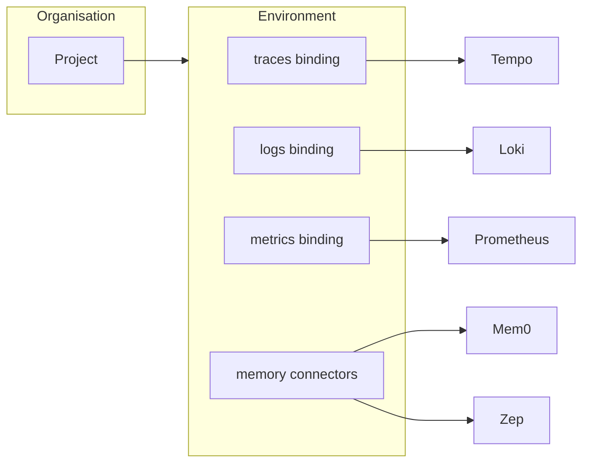

**Connectors** are how OpenLIT attaches to external systems. Each connector is an **atomic** integration: one backend, one credential set, and a clear set of **actions** (test connection, validate signals, bind telemetry, browse memories, and more).

Open **Connectors** from the sidebar under **Configuration → Connectors** (`/connectors`). Always select the correct [project](/latest/openlit/organisation/projects) and [environment](/latest/openlit/organisation/environments) first — connectors belong to the project, not the organisation root.

<Frame>
  
</Frame>

<Info>
Connectors share one registry model across categories. **Data-source connectors** route telemetry reads; **memory connectors** connect OpenLIT to agent memory stores for browsing, editing, and Otter-powered search.
</Info>

## Connector categories

<CardGroup cols={2}>
  <Card title="Data-source connectors" href="/latest/openlit/connectors/datasource" icon="database">
    ClickHouse, Tempo, Loki, Prometheus, and Jaeger — read traces, logs, and metrics with per-signal routing.
  </Card>
  <Card title="Memory connectors" href="/latest/openlit/connectors/memory" icon="brain">
    Claude, Mem0, and Zep — browse, search, write, and copy agent memories from the Memory page and Otter.
  </Card>
</CardGroup>

## Mental model

- **Atomic connectors** — one backend per connector instance. Never a multi-backend blob.
- **Project scope** — connectors are created on a project and partitioned by [environment](/latest/openlit/organisation/environments).
- **Data-source bindings** — traces, logs, and metrics bind independently. See [Signal routing](/latest/openlit/organisation/signal-routing).
- **Memory usage** — memory connectors power the **Memory** page (`/memory`) and Otter memory tools; they do not replace telemetry routing.

## Common actions

| Action | Data-source | Memory |
| --- | --- | --- |
| Add / edit connector | Yes | Yes |
| Store credentials | Vault (ClickHouse) or connector secret | Encrypted on connector |
| Health check / test connection | Yes | Yes |
| Validate AI signal | Yes (`gen_ai.*` markers) | — |
| Bind signal | traces / logs / metrics | — |
| Browse / search / write memories | — | Yes (capability-dependent) |

Enterprise audit logs record connector create, update, delete, test, bind, and unbind events. RBAC permissions are `connectors:read|create|update|delete|test|bind` (owner/admin by default).

## Related

<CardGroup cols={2}>
  <Card title="Organisation overview" href="/latest/openlit/organisation/overview" icon="building">
    How projects and environments scope connectors.
  </Card>
  <Card title="Signal routing" href="/latest/openlit/organisation/signal-routing" icon="route">
    Bind traces, logs, and metrics to data-source connectors.
  </Card>
  <Card title="Database Config" href="/latest/openlit/organisation/database-config" icon="database">
    ClickHouse app store and built-in connector.
  </Card>
  <Card title="Environments" href="/latest/openlit/organisation/environments" icon="layer-group">
    Partition connectors by environment.
  </Card>
</CardGroup>
