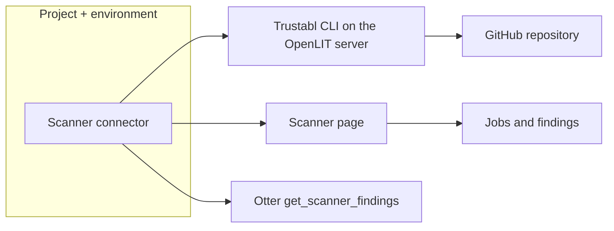

**Scanner connectors** attach OpenLIT to job-based code scanners. Use them to scan a GitHub repository, collect findings with severity and path, and join those results to coding-agent traces.

Add scanner connectors from **Configuration → Connectors** (`/connectors`) under the **Scanners** category, or from the **Scanner** page (`/scanner`) when no connector exists yet. Connectors are scoped to the current [project](/latest/openlit/organisation/projects) and [environment](/latest/openlit/organisation/environments).

<Info>
Scanner connectors use the same atomic registry as [data-source](/latest/openlit/connectors/datasource) and [memory](/latest/openlit/connectors/memory) connectors. They do not participate in telemetry signal routing. GitHub tokens are encrypted on the connector instance.
</Info>

## Mental model

- **Atomic connectors** — one Trustabl scanner per connector instance, with its own target, defaults, and token.
- **GitHub URL target** — v1 scans `https://github.com/owner/repo` only. Local filesystem paths are rejected.
- **On-demand CLI** — OpenLIT installs a checksum-verified Trustabl release onto the server, then runs `trustabl scan`.
- **Environment-scoped jobs** — jobs and findings stay on the connector for the selected environment.

## Supported scanner connectors

| Connector | Runtime | What it's for |
| --- | --- | --- |
| **Trustabl** | Trustabl CLI (`v0.1.8` pin, upgradable) | Scan agent SDKs and MCP servers for reliability and safety findings |

## Add a Trustabl scanner

<Steps>
  <Step title="Select project and environment">
    Use the header selectors for the target [project](/latest/openlit/organisation/projects) and [environment](/latest/openlit/organisation/environments).
  </Step>
  <Step title="Open Connectors or Scanner">
    Go to **Configuration → Connectors** and choose **Add connector**, or open **Scanner** (`/scanner`) and add a connector from the empty state.
  </Step>
  <Step title="Pick Trustabl">
    Select **Trustabl** from the **Scanners** category.
  </Step>
  <Step title="Set the repository and token">
    Enter an `https://github.com/owner/repo` URL. Add `/tree/branch` to pin a branch, or set **Ref** separately. Add a GitHub token for private repositories.
  </Step>
  <Step title="Install the CLI and run a scan">
    On the Scanner page, install the Trustabl CLI onto the OpenLIT server, then **Run scan**. Findings appear on the same page.
  </Step>
</Steps>

<Tip>
Rules source **Follow environment** maps this OpenLIT environment: production → signed production, staging → signed staging, development → unsigned git.
</Tip>

## Scanner page

Once a connector is configured, **Scanner** (`/scanner`) provides:

| Feature | Description |
| --- | --- |
| **Connector selector** | Switch between scanner connectors in the current environment |
| **CLI runtime** | Install or upgrade the Trustabl CLI on the OpenLIT server |
| **Run scan** | Run with connector defaults, or override flags for one job |
| **Jobs** | Recent scans with status, score, duration, and error |
| **Findings** | Severity, rule, path, and suggested fix for the selected job |

## Scan parameters

Connector defaults apply when you run with defaults. Override them for one job from **Run with new parameters**.

| Setting | Purpose |
| --- | --- |
| **Repository URL** | GitHub repo to clone. `/tree/<ref>` is stripped for clone; use it only to pin a branch. |
| **Ref** | Optional branch, tag, or commit |
| **Detectors** | Comma-separated detector ids (for example `claude_sdk,mcp`). Blank runs all detectors. |
| **Strict** | Mark the job failed if any finding is low or higher |
| **Secret / vuln / license scan** | Extra Trustabl scans on repository files and dependencies |
| **Rules source** | Follow environment, or pin Production (signed), Staging (signed), or Git (unsigned) |
| **GitHub token** | Stored on the connector. Never sent in the scan request body. |

## Coding agents and Otter

Coding-agent spans stamp `vcs.repository.url.full`. OpenLIT matches that URL to the latest **succeeded** scan in the current project and environment (https, `git@`, `.git`, and `/tree/<ref>` forms).

- The coding-agent **trace detail** page shows a **Scanner** tab when a repo URL is present.
- Otter can call `get_scanner_findings` with the GitHub URL. Medium+ findings are listed first.

## API

Authenticate with an OpenLIT API key and send organisation, project, and environment headers. See [Settings → OpenAPI Spec](/latest/openlit/developer-resources/api-reference/introduction) for the interactive catalog.

| Method | Path | Purpose |
| --- | --- | --- |
| `POST` | `/api/scanners/{id}/scan` | Run a scan. Optional JSON body overrides connector defaults. Returns `{ connector, job }` with findings. |
| `GET` | `/api/scanners` | List connectors in this environment, including recent jobs and findings. |
| `GET` | `/api/scanners/findings?repoUrl=` | Latest succeeded scan for a GitHub repository URL. |

`POST /api/scanners/{id}/scan` can take several minutes (up to 300 seconds). A second scan is rejected while one is already running on the same connector.

## Security

- Scan targets are GitHub HTTPS URLs only. Local paths, SSH URLs with credentials, and whitespace are rejected.
- Tokens are encrypted on the connector (`enc:v1:…`), redacted from jobs and API responses, and never logged.
- The Trustabl CLI download is checksum-verified before install.

## Related

<CardGroup cols={2}>
  <Card title="Connectors overview" href="/latest/openlit/connectors/overview" icon="plug">
    Shared connector registry and project scope.
  </Card>
  <Card title="Data-source connectors" href="/latest/openlit/connectors/datasource" icon="database">
    Tempo, Loki, Prometheus, Jaeger, and ClickHouse.
  </Card>
  <Card title="Memory connectors" href="/latest/openlit/connectors/memory" icon="brain">
    Claude, Mem0, and Zep for agent memory.
  </Card>
  <Card title="Coding agents" href="/latest/openlit/coding-agents/overview" icon="code">
    How coding-agent traces expose `vcs.repository.url.full`.
  </Card>
</CardGroup>
