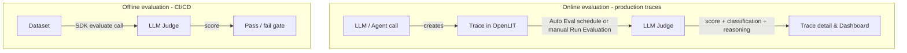

Automated AI evaluation to assess and monitor the quality, safety, and performance of your LLM outputs across development and production environments. For evaluation types, custom evaluators, and online vs. offline concepts, see [Core Concepts](/latest/openlit/evaluations/core-concepts).

<video
      autoPlay
      muted
      loop
      controls
      className="w-full aspect-video rounded-xl"
      src="/images/evaluations.mp4"
      alt="Demo of OpenLIT's automated evaluation scoring"
    >
    </video>

## Find the right feature

| If you want to... | Use this OpenLIT feature |
|---|---|
| Automatically score every production trace | [Auto Evaluation](/latest/openlit/evaluations/auto-evaluation) with a cron schedule |
| Score one specific trace on demand | [Run Evaluation](/latest/openlit/evaluations/llm-as-a-judge#run-from-a-trace) from that trace's Evaluation tab |
| Rate a trace yourself instead of an LLM judge | [Manual Feedback](/latest/openlit/evaluations/manual-feedback) - Good / Bad / Neutral plus a comment |
| Judge responses against your own ground truth, not just the model's knowledge | [Rule Engine](/latest/openlit/prompts-experiments/rule-engine) + [Context](/latest/openlit/prompts-experiments/context) - applies to Auto, Manual, and Programmatic evaluations |
| Evaluate on criteria beyond the 11 built-in types | [Custom evaluation types](/latest/openlit/evaluations/core-concepts#custom-evaluation-types) |
| Only run certain evaluators for certain models, providers, or environments | [Rule Engine conditional linking](/latest/openlit/evaluations/llm-as-a-judge#configure-evaluation-types) |
| Test prompt or model changes before shipping | [Programmatic evaluations](/latest/sdk/quickstart-programmatic-evals) via the SDK |
| Block a deploy on a quality regression | [Programmatic evaluations](/latest/sdk/quickstart-programmatic-evals) in a CI/CD pipeline |
| See detection-rate trends across models and time | [Evaluations dashboard](/latest/openlit/evaluations/llm-as-a-judge#aggregate-statistics-in-dashboard) |

---

<CardGroup cols={2}>
  <Card title="Core Concepts" href="/latest/openlit/evaluations/core-concepts" icon='book'>
    Evaluation types, custom evaluators, and online vs. offline evaluation
  </Card>
  <Card title="Auto Evaluation" href="/latest/openlit/evaluations/auto-evaluation" icon='clock'>
    Run evaluations automatically on a schedule, with sampling to control cost
  </Card>
  <Card title="LLM-as-a-Judge" href="/latest/openlit/evaluations/llm-as-a-judge" icon='gavel'>
    Use advanced LLMs to evaluate AI application quality with automated scoring
  </Card>
  <Card title="Programmatic evaluations" href="/latest/sdk/quickstart-programmatic-evals" icon='bolt'>
    Quick start guide for implementing custom evaluations in your code
  </Card>
</CardGroup>
