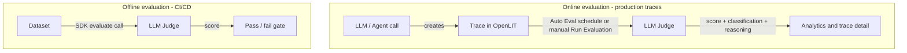

**Evaluations** (`/evaluations`) is OpenLIT's LLM evaluation surface under **Monitor**. Score production traces with an LLM-as-a-judge, enable built-in or custom evaluators, schedule Auto Evaluation, and review pass-rate analytics - or run the same criteria [programmatically via the SDK](/latest/sdk/quickstart-programmatic-evals) for offline CI/CD gates.

Open it from **Monitor → Evaluations**. The page has three tabs:

<CardGroup cols={3}>
  <Card title="Analytics" href="/latest/openlit/evaluations/analytics" icon="chart-line">
    Pass rates, executions, cost, and evaluator results over time
  </Card>
  <Card title="Evaluators" href="/latest/openlit/evaluations/evaluators" icon="list-check">
    Enable built-in types or create custom evaluators
  </Card>
  <Card title="Configuration" href="/latest/openlit/evaluations/configuration" icon="gear">
    Judge model, Vault API key, Auto Evaluation schedule and sampling
  </Card>
</CardGroup>

Default tab is **Analytics**. Use `?tab=evaluators` or `?tab=configuration` for the others.

## Find the right feature

| If you want to... | Use this |
|---|---|
| See pass rates and spend for evals | [Analytics](/latest/openlit/evaluations/analytics) |
| Turn on hallucination, bias, toxicity, or a custom type | [Evaluators](/latest/openlit/evaluations/evaluators) |
| Schedule Auto Evaluation or set the judge model | [Configuration](/latest/openlit/evaluations/configuration) |
| Score one trace on demand | [LLM-as-a-Judge](/latest/openlit/evaluations/llm-as-a-judge) from the trace Evaluation tab |
| Rate a trace yourself | [Manual Feedback](/latest/openlit/evaluations/manual-feedback) |
| Gate CI/CD on quality | [Programmatic evaluations](/latest/openlit/evaluations/programmatic-evals) |

## Methods

<CardGroup cols={3}>
  <Card title="LLM-as-a-Judge" href="/latest/openlit/evaluations/llm-as-a-judge" icon="gavel">
    Automated scoring on live traces
  </Card>
  <Card title="Programmatic evals" href="/latest/openlit/evaluations/programmatic-evals" icon="bolt">
    SDK / CI offline evaluation
  </Card>
  <Card title="Manual Feedback" href="/latest/openlit/evaluations/manual-feedback" icon="thumbs-up">
    Good / Bad / Neutral human ratings
  </Card>
</CardGroup>
