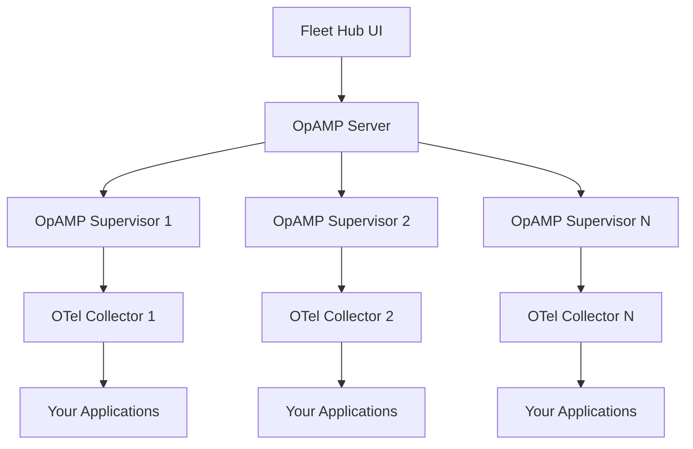

<video
      autoPlay
      muted
      loop
      controls
      className="w-full rounded-xl"
      src="/images/fleet-hub.mp4"
>
</video>

## Upgrade Information

<Warning>
**Important Upgrade Notice**: When upgrading from OpenLIT versions prior to 1.15.0 (which introduced Fleet Hub), special attention is required for Docker Compose deployments.
</Warning>

### Docker Compose Upgrade

If you're running OpenLIT using Docker Compose, you **must** use the `--remove-orphans` flag when upgrading:

```bash
# Upgrade with orphan removal
docker-compose up -d --remove-orphans
```

**Why this is necessary:**
- The OpenTelemetry Collector has been integrated directly into the OpenLIT container
- The standalone `otel-collector` container is no longer needed
- Without `--remove-orphans`, the old collector container will conflict with the new integrated collector
- Both containers attempt to bind to the same ports (4317, 4318), causing startup failures

### Migration Steps

1. **Stop Current Deployment**
   ```bash
   docker-compose down
   ```

2. **Pull Latest Images**
   ```bash
   docker-compose pull
   ```

3. **Start with Orphan Removal**
   ```bash
   docker-compose up -d --remove-orphans
   ```

4. **Verify Fleet Hub Access**
   - Navigate to Fleet Hub in the OpenLIT UI
   - Confirm the integrated collector is running
   - Update any existing collector configurations to connect to the new OpAMP endpoint

### What Changed in Version 1.15.0

- **Integrated Collector**: OpenTelemetry Collector now runs inside the OpenLIT container
- **OpAMP Server**: New OpAMP server for Fleet Hub functionality
- **Port Consolidation**: OTLP ports (4317, 4318) now served by the main OpenLIT container
- **Configuration Management**: Centralized configuration through Fleet Hub UI

<Note>
After upgrading, existing OpenTelemetry Collectors in your infrastructure can be connected to Fleet Hub by configuring them with OpAMP supervisors pointing to your OpenLIT instance.
</Note>

## Overview

Fleet Hub is OpenLIT's centralized management system for OpenTelemetry collectors across your infrastructure. Built on the **OpAMP (Open Agent Management Protocol)** standard, Fleet Hub provides real-time monitoring, configuration management, and health tracking for all your collectors from a unified dashboard.

<Note>
Fleet Hub uses the industry-standard OpAMP protocol, ensuring compatibility with OpenTelemetry ecosystem tools and future-proofing your observability infrastructure.
</Note>

## Key Features

### 🔍 **Real-time Monitoring**
- Live health status of all connected collectors
- Component-level health monitoring
- Performance metrics and resource usage
- Connection status and uptime tracking

### ⚙️ **Configuration Management**
- Centralized configuration updates
- Real-time configuration deployment
- Configuration validation and rollback
- Custom instance-specific configurations

### 📊 **Comprehensive Dashboard**
- Unified view of all collectors
- Detailed collector information (OS, architecture, version)
- Health status indicators with error details
- Searchable and filterable collector list

### 🔧 **OpAMP Integration**
- Standards-compliant OpAMP implementation
- Secure WebSocket connections with TLS support
- Automatic agent discovery and registration
- Bi-directional communication for configuration and status

## How It Works

Fleet Hub operates through three main components:

1. **OpAMP Server**: Built into OpenLIT, handles agent connections and configuration distribution
2. **OpAMP Supervisor**: Manages the OpenTelemetry Collector lifecycle on each host
3. **Fleet Hub UI**: Web interface for monitoring and managing collectors



## Getting Started

### Prerequisites

- OpenLIT platform deployed and running
- OpenTelemetry Collector with OpAMP supervisor support
- Network connectivity between collectors and OpenLIT

### Step 1: Access Fleet Hub

Navigate to Fleet Hub in your OpenLIT dashboard:

1. Open your OpenLIT instance
2. Go to **Fleet Hub** from the main navigation
3. You'll see the Fleet Hub dashboard with any connected collectors

### Step 2: Configure OpAMP Supervisor

On each host where you want to monitor collectors, set up the OpAMP supervisor:

<CodeGroup>

```yaml supervisor.yaml
server:
  # Replace with your OpenLIT instance URL
  endpoint: wss://your-openlit-instance:4320/v1/opamp
  tls:
    insecure_skip_verify: false  # Set to true for development

agent:
  # Path to your OpenTelemetry Collector binary
  executable: /usr/local/bin/otelcol-contrib
  
  # Configuration files for the collector
  config_files: 
    - /etc/otel/otel-collector-config.yaml

capabilities:
  accepts_remote_config: true
  reports_effective_config: true
  reports_own_metrics: false
  reports_own_logs: true
  reports_own_traces: false
  reports_health: true
  reports_remote_config: true

storage:
  directory: ./storage
```

```bash Start Supervisor
# Download OpAMP supervisor
curl -LO https://github.com/open-telemetry/opentelemetry-collector-releases/releases/latest/download/opampsupervisor_linux_amd64

# Make executable
chmod +x opampsupervisor_linux_amd64

# Start with configuration
./opampsupervisor_linux_amd64 --config supervisor.yaml
```

</CodeGroup>

### Step 3: Monitor Your Fleet

Once connected, you can:

- **View all collectors** in the Fleet Hub dashboard
- **Monitor health status** with real-time updates
- **Inspect configurations** both custom and effective
- **Update configurations** remotely through the UI
- **Track performance** and connection metrics

## Using Fleet Hub

### Dashboard Overview

The Fleet Hub dashboard displays:

- **Collector List**: All connected collectors with key information
- **Health Status**: Visual indicators for healthy/unhealthy collectors
- **System Information**: OS type, architecture, version details
- **Connection Details**: Start time, uptime, and connection status

### Managing Collectors

#### Viewing Collector Details

Click on any collector to view:
- Detailed system information
- Component health status
- Current configuration (read-only)
- Custom configuration editor
- Connection and performance metrics

#### Updating Configurations

1. Select a collector from the list
2. Navigate to the **Configuration** section
3. Edit the custom configuration in the YAML editor
4. Click **Save** to deploy changes
5. Monitor the **Effective Configuration** for applied changes

<Warning>
Configuration changes are applied immediately. Always validate your YAML syntax before saving to avoid collector disruption.
</Warning>

#### Health Monitoring

Fleet Hub provides multi-level health monitoring:

- **Overall Health**: Collector-wide health status
- **Component Health**: Individual component status (receivers, processors, exporters)
- **Error Details**: Specific error messages for troubleshooting

## Architecture Details

### OpAMP Protocol

Fleet Hub implements the OpenTelemetry Agent Management Protocol (OpAMP) which provides:

- **Standardized Communication**: Industry-standard protocol for agent management
- **Secure Connections**: WebSocket with TLS encryption
- **Bi-directional Messaging**: Real-time status reporting and configuration updates
- **Capability Negotiation**: Flexible feature support based on agent capabilities

### Security Features

- **TLS Encryption**: All communications encrypted in transit
- **Certificate Management**: Automatic certificate handling
- **Authentication**: Secure agent identification and verification
- **Access Control**: Role-based access to configuration management

### Scalability

Fleet Hub is designed to handle:
- **Multiple Collectors**: Hundreds of collectors per instance
- **Real-time Updates**: Low-latency status and configuration synchronization
- **High Availability**: Resilient to network interruptions and reconnections

## Troubleshooting

### Common Issues

#### Collector Not Appearing in Fleet Hub

1. **Check Network Connectivity**
   ```bash
   # Test connection to OpAMP endpoint
   telnet your-openlit-instance 4320
   ```

2. **Verify Supervisor Configuration**
   ```bash
   # Check supervisor logs
   ./opampsupervisor --config supervisor.yaml --verbose
   ```

3. **Validate TLS Settings**
   - Ensure TLS configuration matches between supervisor and server
   - Check certificate validity and trust chains

#### Configuration Updates Not Applied

1. **Check Supervisor Logs**: Look for configuration parsing errors
2. **Validate YAML Syntax**: Ensure configuration is valid YAML
3. **Verify Permissions**: Ensure supervisor has write access to config files
4. **Monitor Effective Config**: Check if changes appear in effective configuration

#### Health Status Issues

1. **Component Failures**: Check individual component health in the dashboard
2. **Resource Constraints**: Monitor system resources (CPU, memory, disk)
3. **Network Issues**: Verify connectivity to downstream services
4. **Configuration Errors**: Review collector logs for configuration issues

### Getting Help

If you encounter issues with Fleet Hub:

1. **Check Logs**: Review both OpenLIT and supervisor logs
2. **Community Support**: Join our [Slack community](https://join.slack.com/t/openlit/shared_invite/zt-2etnfttwg-TjP_7BZXfYg84oAukY8QRQ)
3. **GitHub Issues**: Report bugs on our [GitHub repository](https://github.com/openlit/openlit)
4. **Documentation**: Check the [OpAMP specification](https://github.com/open-telemetry/opamp-spec) for protocol details
