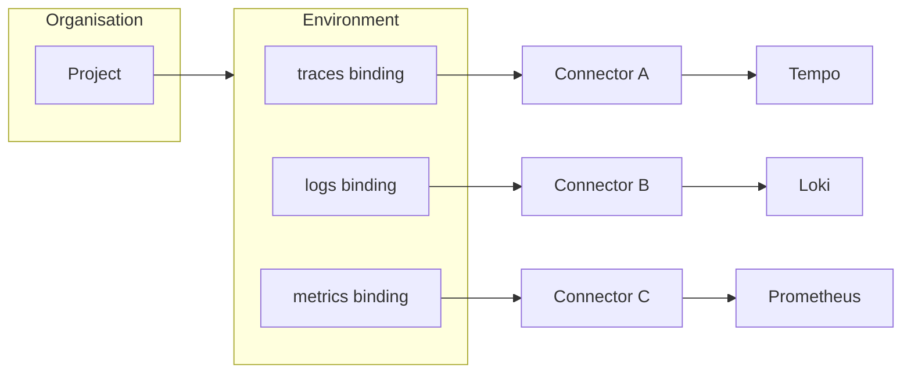

**Connectors** are how OpenLIT attaches to data systems. Each connector is an **atomic** integration: one backend, one credential set, and a clear set of **actions** (test connection, validate AI telemetry, bind signals, manage secrets).

Open the connectors experience from **Organisation → Project → Connectors** (Data sources). Always select the correct [project](/latest/openlit/organisation/projects) and [environment](/latest/openlit/organisation/environments) first — connectors belong to the project, not the organisation root.

<Frame>
  
</Frame>

<Info>
Connectors are the long-term integration point in OpenLIT: **data-source connectors** today, with the same registry model expanding to notifications and other action types over time. Several read paths use portable [@openplait](https://github.com/openlit/openplait) adapters so query behavior stays consistent across backends.
</Info>

## Mental model

- **Atomic connectors** — never a multi-backend blob. One Tempo instance, one Loki instance, one Prometheus endpoint.
- **Signal routing** — each of traces / logs / metrics is bound independently. See [Signal routing](/latest/openlit/organisation/signal-routing).
- **Database Config** — ClickHouse lives as a Database Config and appears as the built-in connector. See [Database Config](/latest/openlit/organisation/database-config).

## Supported connectors (OpenLIT + OpenPlait)

These are the connectors available in open-source OpenLIT. OpenPlait packages power the portable query adapters for ClickHouse, Tempo, Loki, Prometheus, and Jaeger.

### Built-in app store

| Connector | Package / implementation | Signals | What it’s for |
| --- | --- | --- | --- |
| **ClickHouse** | Database Config + `@openplait/adapter-clickhouse` | traces, logs, metrics (+ intelligence) | Default store; full correlation, raw SQL, evals metadata, vault |

### Data-source connectors

| Connector | Package / implementation | Signals | What it’s for |
| --- | --- | --- | --- |
| **Grafana Tempo** | `@openplait/adapter-tempo` | traces | TraceQL search, trace tree, span events |
| **Grafana Loki** | `@openplait/adapter-loki` | logs | LogQL logs; correlate by trace id / service |
| **Prometheus** | `@openplait/adapter-prometheus` | metrics | PromQL HTTP API (also works with Prometheus-compatible endpoints such as Mimir when you point at their query URL) |
| **Jaeger** | `@openplait/adapter-jaeger` | traces | Jaeger Query HTTP API; sampled in-process aggregates |

<Tip>
Prometheus-compatible APIs (for example Grafana Mimir’s PromQL endpoint) use the **Prometheus** connector — there is no separate Mimir connector type in open-source OpenLIT.
</Tip>

## Capability matrix

| Connector | Signals | Trace tree | Span events | Server aggregation | Raw SQL | Cross-signal correlation |
| --- | --- | --- | --- | --- | --- | --- |
| ClickHouse | traces, logs, metrics | Yes | Yes | Yes | Yes | Full |
| Tempo | traces | Yes | Yes | No* | No | trace / span / service |
| Loki | logs | — | — | No | No | trace id, service |
| Prometheus | metrics | — | — | Yes | No | — |
| Jaeger | traces | Yes | Yes | No* | No | trace / span / service |

\* Aggregate graphs are reconstructed in-process from a bounded sample of full traces when the backend cannot aggregate server-side.

## Add a Jaeger connector in OpenLIT

<Frame>
  
</Frame>

1. Select a [project](/latest/openlit/organisation/projects) and environment in the header.  
2. Open **Connectors** and choose **Add connector** / **Add source**.  
3. Pick **Jaeger** from the connector type list.  
4. Set the Query URL (local all-in-one: `http://localhost:16686`) and auth if needed.  
5. Bind **traces** to the connector under [signal routing](/latest/openlit/organisation/signal-routing).  

<Tip>
Local demo credentials for seeded installs: email `user@openlit.io`, password `openlituser`. Jaeger all-in-one + seed script live in the OpenPlait `adapter-jaeger` integration folder.
</Tip>

## Actions you can take on a connector

The connector registry is designed so **actions** attach to a connector type. Today’s data-source actions:

| Action | When to use it |
| --- | --- |
| **Add / edit connector** | Point OpenLIT at a new endpoint or rotate settings |
| **Store credentials in Vault** | API keys and tokens stay encrypted; decrypted only server-side |
| **Health check / test connection** | Confirm the endpoint is reachable with current auth |
| **Validate AI signal** | Confirm recent AI telemetry exists (`gen_ai.*` / OpenLIT markers) |
| **Bind signal** | Route traces, logs, or metrics to this connector for an environment |
| **Unbind / rebind** | Move a signal to another connector without deleting history in the backend |
| **Mark Database Config active** | Choose which ClickHouse app store the UI uses |
| **Share Database Config** | Grant edit / delete / re-share on a ClickHouse connection |

Enterprise audit logs record connector create/update/delete/test plus bind/unbind (with signal, environment, and previous source when switching). RBAC permissions are `connectors:read|create|update|delete|test|bind` (owner/admin by default).

### Future connector categories

The same registry will grow beyond datasources (for example notification and workflow connectors). Each new category still follows: **atomic connector → credentials → actions → optional bindings**. Data-source connectors remain the foundation for telemetry reads.

## How OpenLIT finds AI telemetry

Backends hold all telemetry — not only AI. OpenLIT applies a layered **AI selector** so reads stay focused:

- Resource `telemetry.sdk.name = openlit`
- Resource `telemetry.distro.name = openlit-cli`
- Any `gen_ai.*` attribute
- `coding_agent.session.id`, or Claude Code session markers
- Known `coding_agent.*` span names

## Authentication cheat sheet

| Backend | Typical auth |
| --- | --- |
| **Grafana Cloud** (Tempo / Loki) | Basic: instance ID + access policy token (`traces:read` / `logs:read`). Use **query** URLs from the Cloud Portal. |
| **Self-hosted Tempo / Loki / Prometheus / Jaeger** | None, Basic, or Bearer; optional tenant / `X-Scope-OrgID` |
| **ClickHouse** | Username / password on the Database Config |

## Security and reliability

- Endpoints validated (`http`/`https` only); credentials in URLs rejected; private/metadata SSRF targets blocked where applicable.
- Secrets live in Vault, redacted from errors, never logged.
- Per-source concurrency caps, query budgets, short-lived cache + in-flight de-dupe, and backoff on transient `429`/`5xx`.

## OpenPlait packages

OpenLIT wraps these npm packages for portable reads:

| npm package | Used for |
| --- | --- |
| `@openplait/core` | Query IR and normalized results |
| `@openplait/adapter-sdk` | Adapter contracts |
| `@openplait/adapter-clickhouse` | ClickHouse / OTel |
| `@openplait/adapter-tempo` | Tempo / TraceQL |
| `@openplait/adapter-loki` | Loki / LogQL |
| `@openplait/adapter-prometheus` | Prometheus / PromQL |
| `@openplait/adapter-jaeger` | Jaeger Query HTTP API |
| `@openplait/runtime` | Planning and execution helpers |

See the [OpenPlait repository](https://github.com/openlit/openplait) for publishing and adapter docs.

## Related

<CardGroup cols={2}>
  <Card title="Signal routing" href="/latest/openlit/organisation/signal-routing" icon="route">
    Bind traces, logs, and metrics independently.
  </Card>
  <Card title="Environments" href="/latest/openlit/organisation/environments" icon="layer-group">
    Partition configs and connectors by environment.
  </Card>
  <Card title="Database Config" href="/latest/openlit/organisation/database-config" icon="database">
    Env vars → ClickHouse Database Config.
  </Card>
  <Card title="Projects" href="/latest/openlit/organisation/projects" icon="folder">
    How connectors are scoped to a project.
  </Card>
</CardGroup>
