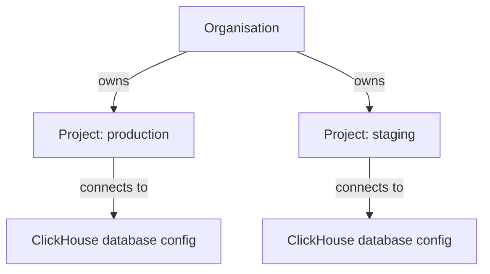

An organisation in OpenLIT is a shared workspace for a team. It owns projects, and each project owns one or more ClickHouse database configurations - this three-level hierarchy is how OpenLIT separates teams, environments, and data without running separate installations.

Use organisations as the membership boundary - who can log in and see this workspace at all. Use projects inside an organisation when you need separate database boundaries for the same team, such as production, staging, or per-customer environments.

## Creating an organisation

New users are prompted to either create an organisation (just a name) or accept a pending invitation during onboarding. Skipping this step creates a personal organisation automatically, so every user always lands in exactly one organisation - onboarding never leaves you without a workspace.

Every organisation gets a default project the moment it's created, and existing installations are migrated into a default project automatically, so upgrading never breaks an existing database configuration.

## Membership and roles

Every organisation member has one of three roles:

| Role | Description |
|---|---|
| **Owner** | The user who created the organisation. Owner status can't be reassigned or changed. |
| **Admin** | Can invite members, manage projects, and change other members' roles (except the owner's). |
| **Member** | Can use the organisation's projects and data; can't manage membership. |

Invite teammates by email from the Organisation page - each invite is scoped to that organisation, and the invited user accepts or declines it from their own onboarding screen. Removing a member revokes their access to every project in that organisation immediately.

## What belongs to an organisation

- Organisation identity, such as the workspace name.
- Members, their roles, and pending invitations.
- Projects owned by the organisation, including the default project.
- Billing and licensing state where applicable.

## Switching and deleting organisations

If you belong to multiple organisations, use the organisation selector in the top navigation to change the active workspace - project and database configuration selectors refresh to match the newly selected organisation. Deleting an organisation removes every project and database configuration that belongs to it, so it's only available to the owner.

## Common tasks

<CardGroup cols={2}>
  <Card title="Manage projects" href="/latest/openlit/organisation/projects" icon="folder">
    Create projects, switch project context, and review project-level structure.
  </Card>
  <Card title="Configure databases" href="/latest/openlit/organisation/database-config" icon="database">
    Add, select, and update ClickHouse database configurations inside a project.
  </Card>
</CardGroup>

## Frequently asked questions

<AccordionGroup>
  <Accordion title="What's the difference between an organisation and a project?">
    An organisation is the membership boundary - it controls who can access a workspace at all. A project is a database boundary inside an organisation - it controls which ClickHouse connection a given environment or team uses. One organisation can have many projects.
  </Accordion>
  <Accordion title="What happens if I skip creating an organisation during onboarding?">
    OpenLIT creates a personal organisation for you automatically, with a default project already set up, so you're never left without a workspace.
  </Accordion>
  <Accordion title="Can I change who owns an organisation?">
    No. The owner is permanently the user who created the organisation. Admins can manage members and projects, but ownership itself can't be reassigned.
  </Accordion>
  <Accordion title="What happens to my data if I delete an organisation?">
    Deleting an organisation deletes every project and database configuration that belongs to it. Only the owner can delete an organisation.
  </Accordion>
</AccordionGroup>
