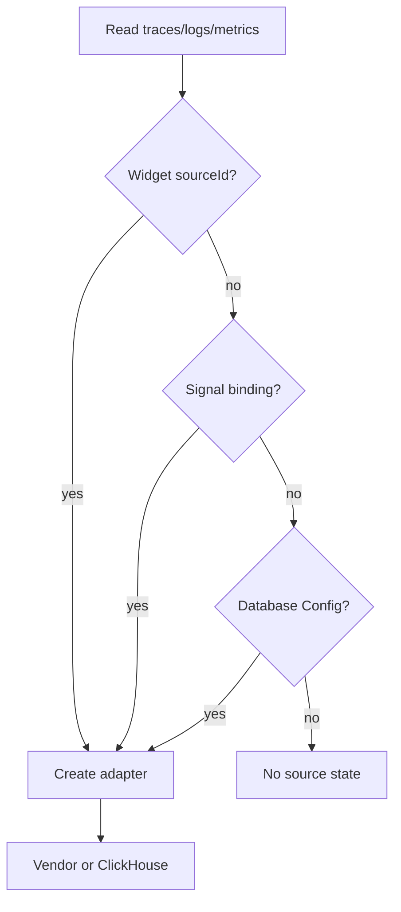

**Signal routing** decides which [connector](/latest/openlit/organisation/connectors) serves each telemetry signal for a project [environment](/latest/openlit/organisation/environments). Bindings are independent: traces can come from Tempo while logs come from Loki and metrics from Prometheus — in the same OpenLIT project.

## Signals

| Signal | Typical connectors | Notes |
| --- | --- | --- |
| **traces** | ClickHouse, Tempo, Jaeger | Powers request views, agent materialization, eval candidate discovery |
| **logs** | ClickHouse, Loki | Correlated when the backend supports trace id / service |
| **metrics** | ClickHouse, Prometheus | PromQL backends support server aggregation |
| **intelligence** | ClickHouse (Database Config) | Derived store — evals, boards metadata, rules, vault — not rebound to external vendors |

<Warning>
Changing a binding changes **where OpenLIT reads**. It does not migrate historical data between backends. Ensure the new connector already holds the telemetry you expect.
</Warning>

## Bind a signal

<Steps>
  <Step title="Open Connectors">
    Go to **Organisation → Project → Connectors** (data sources).
  </Step>
  <Step title="Choose environment">
    Bindings are unique per **project + signal + environment**. Match the environment on your Database Config and connectors.
  </Step>
  <Step title="Add or select a connector">
    Create an atomic connector from the supported catalog, then run **health check** / **AI validate** as needed.
  </Step>
  <Step title="Bind the signal">
    Assign **traces**, **logs**, and/or **metrics** to connectors that declare those capabilities. A metrics-only connector cannot be bound to traces.
  </Step>
</Steps>

When you add a Database Config, OpenLIT can seed default bindings so all signals point at that ClickHouse until you rebind them.

## Resolution order

For every read, OpenLIT resolves the source in this order and **never** returns a connector that does not serve the requested signal:

<Steps>
  <Step title="Explicit override">
    Widget or API `sourceId` (mixed dashboards) wins when present and project-scoped. Use `builtin:<databaseConfigId>` for ClickHouse.
  </Step>
  <Step title="Per-signal binding">
    The binding for this project, signal, and environment.
  </Step>
  <Step title="Built-in ClickHouse">
    Active [Database Config](/latest/openlit/organisation/database-config) for the environment (when no explicit environment fail-closed applies).
  </Step>
</Steps>

If nothing serves the signal, OpenLIT shows a first-class **no source for this signal** state instead of silently reading the wrong backend.

## Mixed dashboards

Each dashboard widget can optionally target its own connector and signal. One board can render Tempo traces next to Prometheus metrics while evaluation results still come from ClickHouse intelligence.

## Correlation across backends

Only ClickHouse holds every signal in one store for **full** correlation. When signals are split:

- Joins use declared keys (`service.name`, trace/span id, `coding_agent.session.id`).
- Features that need correlatable logs/metrics no-op gracefully when the bound source cannot join.
- The UI asks you to connect a correlatable source instead of returning incorrect merges.

## Natural-language / raw SQL

Raw ClickHouse SQL (NL chat and raw-SQL widgets) requires the built-in ClickHouse path. On external connectors, use structured Telemetry, trace, and dashboard views.

## What never leaves ClickHouse

Regardless of signal routing:

- Evaluation results and scoring metadata  
- Dashboard / board definitions and widget layout metadata  
- Rules, vault secrets materialization, controller-derived intelligence  

Raw OTLP **write** paths (SDK exporters, collectors) are separate from these **read** connectors. To mirror only AI telemetry into ClickHouse, see the [OTel Collector AI filter recipe](https://github.com/openlit/openlit/blob/main/assets/otel-collector-ai-filter.yaml).

## Permissions and audit

Enterprise roles control connector management:

| Permission | Typical use |
| --- | --- |
| `connectors:read` | View connectors and current signal bindings |
| `connectors:create` / `update` / `delete` | Add, edit, or remove connectors |
| `connectors:test` | Run health check / AI validation |
| `connectors:bind` | Bind, rebind, or clear a signal for an environment |

Owner and admin built-in roles include the full connector set. Members can read observability data but do not manage connectors by default.

Binding and unbinding are written to the organisation **audit log** (`connectors.connector_bound` / `connectors.connector_unbound`) with signal, environment, next connector, and previous source when switching.

## Related

<CardGroup cols={2}>
  <Card title="Connectors catalog" href="/latest/openlit/organisation/connectors" icon="plug">
    Supported OpenLIT + OpenPlait connectors and actions.
  </Card>
  <Card title="Environments" href="/latest/openlit/organisation/environments" icon="layer-group">
    How bindings are partitioned by environment.
  </Card>
  <Card title="Database Config" href="/latest/openlit/organisation/database-config" icon="database">
    ClickHouse app store and INIT_DB_* bootstrap.
  </Card>
</CardGroup>
