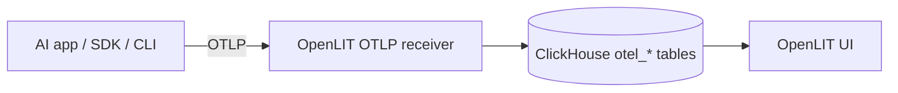

OpenLIT's image includes a first-party **OTLP receiver**. Applications, SDKs, and the `openlit` CLI send traces, metrics, and logs to it. The receiver writes ClickHouse `otel_*` tables. The OpenLIT image does **not** ship `otelcol`.



## Endpoints

| Protocol | Address | Paths |
| --- | --- | --- |
| OTLP/HTTP | `:4318` | `POST /v1/traces`, `POST /v1/metrics`, `POST /v1/logs` (protobuf or JSON; gzip optional) |
| OTLP/gRPC | `:4317` | Standard OTLP gRPC |
| Health | `:4318` | `GET /health` |

The OpenLIT UI also proxies `/v1/*` from the app origin to this process, so the same HTTP paths work through the dashboard host when you cannot reach `:4318` directly.

Docker Compose and Kubernetes examples publish `4317` and `4318` on the **OpenLIT** service (`openlit`), not a separate `otel-collector` container.

Point exporters at the receiver:

```bash
export OTEL_EXPORTER_OTLP_ENDPOINT="http://127.0.0.1:4318"
```

```python
import openlit

openlit.init(otlp_endpoint="http://127.0.0.1:4318")
```

Supported metric types: gauge, sum, histogram, summary, and exponential histogram (`otel_metrics_*` tables).

## Authentication

Send an OpenLIT API key so ingest is scoped to organisation → project → environment and writes to that project's ClickHouse:

```bash
export OTEL_EXPORTER_OTLP_HEADERS="Authorization=Bearer <openlit-api-key>"
```

`x-openlit-api-key` is also accepted. Client `x-database-config-id` headers are ignored.

A valid key stamps `organisation.environment.name`, `openlit.organisation.id`, and `openlit.project.id`. It does **not** overwrite client `deployment.environment`.

Without a key, data is written to `INIT_DB_*` unless `OTLP_REQUIRE_API_KEY=true`.

## Schema

On first ingest, and again if an insert fails because `otel_*` tables were dropped, the receiver runs `CREATE TABLE IF NOT EXISTS` for the OTLP schema and retries the write once. Compose and Kubernetes ClickHouse init scripts still create the same tables on an empty volume.

The ClickHouse user needs `CREATE TABLE` (or the tables must already exist). If create is denied and the tables are missing, ingest fails with an explicit error.

## Optional sidecar Collector

Keep using your own OpenTelemetry Collector for fan-out, sampling, or processors. Forward OTLP to OpenLIT instead of writing ClickHouse from `otelcol`. A starter config is in [`assets/otel-collector-config.yaml`](https://github.com/openlit/openlit/blob/main/assets/otel-collector-config.yaml).

To send SDK data to a Collector you operate (not into OpenLIT), see [OpenTelemetry Collector destination](/latest/sdk/destinations/otelcol).

## Related

<CardGroup cols={2}>
  <Card title="Self-host OpenLIT" href="/latest/openlit/installation" icon="circle-down">
    Docker Compose and Helm deploy OpenLIT plus ClickHouse. OTLP ingest is built in.
  </Card>
  <Card title="Telemetry" href="/latest/openlit/observability/telemetry/overview" icon="wave-pulse">
    Explore traces, metrics, and logs after they land in ClickHouse.
  </Card>
</CardGroup>
