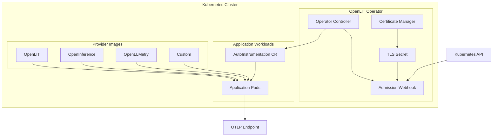
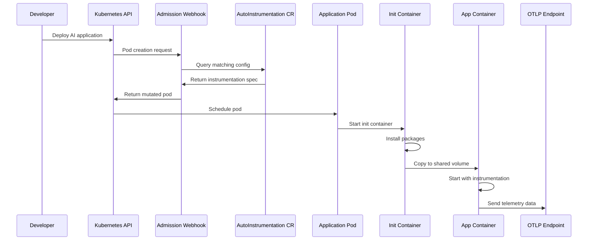
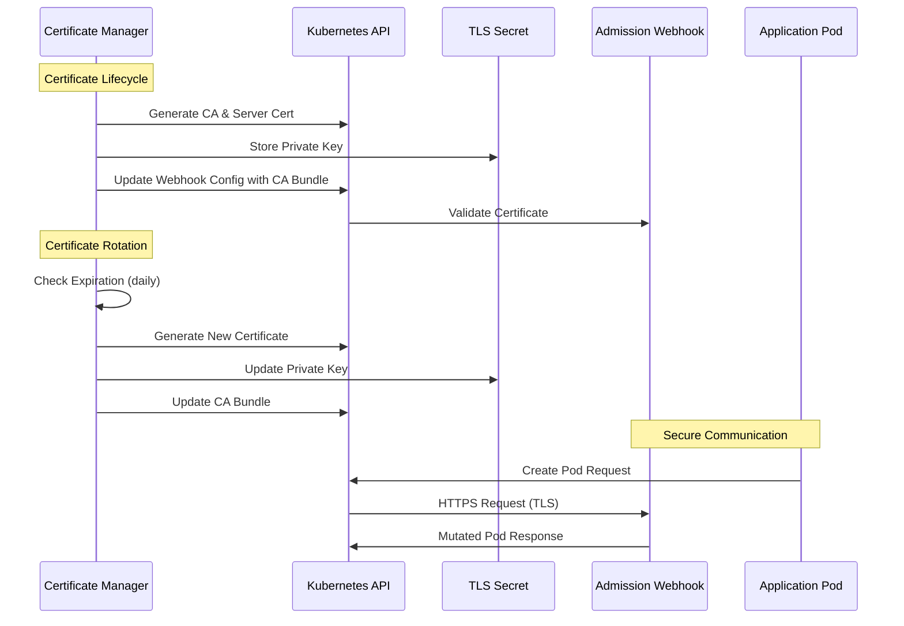
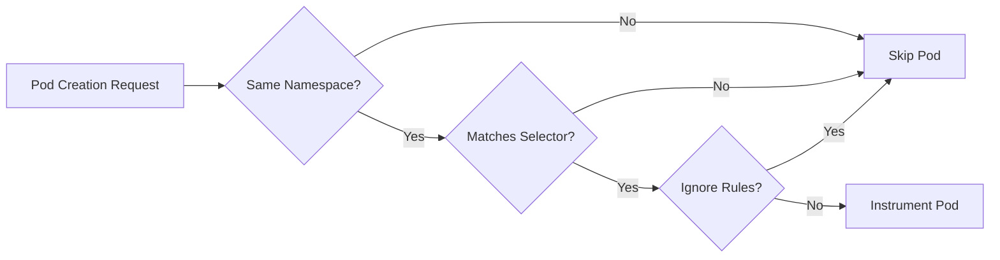
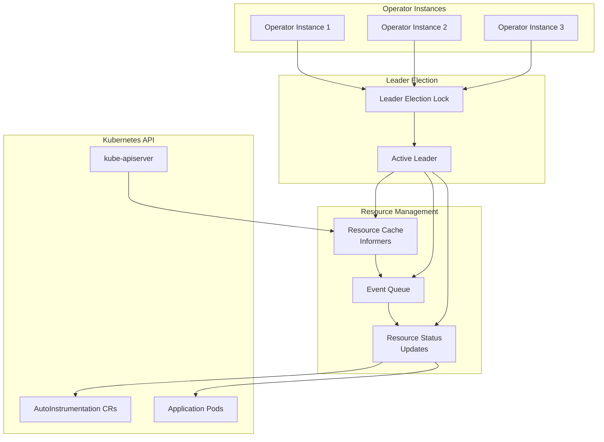

The OpenLIT Operator is built on Kubernetes controller patterns and admission webhooks to provide seamless, zero-code AI observability. This page explains the technical architecture and how components work together.

## Core Components



### Operator Controller
The main controller watches for `AutoInstrumentation` Custom Resources and manages their lifecycle:

- **Resource Validation**: Validates AutoInstrumentation specifications
- **Status Management**: Updates resource status based on instrumentation state
- **Configuration Propagation**: Ensures webhook configurations are up-to-date

### Admission Webhook
A mutating admission webhook that intercepts pod creation requests:

- **Pod Selection**: Uses label selectors to identify pods for instrumentation
- **Init Container Injection**: Adds instrumentation init containers
- **Environment Variables**: Injects OpenTelemetry configuration
- **Volume Mounts**: Sets up shared volumes for instrumentation packages

### TLS Certificate Manager
Automatic TLS certificate management for secure webhook communication:

- **Certificate Generation**: Creates and rotates TLS certificates
- **Kubernetes Secret Storage**: Stores certificates in Kubernetes secrets
- **Multi-Operator Support**: Handles certificate sharing across operator instances

### Init Container Images
Pre-built container images containing instrumentation packages:

- **OpenLIT Image**: `ghcr.io/openlit/openlit-ai-instrumentation`
- **OpenInference Image**: `ghcr.io/openlit/openinference-ai-instrumentation`  
- **OpenLLMetry Image**: `ghcr.io/openlit/openllmetry-ai-instrumentation`

## Instrumentation Flow



<Steps>
  <Step title="Pod Creation Request">
    Developer deploys an application pod with instrumentation labels
    ```yaml
    labels:
      app: ai-chatbot-app
    ```
  </Step>
  
  <Step title="Webhook Interception">
    The admission webhook intercepts the pod creation request from kube-apiserver
  </Step>
  
  <Step title="AutoInstrumentation Lookup">
    Webhook finds matching AutoInstrumentation resources based on:
    - Namespace scope
    - Label selectors
    - Ignore rules
  </Step>
  
  <Step title="Pod Mutation">
    Webhook modifies the pod specification to add:
    - Init container for instrumentation setup
    - Environment variables for OpenTelemetry configuration
    - Volume mounts for shared instrumentation packages
    ```yaml
    initContainers:
    - name: auto-instrumentation-openlit
      image: ghcr.io/openlit/openlit-ai-instrumentation:latest
      volumeMounts:
      - name: instrumentation-packages
        mountPath: /instrumentation-packages
    ```
  </Step>
  
  <Step title="Pod Scheduling">
    Kubernetes schedules the modified pod with instrumentation
  </Step>
  
  <Step title="Init Container Execution">
    Init container runs first and:
    - Copies instrumentation packages to shared volume
    - Installs custom packages if specified
    - Prepares instrumentation environment
  </Step>
  
  <Step title="Application Container Start">
    Main application container starts with:
    - `PYTHONPATH` pointing to instrumentation packages
    - OpenTelemetry environment variables configured
    - Automatic instrumentation enabled
  </Step>
</Steps>

## Custom Resource Definitions

### AutoInstrumentation CRD

The core CRD that defines instrumentation configuration:

```yaml
apiVersion: openlit.io/v1alpha1
kind: AutoInstrumentation
metadata:
  name: my-instrumentation
  namespace: default
spec:
  # Pod selection criteria
  selector:
    matchLabels:
      openlit.io/instrument: "true"
  
  # Optional: Pods to ignore
  ignore:
    matchLabels:
      openlit.io/skip: "true"
  
  # Python instrumentation settings
  python:
    instrumentation:
      enabled: true
      provider: "openlit"
      version: "latest"
      customPackages: "langchain>=0.1.0"
  
  # OTLP configuration
  otlp:
    endpoint: "http://openlit:4318"
    timeout: 30
  
  # Resource attributes
  resource:
    environment: "production"
```

## Security Architecture

### RBAC Permissions

The operator requires specific permissions to function:

```yaml
# Cluster-level permissions
- pods: [get, list, watch, update, patch]
- autoinstrumentations: [get, list, watch, create, update, patch, delete]
- mutatingwebhookconfigurations: [get, list, watch, create, update, patch, delete]

# Namespace-level permissions  
- secrets: [get, list, watch, create, update, patch, delete]
- configmaps: [get, list, watch]
```

### TLS Certificate Security



- **Automatic Rotation**: Certificates rotate before expiration
- **Secure Storage**: Private keys stored in Kubernetes secrets
- **CA Bundle Injection**: Webhook configuration updated with CA bundle
- **Multi-Operator Safety**: Prevents conflicts in multi-operator environments

### Webhook Security

- **TLS Encryption**: All webhook communication is TLS encrypted
- **Certificate Validation**: Kubernetes validates webhook certificates
- **Failure Policy**: Configurable behavior when webhook is unavailable
- **Admission Review**: Only processes valid admission review requests

## Pod Selection Logic

The operator uses a sophisticated matching system to determine which pods to instrument:



### 1. **Primary Selection**
```yaml
selector:
  matchLabels:
    openlit.io/instrument: "true"
  matchExpressions:
  - key: "environment"
    operator: In
    values: ["production", "staging"]
```

### 2. **Ignore Rules**
```yaml
ignore:
  matchLabels:
    openlit.io/skip: "true"
    system-pod: "true"
```

### 3. **Namespace Scope**
- AutoInstrumentation resources only affect pods in the same namespace
- Cross-namespace instrumentation requires separate AutoInstrumentation resources

## State Management

The operator maintains various states and ensures consistent operation across multiple instances:



### Operator State
- **Leader Election**: Ensures only one active operator instance
- **Resource Caching**: Uses Kubernetes informers for efficient resource watching
- **Event Processing**: Queues and processes resource changes

### Resource Status
AutoInstrumentation resources maintain status information:

```yaml
status:
  conditions:
  - type: "Ready"
    status: "True"
    reason: "ValidationSucceeded"
  observedGeneration: 1
  managedPods: 5
```

## Observability and Monitoring

### Operator Logs
Structured JSON logging with configurable levels:
- **Debug**: Detailed webhook and controller operations
- **Info**: Normal operational events
- **Warn**: Non-critical issues and recoverable errors
- **Error**: Critical failures requiring attention

**Note**: The operator currently uses OpenTelemetry logging for observability. These logs can also be directly sent to an OpenTelemetry endpoint.

### Health Checks
- **Readiness Probe**: Webhook server is ready to accept requests
- **Liveness Probe**: Operator is healthy and responsive
- **Webhook Health**: Certificate validity and webhook availability

## Extensibility

### Custom Instrumentation Providers
Support for custom instrumentation through:
- Custom init container images
- Flexible package installation
- Environment variable injection
- Volume mounting capabilities

### Integration Points
- **OpenTelemetry Collectors**: Send telemetry to any OTLP endpoint
- **Observability Platforms**: Compatible with Jaeger, Prometheus, Grafana, etc.
- **Service Meshes**: Works alongside Istio, Linkerd, and other meshes
