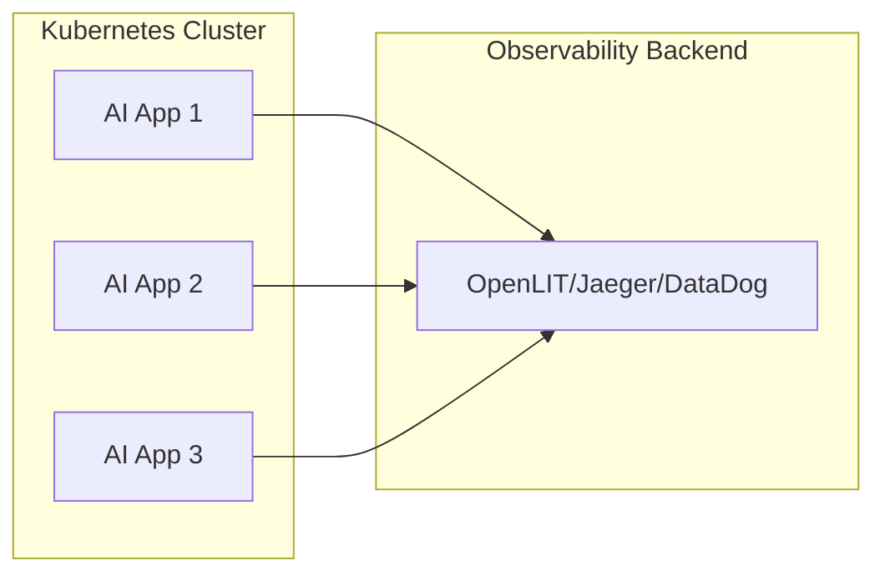
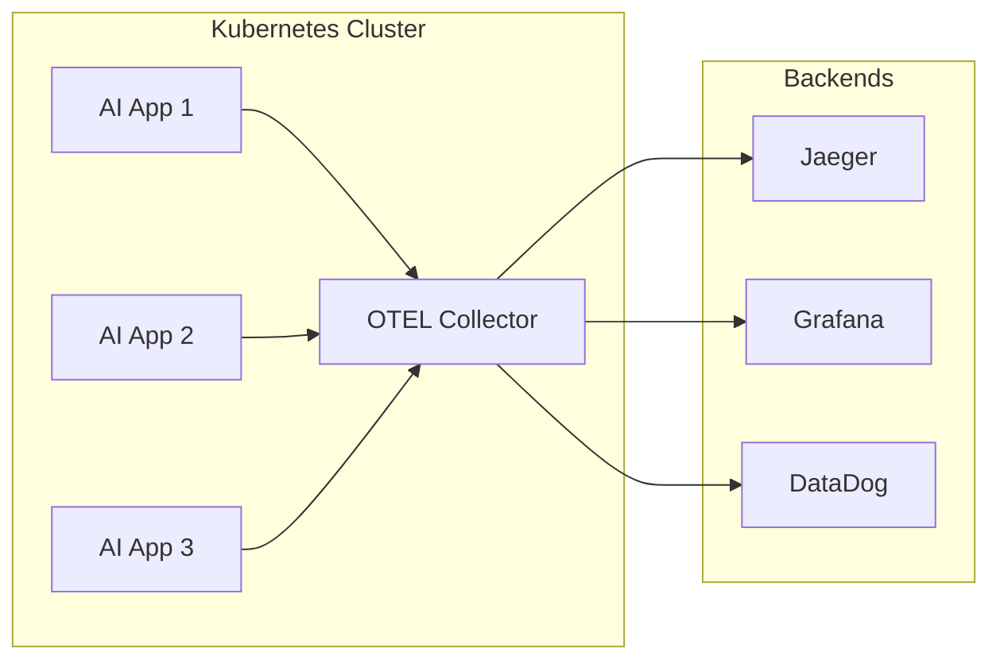
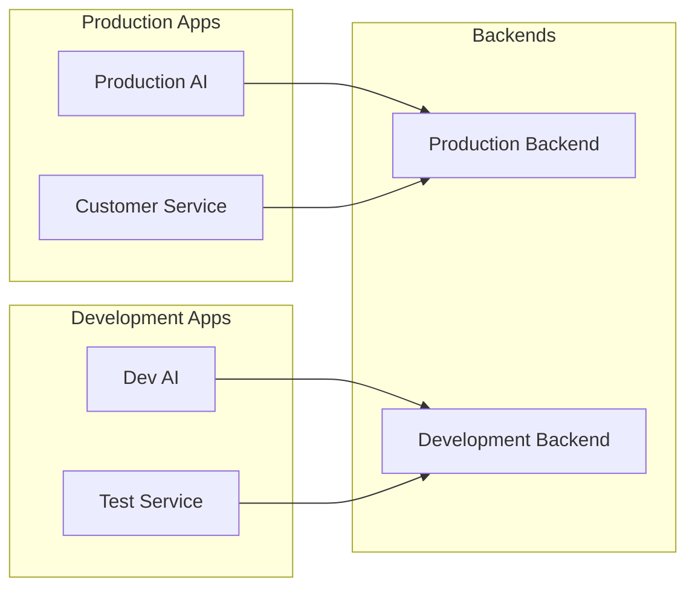

The OpenLIT Operator sends telemetry data to various observability backends through OTLP (OpenTelemetry Protocol). This overview covers destination configuration, backend compatibility, and routing strategies.

## 🌐 What are Destinations?

Destinations are observability backends that receive and process telemetry data from your instrumented applications. The operator supports any OTLP-compatible destination, enabling flexible observability architectures.

## 🔧 How Destinations Work

<Steps>
  <Step title="Telemetry Collection">
    Instrumented applications collect traces, metrics, and logs
  </Step>
  
  <Step title="OTLP Export">
    Data is exported via OpenTelemetry Protocol (OTLP) to configured endpoints
  </Step>
  
  <Step title="Backend Processing">
    Destination backends receive, process, and store the telemetry data
  </Step>
  
  <Step title="Visualization">
    Data is visualized in dashboards, alerts, and analytics tools
  </Step>
</Steps>

## 🎯 Destination Types

<CardGroup cols={2}>
  <Card title="🏠 Self-Hosted Solutions" icon="server">
    **Full control and customization**
    
    OpenLIT, Jaeger, Grafana Stack, Elastic Stack, and more
  </Card>
  
  <Card title="☁️ Cloud Observability" icon="cloud">
    **Managed services**
    
    DataDog, New Relic, Honeycomb, Grafana Cloud, and others
  </Card>
  
  <Card title="🔀 OpenTelemetry Collectors" icon="route">
    **Data processing and routing**
    
    OTEL Collectors for data transformation and multi-backend routing
  </Card>
  
  <Card title="🏢 Enterprise Platforms" icon="building">
    **Enterprise observability**
    
    Splunk, Dynatrace, AppDynamics, and proprietary solutions
  </Card>
</CardGroup>

## 🔄 Destination Architectures

### Direct Export

Simple one-to-one mapping from applications to destinations:



**Configuration:**
```yaml
spec:
  otlp:
    endpoint: "http://openlit:4318"
```

### Collector-Based Routing

Use OpenTelemetry Collector for data processing and routing:



**Configuration:**
```yaml
spec:
  otlp:
    endpoint: "http://otel-collector:4318"
```

### Multi-Destination Setup

Route different applications to different destinations:



**Configuration:**
```yaml
# Production instrumentation
apiVersion: openlit.io/v1alpha1
kind: AutoInstrumentation
metadata:
  name: production-instrumentation
spec:
  selector:
    matchLabels:
      environment: "production"
  otlp:
    endpoint: "https://prod-traces.company.com:4318"

---
# Development instrumentation
apiVersion: openlit.io/v1alpha1
kind: AutoInstrumentation
metadata:
  name: development-instrumentation
spec:
  selector:
    matchLabels:
      environment: "development"
  otlp:
    endpoint: "http://dev-jaeger:4318"
```

## 🔧 Configuration Options

### Basic OTLP Configuration

| Parameter | Description | Default | Example |
|-----------|-------------|---------|---------|
| `endpoint` | OTLP endpoint URL | Required | `"http://openlit:4318"` |
| `headers` | HTTP headers | `""` | `"authorization=Bearer token"` |
| `timeout` | Request timeout (seconds) | `30` | `60` |

### Advanced Configuration

| Parameter | Description | Default | Example |
|-----------|-------------|---------|---------|
| `compression` | Compression algorithm | `""` | `"gzip"` |
| `insecure` | Disable TLS verification | `false` | `true` |
| `certificate` | Custom TLS certificate | `""` | Path to cert file |
| `retry_enabled` | Enable automatic retries | `true` | `false` |

## 🌟 Popular Destinations

### Self-Hosted Solutions

<CardGroup cols={2}>
  <Card title="🚀 OpenLIT" icon="rocket">
    **Complete AI observability platform**
    
    - Native AI/LLM support
    - Cost tracking and analytics
    - Business intelligence features
    - Built-in dashboards
  </Card>
  
  <Card title="🔍 Jaeger" icon="search">
    **Distributed tracing system**
    
    - OpenTelemetry native
    - High performance
    - Simple deployment
    - Open source
  </Card>
  
  <Card title="📊 Grafana Stack" icon="chart-line">
    **Observability platform**
    
    - Tempo for traces
    - Prometheus for metrics
    - Loki for logs
    - Unified dashboards
  </Card>
  
  <Card title="🔍 Elastic Stack" icon="magnifying-glass">
    **Search and analytics**
    
    - APM for traces
    - Elasticsearch for storage
    - Kibana for visualization
    - Machine learning features
  </Card>
</CardGroup>

### Cloud Observability

<CardGroup cols={2}>
  <Card title="🐕 DataDog" icon="dog">
    **Cloud monitoring platform**
    
    - APM and infrastructure
    - AI/ML monitoring
    - Log management
    - Real user monitoring
  </Card>
  
  <Card title="🆕 New Relic" icon="chart-bar">
    **Full-stack observability**
    
    - Application monitoring
    - Infrastructure monitoring
    - Synthetic monitoring
    - AI insights
  </Card>
  
  <Card title="🍯 Honeycomb" icon="honeycomb">
    **Observability platform**
    
    - High-cardinality data
    - Query-driven exploration
    - Service maps
    - Intelligent alerting
  </Card>
  
  <Card title="☁️ Grafana Cloud" icon="cloud">
    **Managed Grafana stack**
    
    - Hosted Tempo/Prometheus/Loki
    - Global infrastructure
    - Enterprise features
    - Automatic scaling
  </Card>
</CardGroup>

### Enterprise Platforms

<CardGroup cols={2}>
  <Card title="🔧 Splunk" icon="gear">
    **Enterprise platform**
    
    - APM and observability
    - Log analysis
    - Security monitoring
    - Custom integrations
  </Card>
  
  <Card title="⚡ Dynatrace" icon="bolt">
    **Full-stack monitoring**
    
    - AI-powered insights
    - Automatic discovery
    - Real user monitoring
    - Cloud-native support
  </Card>
</CardGroup>

## 🔄 Configuration Examples

### OpenLIT Destination

```yaml
# Direct OpenLIT connection
spec:
  otlp:
    endpoint: "http://openlit:4318"
    timeout: 30

# OpenLIT with authentication
spec:
  otlp:
    endpoint: "https://cloud.openlit.io:4318"
    headers: "authorization=Bearer ol-xxxxx"
    timeout: 60
```

### Jaeger Destination

```yaml
# Jaeger collector endpoint
spec:
  otlp:
    endpoint: "http://jaeger-collector:4318"
    timeout: 30

# Jaeger with custom headers
spec:
  otlp:
    endpoint: "http://jaeger-collector:4318"
    headers: "x-tenant=production"
```

### DataDog Destination

```yaml
# DataDog APM endpoint
spec:
  otlp:
    endpoint: "https://trace.agent.datadoghq.com"
    headers: "dd-api-key=${DD_API_KEY}"
    timeout: 30
```

### New Relic Destination

```yaml
# New Relic OTLP endpoint
spec:
  otlp:
    endpoint: "https://otlp.nr-data.net:4318/v1/traces"
    headers: "api-key=${NEW_RELIC_LICENSE_KEY}"
    timeout: 30
```

### Grafana Cloud Destination

```yaml
# Grafana Cloud Tempo
spec:
  otlp:
    endpoint: "https://tempo-prod-04-prod-us-central-0.grafana.net:443/tempo"
    headers: "authorization=Basic ${GRAFANA_CLOUD_TOKEN}"
    timeout: 30
```

## 🔀 OpenTelemetry Collector Integration

### Collector Benefits

- **Data Processing**: Transform and enrich telemetry data
- **Multi-Backend**: Send data to multiple destinations
- **Buffering**: Handle backend outages gracefully
- **Filtering**: Reduce data volume and costs
- **Security**: Centralized credential management

### Basic Collector Configuration

```yaml
# otel-collector-config.yaml
receivers:
  otlp:
    protocols:
      grpc:
        endpoint: 0.0.0.0:4317
      http:
        endpoint: 0.0.0.0:4318

processors:
  batch:
    send_batch_size: 1024
    timeout: 5s
  
  resource:
    attributes:
    - key: environment
      value: production
      action: upsert

exporters:
  # Primary destination
  otlp/primary:
    endpoint: http://openlit:4317
    tls:
      insecure: true
  
  # Secondary destination
  jaeger:
    endpoint: jaeger-collector:14250
    tls:
      insecure: true

service:
  pipelines:
    traces:
      receivers: [otlp]
      processors: [resource, batch]
      exporters: [otlp/primary, jaeger]
```

### Multi-Backend Collector

```yaml
# Advanced multi-backend configuration
exporters:
  # OpenLIT for AI observability
  otlp/openlit:
    endpoint: http://openlit:4317
    tls:
      insecure: true
  
  # DataDog for infrastructure
  datadog:
    api:
      key: ${DD_API_KEY}
      site: datadoghq.com
  
  # Jaeger for development
  jaeger:
    endpoint: jaeger-collector:14250
    tls:
      insecure: true

service:
  pipelines:
    traces/production:
      receivers: [otlp]
      processors: [batch]
      exporters: [otlp/openlit, datadog]
    
    traces/development:
      receivers: [otlp]
      processors: [batch]
      exporters: [jaeger]
```

## 🔒 Security and Authentication

### Authentication Methods

| Method | Description | Example |
|--------|-------------|---------|
| **API Key** | Simple key-based auth | `"x-api-key=secret123"` |
| **Bearer Token** | OAuth/JWT tokens | `"authorization=Bearer token"` |
| **Basic Auth** | Username/password | `"authorization=Basic base64(user:pass)"` |
| **Custom Headers** | Proprietary auth | `"x-custom-auth=value"` |

### TLS Configuration

```yaml
# TLS with custom certificate
spec:
  otlp:
    endpoint: "https://secure-endpoint:4318"
    certificate: "/path/to/ca.crt"
    insecure: false

# TLS with system certificates
spec:
  otlp:
    endpoint: "https://cloud-provider:4318"
    insecure: false
```

### Secret Management

```yaml
# Using Kubernetes secrets
spec:
  otlp:
    endpoint: "https://cloud-endpoint:4318"
    headers: "authorization=Bearer ${AUTH_TOKEN}"
  python:
    instrumentation:
      env:
      - name: AUTH_TOKEN
        valueFrom:
          secretKeyRef:
            name: observability-secret
            key: auth-token
```

## 📊 Monitoring Destination Health

### Health Check Configuration

```yaml
# Enable health monitoring
spec:
  python:
    instrumentation:
      env:
      - name: OTEL_EXPORTER_OTLP_TIMEOUT
        value: "30000"  # 30 seconds
      - name: OTEL_EXPORTER_OTLP_RETRY_ENABLED
        value: "true"
      - name: OTEL_EXPORTER_OTLP_RETRY_MAX_ATTEMPTS
        value: "3"
```

### Destination Metrics

Monitor these key metrics for destination health:

| Metric | Description | Alert Threshold |
|--------|-------------|-----------------|
| `otlp_export_success_rate` | Export success percentage | < 95% |
| `otlp_export_duration` | Export latency | > 5 seconds |
| `otlp_export_queue_size` | Pending exports | > 1000 |
| `otlp_export_errors_total` | Export error count | > 10/min |

## 🚨 Troubleshooting

<AccordionGroup>
  <Accordion title="Connection refused errors">
    **Symptoms:** Applications can't reach destination endpoint
    
    **Solutions:**
    ```bash
    # Test connectivity
    kubectl exec pod-name -- curl http://openlit:4318/v1/traces
    
    # Check DNS resolution
    kubectl exec pod-name -- nslookup openlit
    
    # Verify network policies
    kubectl get networkpolicies
    ```
  </Accordion>
  
  <Accordion title="Authentication failures">
    **Symptoms:** 401/403 errors in logs
    
    **Solutions:**
    ```bash
    # Check headers configuration
    kubectl get autoinstrumentation -o yaml
    
    # Verify secrets
    kubectl get secrets
    kubectl describe secret observability-secret
    
    # Test authentication manually
    curl -H "authorization=Bearer token" http://endpoint:4318
    ```
  </Accordion>
  
  <Accordion title="High export latency">
    **Symptoms:** Slow trace export causing application delays
    
    **Solutions:**
    ```yaml
    # Increase timeout
    spec:
      otlp:
        timeout: 60
    
    # Enable batching
    env:
    - name: OTEL_BSP_MAX_EXPORT_BATCH_SIZE
      value: "512"
    - name: OTEL_BSP_EXPORT_TIMEOUT
      value: "30000"
    ```
  </Accordion>
  
  <Accordion title="Data not appearing in destination">
    **Symptoms:** Exports succeed but no data visible
    
    **Solutions:**
    ```bash
    # Check destination logs
    kubectl logs deployment/openlit
    
    # Verify data format
    kubectl logs pod-name | grep -i otlp
    
    # Check sampling configuration
    kubectl exec pod-name -- env | grep OTEL_TRACES_SAMPLER
    ```
  </Accordion>
</AccordionGroup>

## 📖 Next Steps

<CardGroup cols={2}>
  <Card title="🌐 Supported Backends" href="/latest/operator/destinations-supported" icon="list">
    Explore detailed configuration for specific backends
  </Card>
  <Card title="🎯 Instrumentations" href="/latest/operator/instrumentations-overview" icon="target">
    Learn about different instrumentation providers
  </Card>
  <Card title="⚙️ Configuration" href="/latest/operator/config-autoinstrumentation" icon="gear">
    Configure AutoInstrumentation resources
  </Card>
  <Card title="🔧 Troubleshooting" href="/latest/operator/troubleshooting" icon="wrench">
    Debug destination connectivity issues
  </Card>
</CardGroup>
