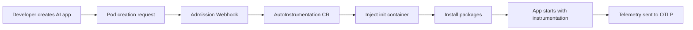

The **OpenLIT Operator** brings zero-code AI observability to Kubernetes environments, automatically injecting instrumention to your AI applications with **OpenTelemetry** to produce distributed traces and metrics **without requiring any code changes**. 

Its built specifically for AI workloads, it provides seamless observability for LLMs, vector databases, and AI frameworks running in Kubernetes.

## Features

* ⚡ **Zero-Code Instrumentation** - OpenLIT Operator automatically injects and configures instrumentation in your AI applications and produces distributed traces and metrics **without any code changes**.
* 🔭 **OpenTelemetry-native** - Built entirely on OpenTelemetry standards and protocols, ensuring seamless integration with existing observability infrastructure and vendor-neutral telemetry collection 
* 🔀 **Provider Flexibility** - Support for multiple AI instrumentation providers (OpenLIT, OpenInference, OpenLLMetry, Custom) with easy switching capabilities

OpenLIT achieves this by deploying a set of components that work together to inject, configure, and manage telemetry collection from your AI applications.

## Adopt OpenTelemetry for LLM Apps and AI Agents in minutes

Get complete visibility into your LLM applications and AI Agents running in Kubernetes. Track token usage, monitor agent workflows, measure response times, and debug AI framework interactions - all without touching your code.

### Supported Instrumentations

The OpenLIT Operator automatically instruments:

<CardGroup cols={3}>
  <Card title="LLM Providers" icon="brain">    
    OpenAI, Anthropic, Google, Azure OpenAI, AWS Bedrock, Ollama, Groq, Cohere, Mistral, and more
  </Card>
  <Card title="AI/Agentic Frameworks" icon="cube">    
    LangChain, LlamaIndex, CrewAI, Haystack, AG2, DSPy, Guardrails, and more
  </Card>
  <Card title="Vector Databases" icon="database">    
    ChromaDB, Pinecone, Qdrant, Milvus, Weaviate, and more
  </Card>
</CardGroup>

### Supported Languages

<CardGroup cols={3}>
  <Card title="Python" icon="python">
    **Full support**
    
    Complete instrumentation for all Python based AI applications and AI Agents
  </Card>
  <Card title="Javscript" icon="node-js">
    **Coming soon**
    
    Complete instrumentation for all JS/TS based AI applications and AI Agents
  </Card>
  <Card title="More languages" icon="code">
    **Roadmap**
    
    Java, Go, and other languages planned for future releases
  </Card>
</CardGroup>

## How It Works



<Steps>
  <Step title="Install the Operator">
    Deploy OpenLIT Operator to your Kubernetes cluster using Helm
    ```bash
    helm install openlit-operator openlit/openlit-operator
    ```
  </Step>
  
  <Step title="Create AutoInstrumentation Custom Resource">
    Define which applications to instrument
    ```yaml
    apiVersion: openlit.io/v1alpha1
    kind: AutoInstrumentation
    spec:
      selector:
        # Use any existing label from you application deployment
        matchLabels:
          app: backend
          type: chatbotagent
      otlp:
        endpoint: "http://openlit:4318"
    ```
  </Step>
  
  <Step title="Zero-Code AI Observability Ready!">
    Restart your pods and they automatically start emitting distributed traces with LLM costs, token usage, and agent performance metrics.
  </Step>
</Steps>

## Next Steps

Ready to get started? Follow our guides:

<CardGroup cols={2}>
  <Card title="🚀 Quickstart" href="/latest/operator/quickstart" icon="rocket">
    Get started in 5 minutes with Helm installation and test application
  </Card>
  <Card title="🛠️ Installation" href="/latest/operator/installation" icon="download">
    Detailed Helm installation guide with prerequisites and configuration
  </Card>
  <Card title="🏗️ Architecture" href="/latest/operator/architecture" icon="sitemap">
    Understand how the operator works under the hood
  </Card>
  <Card title="⚙️ Configuration" href="/latest/operator/configuration/operator" icon="gear">
    Configure the operator and AutoInstrumentation resources
  </Card>
</CardGroup>