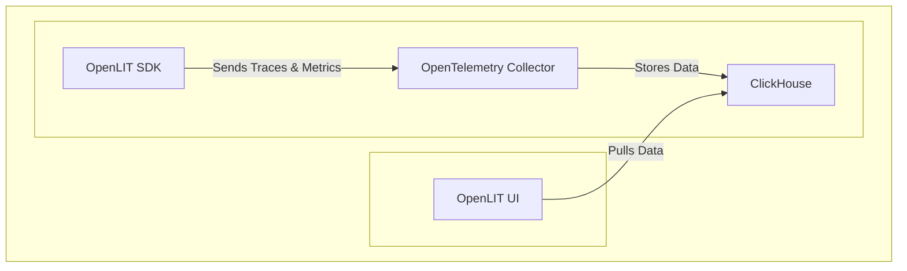

This guide will walk you through setting up OpenTelemetry Auto Instrumentation for monitoring your LLM Application using OpenLIT. In just a few steps, you'll be able to track and analyze the performance and usage of your LLM Applications. 
In this guide, we'll show how you can send OpenTelemetry traces and metrics from your LLM Applications to Grafana Cloud



<Steps>
    <Step title="Deploy OpenLIT UI">
      <Steps>
        <Step title="Git Clone OpenLIT Repository">
        ```shell
        git clone git@github.com:openlit/openlit.git
        ```
        </Step>
        <Step title="Start Docker Compose">
        From the root directory of the [OpenLIT Repo](https://github.com/openlit/openlit), Run the below command:
        ```shell
        docker-compose up -d
        ```
        </Step>
      </Steps>
    </Step>
    <Step title="Install the OpenLIT SDK">
      ```shell
      pip install openlit
      ```
    </Step>
    <Step title="Initialize the OpenLIT in Your Application">
      Add the following two lines to your application code:
      <Tabs>
      <Tab title="Setup using function arguments">
      ```python
      import openlit

      openlit.init(otlp_endpoint="http://127.0.0.1:4318")
      ```

      Example Usage for monitoring `OpenAI` Usage:

      ```python
      from openai import OpenAI
      import openlit

      openlit.init(otlp_endpoint="http://127.0.0.1:4318")

      client = OpenAI(
          api_key="YOUR_OPENAI_KEY"
      )

      chat_completion = client.chat.completions.create(
          messages=[
              {
                  "role": "user",
                  "content": "What is LLM Observability",
              }
          ],
          model="gpt-3.5-turbo",
      )
      ```
      </Tab>
      <Tab title="Setup using Environment Variables">
      
      Add the following two lines to your application code:
      ```python
      import openlit

      openlit.init()
      ```

      Run the following command to configure the OTEL export endpoint:
      ```shell
      export OTEL_EXPORTER_OTLP_ENDPOINT = "http://127.0.0.1:4318"
      ```

      Example Usage for monitoring `OpenAI` Usage:

      ```python
      from openai import OpenAI
      import openlit

      openlit.init()

      client = OpenAI(
          api_key="YOUR_OPENAI_KEY"
      )

      chat_completion = client.chat.completions.create(
          messages=[
              {
                  "role": "user",
                  "content": "What is LLM Observability",
              }
          ],
          model="gpt-3.5-turbo",
      )
      ```
      </Tab>
      </Tabs>
      Refer to the OpenLIT [Python SDK repository](https://github.com/openlit/openlit/tree/main/sdk/python) for more advanced configurations and use cases.
    </Step>
    <Step title="Visualize and Analyze">
    With the LLM Observability data now being collected and sent to OpenLIT, the next step is to visualize and analyze this data to get insights into your LLM application's performance, behavior, and identify areas of improvement.

    Just head over to OpenLIT UI at `127.0.0.1:3000` on your browser to start exploring. You can login using the default credentials
    - **Email**: `user@openlit.io`
    - **Password**: `openlituser`
    <Frame>
      
      
    </Frame>
    </Step>
</Steps>

You're all set! Following these steps should have you on your way to effectively monitoring your LLM applications with OpenTelemetry. If you wish to send telemetry to any other backend, Refer to our [Connections](./connections/intro). 

If you have any questions or need support, reach out to our [community](https://join.slack.com/t/openlit/shared_invite/zt-2etnfttwg-TjP_7BZXfYg84oAukY8QRQ).

---

<CardGroup cols={2}>
<Card title="Integrations" href="/latest/integrations/introduction" icon='circle-nodes'>
Integrate your LLM Stack with OpenLIT 
</Card>
<Card title="Connections" href="/latest/connections/intro" icon='link'>
Connect to your existing Observablity Stack
</Card>
</CardGroup>