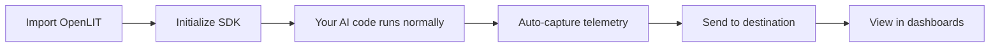

The **OpenLIT SDK** provides comprehensive observability for AI applications through **OpenTelemetry**, enabling developers to monitor LLMs, vector databases, and AI frameworks with **minimal code changes**.

Built specifically for AI workloads, it offers automatic instrumentation, cost tracking, performance metrics, and evaluation capabilities for AI applications across multiple programming languages.

## Features

* 🚀 **Automatic Instrumentation** - Auto-instrument your AI applications with a single line of code using OpenTelemetry standards
* 📊 **Comprehensive Metrics** - Track token usage, costs, response times, and performance across all your AI components
* 🔍 **Distributed Tracing** - Get complete visibility into your AI application flows, from user requests to LLM responses
* 💰 **Cost Tracking** - Monitor spending across providers with support for custom model pricing
* 🛡️ **Quality Evaluations** - Built-in bias, toxicity, and hallucination detection for AI outputs
* 🎯 **Provider Agnostic** - Works with 60+ LLM providers, vector databases, and AI frameworks

## Instrument Your AI Apps in 2 Lines of Code

Get complete observability for your AI applications. Track LLM costs, monitor agent performance, measure response times, and evaluate AI outputs - all with minimal setup.

### Supported Integrations

The OpenLIT SDK automatically instruments:

<CardGroup cols={3}>
  <Card title="LLM Providers" icon="brain">    
    OpenAI, Anthropic, Google, Azure OpenAI, AWS Bedrock, Ollama, Groq, Cohere, Mistral, and 40+ more
  </Card>
  <Card title="AI/Agentic Frameworks" icon="cube">    
    LangChain, LlamaIndex, CrewAI, Haystack, AG2, DSPy, Guardrails, and more
  </Card>
  <Card title="Vector Databases" icon="database">    
    ChromaDB, Pinecone, Qdrant, Milvus, Weaviate, and more
  </Card>
</CardGroup>

### Supported Languages

<CardGroup cols={2}>
  <Card title="Python" icon="python">
    **Full support**
    
    Complete instrumentation for all Python-based AI applications with automatic dependency detection
  </Card>
  <Card title="TypeScript/JavaScript" icon="node-js">
    **Full support**
    
    Complete instrumentation for Node.js applications with TypeScript and JavaScript support
  </Card>
</CardGroup>

## How It Works



<Steps>
  <Step title="Install the SDK">
    Add OpenLIT to your project
    
    <Tabs>
      <Tab title="Python">
        ```bash
        pip install openlit
        ```
      </Tab>
      <Tab title="TypeScript">
        ```bash
        npm install @openlit/openlit
        ```
      </Tab>
    </Tabs>
  </Step>
  
  <Step title="Initialize with 2 lines of code">
    Import and initialize OpenLIT in your application
    
    <Tabs>
      <Tab title="Python">
        ```python
        import openlit
        openlit.init()
        
        # Your existing AI code works without changes
        client = OpenAI()
        response = client.chat.completions.create(...)
        ```
      </Tab>
      <Tab title="TypeScript">
        ```typescript
        import openlit from '@openlit/openlit';
        openlit.init();
        
        // Your existing AI code works without changes
        const client = new OpenAI();
        const response = await client.chat.completions.create(...);
        ```
      </Tab>
    </Tabs>
  </Step>
  
  <Step title="Comprehensive AI Observability Ready!">
    Your AI applications automatically start emitting distributed traces with LLM costs, token usage, performance metrics, and quality evaluations.
  </Step>
</Steps>

## Core Capabilities

<CardGroup cols={2}>
  <Card title="Tracing" href="/latest/openlit/observability/tracing" icon="bars-staggered">
    Distributed tracing for complete AI application visibility
  </Card>
  <Card title="Metrics" href="/latest/openlit/observability/metrics" icon="chart-line">
    Performance and usage metrics with OpenTelemetry
  </Card>
  <Card title="Cost Tracking" href="/latest/sdk/features/pricing" icon="dollar-sign">
    Monitor AI costs across providers and custom models
  </Card>
  <Card title="Evaluations" href="/latest/sdk/features/evaluations" icon="shield-check">
    Built-in bias, toxicity, and hallucination detection
  </Card>
</CardGroup>

## Next Steps

Ready to get started? Follow our guides:

<CardGroup cols={2}>
  <Card title="🚀 Quickstart - Observability" href="/latest/quickstart-observability" icon="rocket">
    Get started in 5 minutes with basic tracing and metrics
  </Card>
  <Card title="🛡️ Quickstart - Evaluations" href="/latest/quickstart-evals" icon="shield">
    Add AI quality evaluations to your application
  </Card>
  <Card title="🔧 Configuration" href="/latest/sdk/configuration" icon="gear">
    Detailed SDK configuration options and advanced settings
  </Card>
  <Card title="🔌 Integrations" href="/latest/sdk/integrations/introduction" icon="plug">
    Explore 60+ supported LLM providers, frameworks, and databases
  </Card>
</CardGroup>
