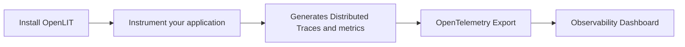

The OpenLIT SDK is an **open-source**, **OpenTelemetry-native** AI observability platform
that enables production-ready LLM application and agent monitoring **without any code changes**. 

It includes upstream OpenTelemetry instrumentations for HTTP frameworks, clients, and system components, delivering **complete visibility across your entire AI infrastructure**.

## Goals

- **Zero Code AI Observability** - Enable production-ready LLM monitoring for your AI applications **without any code changes**.

- **OpenTelemetry Native** - Built on OpenTelemetry standards for seamless integration with existing observability stacks like Grafana, Datadog, New Relic, and Dash0.

- **Drop-in Replacement** - Simply replace `opentelemetry-instrument` with `openlit-instrument` to get the same functionality plus comprehensive AI capabilities.

- **Complete Stack Coverage** - AI instrumentations + upstream OpenTelemetry instrumentations for full-stack observability.

- **End-to-End Distributed Tracing** - Complete visibility: HTTP requests → framework routing → database queries → LLM calls → agent workflows → tool usage → responses

- **Advanced LLM Monitoring** - Real-time cost tracking, token usage optimization, performance monitoring, and evaluations scoring.

## Supported instrumentations

The OpenLIT SDK automatically instruments:

<CardGroup cols={2}>
  <Card title="LLM Providers" icon="brain">    
    OpenAI, Anthropic, Google, Azure OpenAI, AWS Bedrock, Ollama, Groq, Cohere, Mistral, and more
  </Card>
  <Card title="AI/Agentic Frameworks" icon="cube">    
    LangChain, LlamaIndex, CrewAI, mem0, AG2, DSPy, Agno, and more
  </Card>
  <Card title="Vector Databases" icon="database">    
    ChromaDB, Pinecone, Qdrant, Milvus, Weaviate, and more
  </Card>
  <Card title="GPUs" icon="server">
    NVIDIA and AMD
  </Card>
  <Card title="HTTP Frameworks and Clients" icon="globe">    
     FastAPI, Flask, Django, Requests, HTTPX, aiohttp, urllib and more
  </Card>
</CardGroup>

## Supported languages

<CardGroup cols={3}>
  <Card title="Python" icon="python">
    Complete AI observability with automatic dependency detection. Zero-code instrumentation for production Python LLM applications with real-time performance monitoring.
  </Card>
  <Card title="TypeScript/JavaScript" icon="node-js">
    Full LLM monitoring support for TypeScript / JavaScript applications with distributed tracing, metrics and cost optimization.
  </Card>
  <Card title="Go" icon="golang" href="/latest/sdk/go-overview">
    OpenTelemetry-native instrumentation for Go applications. Wrap your OpenAI and Anthropic clients for automatic tracing, token tracking, and cost monitoring.
  </Card>
</CardGroup>

## How it works


```mermaid
flowchart LR
    A[Install OpenLIT] --> B[Instrument your application]
    B --> C[Generates Distributed Traces and metrics]
    C --> D[OpenTelemetry Export]
    D --> E[Observability Dashboard]
```

**Option 1: Zero code instrumentation**
```bash
openlit-instrument python your_app.py
```

**Option 2: Manual instrumentation**
```python
import openlit

openlit.init()  # Enables Automatic instrumentation for AI apps and agents
```

Both approaches provide production-ready observability: **distributed tracing**, **real-time cost tracking**, **latency monitoring**, **token usage optimization**, and **evaluation scoring**.

## Getting started
Select from the following guides to learn more about production AI monitoring:

<CardGroup cols={2}>
  <Card title="Quickstart: LLM Observability" href="/latest/sdk/quickstart-ai-observability" icon='bolt'>
    Production-ready AI monitoring setup in 2 simple steps with zero code changes
  </Card>
  <Card title="Integrations" href="/latest/sdk/integrations/overview" icon='circle-nodes'>
    60+ AI integrations with automatic instrumentation and performance tracking
  </Card>
  <Card title="Deploy OpenLIT Platform" href="/latest/openlit/installation" icon='circle-down'>
    Deployment options for scalable LLM monitoring infrastructure
  </Card>
  <Card title="Destinations" href="/latest/sdk/destinations/overview" icon='link'>
    Send telemetry to Datadog, Grafana, New Relic, Dash0, and other observability stacks
  </Card>
</CardGroup>

## Frequently asked questions

<AccordionGroup>
  <Accordion title="What is the OpenLIT SDK?">
    The OpenLIT SDK is an open-source, OpenTelemetry-native library that auto-instruments LLM providers, agent frameworks, and vector databases for AI observability - tracing, cost tracking, and evaluation - without code changes.
  </Accordion>
  <Accordion title="Does the SDK require changing my code?">
    No. Run `openlit-instrument python your_app.py` for zero-code instrumentation, or call `openlit.init()` once if you prefer manual setup - both produce the same OpenTelemetry traces.
  </Accordion>
  <Accordion title="Can I send data to my existing observability stack?">
    Yes. Since the SDK emits standard OpenTelemetry data, you can export to Datadog, Grafana, New Relic, Dash0, or any OTLP-compatible backend - see [Destinations](/latest/sdk/destinations/overview).
  </Accordion>
</AccordionGroup>