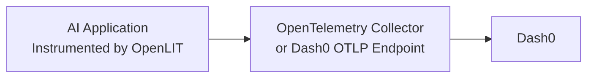

<Frame>
  
</Frame>

<Frame>
  
</Frame>

To send OpenTelemetry metrics and traces generated by OpenLIT from your AI Application to Dash0, follow the below steps.

### 1. Dash0 Setup

<Note>
**Prerequisites**: You'll need a Dash0 account and authorization token. [Sign up at dash0.com](https://www.dash0.com) for a 14-days free trial, if you don't have an account yet.
</Note>

#### Get your Dash0 credentials

1. Log into your Dash0 account
2. Navigate to **Organization Settings** → **Auth Tokens**
3. Create a new token or copy an existing one
4. Note your Dash0 OTLP ingestion endpoint (e.g., `ingress.eu-west-1.aws.dash0.com:4318` for HTTP or `:4317` for gRPC)
5. Your token will be in the format `Bearer auth_xxxxx...`

<Note>
You can send telemetry directly to Dash0's OTLP endpoint, or route it through an OpenTelemetry Collector for additional processing and filtering.
</Note>

