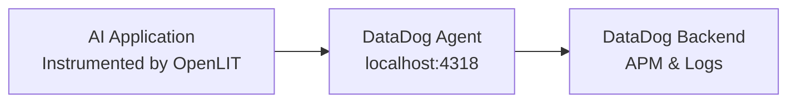

<Frame>
  
</Frame>

To send OpenTelemetry metrics and traces generated by OpenLIT from your AI Application to DataDog via the DataDog Agent, follow the below steps.

### 1. DataDog Agent Setup

<Note>
**Prerequisites**: This guide assumes you have a DataDog Agent already installed and configured with OpenTelemetry support. 
If you need to install the DataDog Agent, please refer to the [DataDog Agent Installation Guide](https://docs.datadoghq.com/agent/).
</Note>

