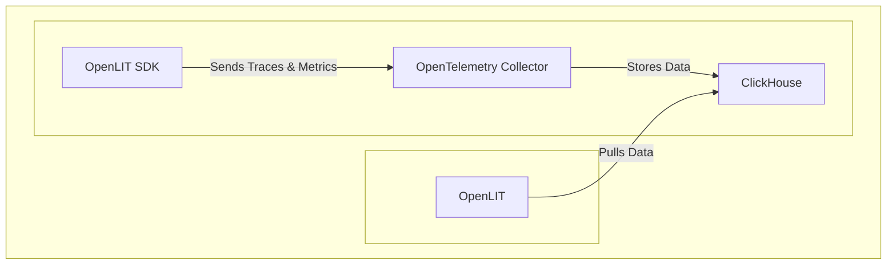

This guide demonstrates production-ready MCP (Model Context Protocol) observability setup with OpenTelemetry-native auto-instrumentations. Get enterprise-grade AI monitoring with **zero code changes** using our CLI or minimal SDK integration for complete MCP performance tracking.

Learn how to implement real-time context tracking, tool usage monitoring, protocol performance analysis, and resource utilization optimization for your MCP applications with OpenTelemetry traces and metrics.



<Steps>
    <Step title="Deploy OpenLIT">
      <Steps>
        <Step title="Git clone OpenLIT repository">
        ```shell
        git clone git@github.com:openlit/openlit.git
        ```
        </Step>
        <Step title="Start Docker Compose">
        From the root directory of the [OpenLIT Repo](https://github.com/openlit/openlit), Run the below command:
        ```shell
        docker compose up -d
        ```
        </Step>
      </Steps>
    </Step>
    <Step title="Install OpenLIT SDK">
        <Tabs>
        <Tab title="Python">
           ```shell
           pip install openlit
           ```
        </Tab>
        <Tab title="Typescript">
           ```shell
           npm install openlit
           ```
        </Tab>
        </Tabs>

    </Step>
    <Step title="Instrument your MCP server">
      <Tabs>
        <Tab title="Python">
          <Tabs>
            <Tab title="Zero-Code instrumentation">              
              <Tabs>
                <Tab title="Via CLI arguments">
                ```bash
                # Install OpenLIT
                pip install openlit

                # Start MCP monitoring instantly
                openlit-instrument --service-name my-mcp-app python your_mcp_app.py
                
                # With custom settings for MCP applications
                openlit-instrument \
                  --otlp-endpoint http://127.0.0.1:4318 \
                  --service-name my-mcp-app \
                  --environment production \
                  python your_mcp_app.py
                ```
                </Tab>
                <Tab title="Via environment variables">
                ```bash
                # Install OpenLIT
                pip install openlit

                # Set environment variables
                export OTEL_EXPORTER_OTLP_ENDPOINT="http://127.0.0.1:4318"
                export OTEL_SERVICE_NAME=my-mcp-app
                export OTEL_DEPLOYMENT_ENVIRONMENT=production
                
                # Run your MCP application
                openlit-instrument python your_mcp_app.py
                ```
                </Tab>
              </Tabs>
            </Tab>
            <Tab title="Manual instrumentation">
              <Tabs>
                <Tab title="Via function parameters">
                Add the following two lines to your MCP application code:

                ```python
                import openlit

                openlit.init(
                  otlp_endpoint="http://127.0.0.1:4318",
                  service_name="my-mcp-app",
                  environment="production"
                )
                
                # Your existing MCP code works the same
                # MCP interactions are traced automatically
                ```
                </Tab>
                <Tab title="Via environment variables">
                Configure your OTLP endpoint using environment variables:
                ```shell
                export OTEL_EXPORTER_OTLP_ENDPOINT="http://127.0.0.1:4318"
                export OTEL_SERVICE_NAME=my-mcp-app
                export OTEL_DEPLOYMENT_ENVIRONMENT=production
                ```
                
                Add the following two lines to your MCP application code:

                ```python
                import openlit

                openlit.init()
                ```
                </Tab>
              </Tabs>
            </Tab>
          </Tabs>
        </Tab>
        <Tab title="Typescript">
          <Tabs>
            <Tab title="Manual instrumentation">
              <Tabs>
                <Tab title="Parameters">
                Add the following two lines to your MCP application code:

                ```javascript
                import { OpenLIT } from 'openlit';

                await OpenLIT.init({
                  otlpEndpoint: 'http://127.0.0.1:4318',
                  serviceName: 'my-mcp-app',
                  environment: 'production'
                });
                
                // Your existing MCP code works the same
                // MCP interactions are traced automatically
                ```
                </Tab>
                <Tab title="Environment variables">
                Configure your OTLP endpoint using environment variables:
                ```shell
                export OTEL_EXPORTER_OTLP_ENDPOINT="http://127.0.0.1:4318"
                export OTEL_SERVICE_NAME=my-mcp-app
                export OTEL_DEPLOYMENT_ENVIRONMENT=production
                ```
                
                Add the following two lines to your MCP application code:

                ```javascript
                import { OpenLIT } from 'openlit';

                await OpenLIT.init();
                ```
                </Tab>
              </Tabs>
            </Tab>
          </Tabs>
        </Tab>
      </Tabs>
    </Step>
    <Step title="Monitor, debug and test the quality of your MCP server">
        Navigate to OpenLIT at `127.0.0.1:3000` to start monitoring your MCP applications.

        <Frame>
            
        </Frame>

        You should see MCP-specific traces and metrics including:
        - **Context Protocol Interactions**: Track context loading, management, and utilization
        - **Tool Usage Metrics**: Monitor tool calls and their performance within MCP workflows  
        - **Protocol Performance**: Analyze MCP handshakes and communication efficiency
        - **Resource Utilization**: Monitor context window usage and memory consumption
        - **Error Tracking**: Identify and debug MCP protocol errors and failures

        **Send Observability telemetry to other OpenTelemetry backends**

        ```mermaid
        flowchart TB;
            subgraph " "
                direction LR;
                ApplicationCode[Application Code] -->|Instrumented with| OpenLIT_SDK[OpenLIT SDK];
                OpenLIT_SDK -->|Sends Traces & Metrics| OT_Backend[OpenTelemetry Backend];
            end
        ```

        If you wish to send telemetry directly from the SDK to another backend, you can stop the current Docker services by using the command below. For more details on sending the data to your existing OpenTelemetry backends, checkout our [Supported Destinations](/latest/sdk/destinations/overview) guide.

        ```sh
        docker compose down
        ```

        If you have any questions or need support, reach out to our [community](https://join.slack.com/t/openlit/shared_invite/zt-2etnfttwg-TjP_7BZXfYg84oAukY8QRQ).
    </Step>
</Steps>

