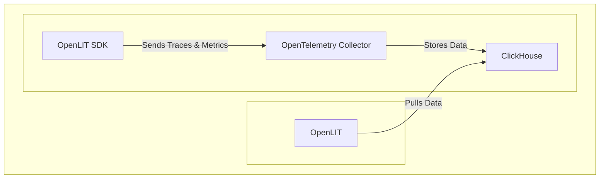
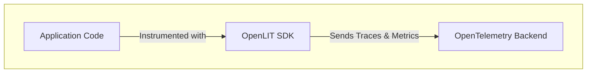

This guide demonstrates how to implement real-time cost tracking, token usage monitoring, hallucination detection, and latency optimization for your AI applications with OpenTelemetry traces and metrics.



<Steps>
    <Step title="Deploy OpenLIT">
      <Steps>
        <Step title="Git clone OpenLIT repository">
        ```shell
        git clone git@github.com:openlit/openlit.git
        ```
        </Step>
        <Step title="Start Docker Compose">
        From the root directory of the [OpenLIT Repo](https://github.com/openlit/openlit), Run the below command:
        ```shell
        docker compose up -d
        ```
        </Step>
      </Steps>
    </Step>
    <Step title="Install OpenLIT SDK">
        <Card
            title="Running in Kubernetes? Try the OpenLIT Operator"
            icon={<svg role="img" viewBox="0 0 24 24" xmlns="http://www.w3.org/2000/svg">
            <title>Kubernetes</title>
            <path fill="#FFA500" d="M10.204 14.35l.007.01-.999 2.413a5.171 5.171 0 0 1-2.075-2.597l2.578-.437.004.005a.44.44 0 0 1 .484.606zm-.833-2.129a.44.44 0 0 0 .173-.756l.002-.011L7.585 9.7a5.143 5.143 0 0 0-.73 3.255l2.514-.725.002-.009zm1.145-1.98a.44.44 0 0 0 .699-.337l.01-.005.15-2.62a5.144 5.144 0 0 0-3.01 1.442l2.147 1.523.004-.002zm.76 2.75l.723.349.722-.347.18-.78-.5-.623h-.804l-.5.623.179.779zm1.5-3.095a.44.44 0 0 0 .7.336l.008.003 2.134-1.513a5.188 5.188 0 0 0-2.992-1.442l.148 2.615.002.001zm10.876 5.97l-5.773 7.181a1.6 1.6 0 0 1-1.248.594l-9.261.003a1.6 1.6 0 0 1-1.247-.596l-5.776-7.18a1.583 1.583 0 0 1-.307-1.34L2.1 5.573c.108-.47.425-.864.863-1.073L11.305.513a1.606 1.606 0 0 1 1.385 0l8.345 3.985c.438.209.755.604.863 1.073l2.062 8.955c.108.47-.005.963-.308 1.34zm-3.289-2.057c-.042-.01-.103-.026-.145-.034-.174-.033-.315-.025-.479-.038-.35-.037-.638-.067-.895-.148-.105-.04-.18-.165-.216-.216l-.201-.059a6.45 6.45 0 0 0-.105-2.332 6.465 6.465 0 0 0-.936-2.163c.052-.047.15-.133.177-.159.008-.09.001-.183.094-.282.197-.185.444-.338.743-.522.142-.084.273-.137.415-.242.032-.024.076-.062.11-.089.24-.191.295-.52.123-.736-.172-.216-.506-.236-.745-.045-.034.027-.08.062-.111.088-.134.116-.217.23-.33.35-.246.25-.45.458-.673.609-.097.056-.239.037-.303.033l-.19.135a6.545 6.545 0 0 0-4.146-2.003l-.012-.223c-.065-.062-.143-.115-.163-.25-.022-.268.015-.557.057-.905.023-.163.061-.298.068-.475.001-.04-.001-.099-.001-.142 0-.306-.224-.555-.5-.555-.275 0-.499.249-.499.555l.001.014c0 .041-.002.092 0 .128.006.177.044.312.067.475.042.348.078.637.056.906a.545.545 0 0 1-.162.258l-.012.211a6.424 6.424 0 0 0-4.166 2.003 8.373 8.373 0 0 1-.18-.128c-.09.012-.18.04-.297-.029-.223-.15-.427-.358-.673-.608-.113-.12-.195-.234-.329-.349-.03-.026-.077-.062-.111-.088a.594.594 0 0 0-.348-.132.481.481 0 0 0-.398.176c-.172.216-.117.546.123.737l.007.005.104.083c.142.105.272.159.414.242.299.185.546.338.743.522.076.082.09.226.1.288l.16.143a6.462 6.462 0 0 0-1.02 4.506l-.208.06c-.055.072-.133.184-.215.217-.257.081-.546.11-.895.147-.164.014-.305.006-.48.039-.037.007-.09.02-.133.03l-.004.002-.007.002c-.295.071-.484.342-.423.608.061.267.349.429.645.365l.007-.001.01-.003.129-.029c.17-.046.294-.113.448-.172.33-.118.604-.217.87-.256.112-.009.23.069.288.101l.217-.037a6.5 6.5 0 0 0 2.88 3.596l-.09.218c.033.084.069.199.044.282-.097.252-.263.517-.452.813-.091.136-.185.242-.268.399-.02.037-.045.095-.064.134-.128.275-.034.591.213.71.248.12.556-.007.69-.282v-.002c.02-.039.046-.09.062-.127.07-.162.094-.301.144-.458.132-.332.205-.68.387-.897.05-.06.13-.082.215-.105l.113-.205a6.453 6.453 0 0 0 4.609.012l.106.192c.086.028.18.042.256.155.136.232.229.507.342.84.05.156.074.295.145.457.016.037.043.09.062.129.133.276.442.402.69.282.247-.118.341-.435.213-.71-.02-.039-.045-.096-.065-.134-.083-.156-.177-.261-.268-.398-.19-.296-.346-.541-.443-.793-.04-.13.007-.21.038-.294-.018-.022-.059-.144-.083-.202a6.499 6.499 0 0 0 2.88-3.622c.064.01.176.03.213.038.075-.05.144-.114.28-.104.266.039.54.138.87.256.154.06.277.128.448.173.036.01.088.019.13.028l.009.003.007.001c.297.064.584-.098.645-.365.06-.266-.128-.537-.423-.608zM16.4 9.701l-1.95 1.746v.005a.44.44 0 0 0 .173.757l.003.01 2.526.728a5.199 5.199 0 0 0-.108-1.674A5.208 5.208 0 0 0 16.4 9.7zm-4.013 5.325a.437.437 0 0 0-.404-.232.44.44 0 0 0-.372.233h-.002l-1.268 2.292a5.164 5.164 0 0 0 3.326.003l-1.27-2.296h-.01zm1.888-1.293a.44.44 0 0 0-.27.036.44.44 0 0 0-.214.572l-.003.004 1.01 2.438a5.15 5.15 0 0 0 2.081-2.615l-2.6-.44-.004.005z"/></svg>}
            href="/latest/operator/quickstart"
          >
          Automatically inject instrumentation into existing workloads without modifying pod specs, container images, or application code.
        </Card>
        <Tabs>
        <Tab title="Python">
           ```shell
           pip install openlit
           ```
        </Tab>
        <Tab title="Typescript">
           ```shell
           npm install openlit
           ```
        </Tab>
        </Tabs>

    </Step>
    <Step title="Instrument your AI application">
      <Tabs>
        <Tab title="Python">
          <Tip>
          Not sure which method to choose? Check out [Instrumentation Methods](/latest/sdk/instrumentation-methods) to understand the differences.
          </Tip>
          <Tabs>
            <Tab title="Zero-code instrumentation">              
              <Tabs>
                <Tab title="Via CLI arguments">
                ```bash
                # Install OpenLIT
                pip install openlit
                
                # Configure via CLI arguments
                openlit-instrument \
                  --service-name my-ai-app \
                  --environment production \
                  --otlp-endpoint http://127.0.0.1:4318 \
                  python your_app.py
                ```
                </Tab>
                <Tab title="Via environment variables">
                ```bash
                # Configure via environment variables
                export OTEL_SERVICE_NAME=my-ai-app
                export OTEL_DEPLOYMENT_ENVIRONMENT=production
                export OTEL_EXPORTER_OTLP_ENDPOINT=http://127.0.0.1:4318
                
                # Run with zero code changes
                openlit-instrument python your_app.py
                ```
                </Tab>
              </Tabs>
            </Tab>
            <Tab title="Manual instrumentation">
              <Tabs>
                <Tab title="Via function parameters">
                  ```python
                  import openlit

                  openlit.init(otlp_endpoint="http://127.0.0.1:4318")
                  ```

                  Examples:

                  <CodeGroup>

                  ```python OpenAI
                  from openai import OpenAI
                  import openlit

                  openlit.init(otlp_endpoint="http://127.0.0.1:4318")

                  client = OpenAI(
                      api_key="YOUR_OPENAI_KEY"
                  )

                  chat_completion = client.chat.completions.create(
                      messages=[
                          {
                              "role": "user",
                              "content": "What is LLM Observability?",
                          }
                      ],
                      model="gpt-3.5-turbo",
                  )
                  ```

                  ```python Anthropic
                  import os
                  from anthropic import Anthropic
                  import openlit

                  openlit.init(otlp_endpoint="http://127.0.0.1:4318")

                  client = Anthropic(
                      # This is the default and can be omitted
                      api_key=os.environ.get("ANTHROPIC_API_KEY"),
                  )

                  message = client.messages.create(
                      max_tokens=1024,
                      messages=[
                          {
                              "role": "user",
                              "content": "Hello, What is LLM Observability?",
                          }
                      ],
                      model="claude-3-opus-20240229",
                  )
                  ```

                  ```python Cohere
                  import cohere
                  import openlit

                  openlit.init(otlp_endpoint="http://127.0.0.1:4318")

                  co = cohere.Client(
                      api_key="YOUR_API_KEY",
                  )

                  chat = co.chat(
                      message="hello world!",
                      model="command"
                  )
                  ```

                  ```python LiteLLM
                  from litellm import completion
                  import os
                  import openlit

                  openlit.init(otlp_endpoint="http://127.0.0.1:4318")

                  os.environ["HUGGINGFACE_API_KEY"] = "huggingface_api_key"

                  # e.g. Call 'WizardLM/WizardCoder-Python-34B-V1.0' hosted on HF Inference endpoints
                  response = completion(
                    model="huggingface/WizardLM/WizardCoder-Python-34B-V1.0",
                    messages=[{ "content": "Hello, how are you?","role": "user"}],
                    api_base="https://my-endpoint.huggingface.cloud"
                  )
                  ```

                  ```python Langchain
                  from langchain_core.messages import HumanMessage, SystemMessage
                  import openlit

                  openlit.init(otlp_endpoint="http://127.0.0.1:4318")

                  from langchain_openai import ChatOpenAI

                  model = ChatOpenAI(model="gpt-4o-mini")

                  messages = [
                      SystemMessage(content="Translate the following from English into Italian"),
                      HumanMessage(content="hi!"),
                  ]

                  model.invoke(messages)
                  ```

                  ```python Ollama
                  import ollama
                  import openlit

                  openlit.init(otlp_endpoint="http://127.0.0.1:4318")

                  response = ollama.chat(model='llama3.1', messages=[
                    {
                      'role': 'user',
                      'content': 'Why is the sky blue?',
                    },
                  ])
                  ```

                  </CodeGroup>
                </Tab>
                <Tab title="Via environment variables">
                  Add the following two lines to your application code:
                  ```python
                  import openlit

                  openlit.init()
                  ```

                  Run the following command to configure the OTEL export endpoint:
                  ```shell
                  export OTEL_EXPORTER_OTLP_ENDPOINT = "http://127.0.0.1:4318"
                  ```

                  Examples:

                  <CodeGroup>

                  ```python OpenAI
                  from openai import OpenAI
                  import openlit

                  openlit.init()

                  client = OpenAI(
                      api_key="YOUR_OPENAI_KEY"
                  )

                  chat_completion = client.chat.completions.create(
                      messages=[
                          {
                              "role": "user",
                              "content": "What is LLM Observability?",
                          }
                      ],
                      model="gpt-3.5-turbo",
                  )
                  ```

                  ```python Anthropic
                  import os
                  from anthropic import Anthropic
                  import openlit

                  openlit.init()

                  client = Anthropic(
                      # This is the default and can be omitted
                      api_key=os.environ.get("ANTHROPIC_API_KEY"),
                  )

                  message = client.messages.create(
                      max_tokens=1024,
                      messages=[
                          {
                              "role": "user",
                              "content": "Hello, What is LLM Observability?",
                          }
                      ],
                      model="claude-3-opus-20240229",
                  )
                  ```

                  ```python Cohere
                  import cohere
                  import openlit

                  openlit.init()

                  co = cohere.Client(
                      api_key="YOUR_API_KEY",
                  )

                  chat = co.chat(
                      message="hello world!",
                      model="command"
                  )
                  ```

                  ```python LiteLLM
                  from litellm import completion
                  import os
                  import openlit

                  openlit.init()

                  os.environ["HUGGINGFACE_API_KEY"] = "huggingface_api_key"

                  # e.g. Call 'WizardLM/WizardCoder-Python-34B-V1.0' hosted on HF Inference endpoints
                  response = completion(
                    model="huggingface/WizardLM/WizardCoder-Python-34B-V1.0",
                    messages=[{ "content": "Hello, how are you?","role": "user"}],
                    api_base="https://my-endpoint.huggingface.cloud"
                  )
                  ```

                  ```python Langchain
                  from langchain_core.messages import HumanMessage, SystemMessage
                  import openlit

                  openlit.init()

                  from langchain_openai import ChatOpenAI

                  model = ChatOpenAI(model="gpt-4o-mini")

                  messages = [
                      SystemMessage(content="Translate the following from English into Italian"),
                      HumanMessage(content="hi!"),
                  ]

                  model.invoke(messages)
                  ```

                  ```python Ollama
                  import ollama
                  import openlit

                  openlit.init()

                  response = ollama.chat(model='llama3.1', messages=[
                    {
                      'role': 'user',
                      'content': 'Why is the sky blue?',
                    },
                  ])
                  ```

                  </CodeGroup>
                </Tab>
              </Tabs>
            </Tab>
          </Tabs>
        </Tab>
        <Tab title="Typescript">
          <Tabs>
            <Tab title="SDK Integration">
              <Tabs>
                <Tab title="Via function parameters">
                   ```typescript
                  import Openlit from "openlit"

                  Openlit.init({ otlpEndpoint: "http://127.0.0.1:4318" })
                  ```

                  Example Usage for monitoring `OpenAI` Usage:

                  ```typescript
                  import Openlit from "openlit"

                  Openlit.init({ otlpEndpoint: "http://127.0.0.1:4318" })

                  async function main() {
                        const OpenAI = await import("openai").then((e) => e.default);
                        const openai = new OpenAI({
                            apiKey: YOUR_OPENAI_KEY,
                        });
                        const completion = await openai.chat.completions.create({
                            model: "gpt-3.5-turbo",
                            messages: [{ role: "system", content: "Who are you ?" }],
                        });

                        console.log(completion?.choices?.[0]);
                    }

                    main();
                  ```
                  OR
                  ```typescript
                  import openlit from "openlit"
                  import OpenAI from "openai"

                  openlit.init({ 
                    otlpEndpoint: "http://127.0.0.1:4318", 
                    instrumentations: {
                      openai: OpenAI,
                    } 
                  })

                  async function main() {
                        const openai = new OpenAI({
                            apiKey: YOUR_OPENAI_KEY,
                        });
                        const completion = await openai.chat.completions.create({
                            model: "gpt-3.5-turbo",
                            messages: [{ role: "system", content: "Who are you ?" }],
                        });

                        console.log(completion?.choices?.[0]);
                    }

                    main();
                  ```
                </Tab>
                <Tab title="Via environment variables">
                   Add the following two lines to your application code:
              ```typescript
              import openlit from "openlit"

              openlit.init()
              ```

              Run the following command to configure the OTEL export endpoint:
              ```shell
              export OTEL_EXPORTER_OTLP_ENDPOINT = "http://127.0.0.1:4318"
              ```

              Example Usage for monitoring `OpenAI` Usage:

              ```typescript
              import openlit from "openlit"

              openlit.init()

              async function main() {
                    const OpenAI = await import("openai").then((e) => e.default);
                    const openai = new OpenAI({
                        apiKey: YOUR_OPENAI_KEY,
                    });
                    const completion = await openai.chat.completions.create({
                        model: "gpt-3.5-turbo",
                        messages: [{ role: "system", content: "Who are you ?" }],
                    });

                    console.log(completion?.choices?.[0]);
                }

                main();
              ```
                OR
              ```typescript
              import openlit from "openlit"
              import OpenAI from "openai"

              openlit.init({
                instrumentations: {
                  openai: OpenAI,
                } 
              })

              async function main() {
                    const openai = new OpenAI({
                        apiKey: YOUR_OPENAI_KEY,
                    });
                    const completion = await openai.chat.completions.create({
                        model: "gpt-3.5-turbo",
                        messages: [{ role: "system", content: "Who are you ?" }],
                    });

                    console.log(completion?.choices?.[0]);
                }

                main();
              ```
                </Tab>
              </Tabs>
            </Tab>
          </Tabs>
        </Tab>
      </Tabs>
      Refer to OpenLIT [Python SDK repository](https://github.com/openlit/openlit/tree/main/sdk/python) or [Typescript SDK repository](https://github.com/openlit/openlit/tree/main/sdk/typescript) for more advanced configurations and use cases.
    </Step>
    <Step title="Monitor, debug and test the quality of your AI applications">
    With real-time LLM observability data now flowing to OpenLIT, visualize comprehensive AI performance metrics including token costs, latency patterns, hallucination rates, and model accuracy to optimize your production AI applications.

    Just head over to OpenLIT at `127.0.0.1:3000` on your browser to start exploring. You can login using the default credentials
    - **Email**: `user@openlit.io`
    - **Password**: `openlituser`
    <Frame>
      
      
    </Frame>
    </Step>

</Steps>

You're all set! Your AI applications now have observability with real-time performance monitoring, cost tracking, and AI safety evaluations. 

**Send Observability telemetry to other OpenTelemetry backends**



If you wish to send telemetry directly from the SDK to another backend, you can stop the current Docker services by using the command below. For more details on sending the data to your existing OpenTelemetry backends, checkout our [Supported Destinations](/latest/sdk/destinations/overview) guide.

```sh
docker compose down
```

If you have any questions or need support, reach out to our [community](https://join.slack.com/t/openlit/shared_invite/zt-2etnfttwg-TjP_7BZXfYg84oAukY8QRQ).