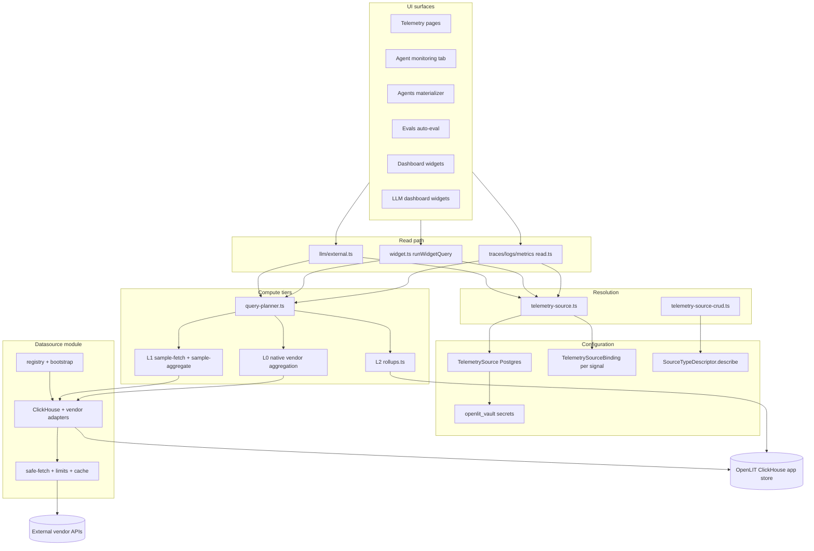

# External Observability Data Sources — Branch Handoff

**Audience:** developers picking up this branch.  
**Goal:** make raw AI telemetry pluggable (Grafana LGTM today; any OTLP vendor later) while OpenLIT keeps derived/eval/agent data in its own ClickHouse app store.

This document describes **what landed on this branch**, how the pieces fit together, and where to extend safely. For a short “add a vendor” checklist, see `src/client/src/lib/platform/datasource/README.md`.

---

## Executive summary

Before this branch, ~286 call sites executed raw ClickHouse SQL via `dataCollector()`. Observability reads were implicitly tied to the project’s `DatabaseConfig` ClickHouse.

This branch introduces:

1. A **normalized datasource layer** (`src/client/src/lib/platform/datasource/`) with a `DataSourceAdapter` contract, vendor adapters, and a **QueryPlanner** (L0 native / L1 sample / L2 rollup).
2. **Project-scoped telemetry source config** in Postgres (`TelemetrySource`, `TelemetrySourceBinding`) with secrets in the vault.
3. **Read facades** per signal (`traces/read.ts`, `logs/read.ts`, `metrics/read.ts`) that route built-in ClickHouse unchanged and external vendors through adapters + denormalization back to the row shapes the UI already expects.
4. **Grafana-parity performance**: push-down aggregation, pixel-bounded downsampling, query budgets, per-source concurrency/retry, short TTL caches, stale-while-revalidate polling, and L2 rollups for dashboard KPIs.
5. **Descriptor-driven configuration**: each vendor’s `describe()` returns `configFields`, `authStyle`, optional `stackTemplate` — no per-vendor UI switches.
6. **Surface migrations**: Telemetry, Agents (materializer + graph + monitoring tab), Evals (auto-eval candidates), Dashboards (structured query builder + per-widget `sourceId`), LLM dashboard widgets (external path via `llm/external.ts`).

**Important:** configuring an external source does **not** automatically reroute every legacy SQL path. Only surfaces that call the facades / `getTelemetryAdapter` / `runWidgetQuery` with structured queries are adapter-aware. Built-in ClickHouse behavior is preserved.

---

## Architectural split (unchanged principle, now enforced)

| Store | Role | What lives here |
|-------|------|-----------------|
| **App / derived store** | OpenLIT-owned ClickHouse (`DatabaseConfig`) | `openlit_agents_summary`, `openlit_agent_versions`, `openlit_evaluation`, dashboards, vault, controller tables, **and new L2 rollup tables** |
| **Telemetry source** | Pluggable per project (and per widget) | Raw `otel_*` when built-in; vendor APIs when external |

Only **raw telemetry reads** go through adapters. Derived writes/reads stay on OpenLIT ClickHouse. Moving `openlit_*` to Postgres is explicitly out of scope.

### L2 rollup tables (new on this branch)

Created by ClickHouse migrations (`create-telemetry-rollups-migration.ts`, `alter-telemetry-rollups-dimensions-migration.ts`):

| Table | Purpose |
|-------|---------|
| `openlit_signal_buckets` | Time-bucketed request/cost/token rollups per `source_id` + service + environment |
| `openlit_llm_rollups` | Grouped LLM dimensions (model, provider, application, …) for dashboard KPIs |
| `openlit_external_span_cache` | Short-lived recent-span hot cache for list views (TTL ~2h, row cap) |

Rollups are **not** a full vendor mirror. Materialization samples via adapters and writes bounded aggregates. QueryPlanner prefers L2 when fresh (`ROLLUP_FRESHNESS_MS` = 5m) and filters allow (`rollup-policy.ts` — version-scoped queries still fall back to L1).

---

## End-to-end data flow (as built)



---

## Configuration model

### Postgres (`prisma/schema.prisma`)

**`TelemetrySource`** (project-scoped):

- `type` — free string (`tempo`, `loki`, `mimir`, `datadog`, …). **No enum** — new vendors need no migration.
- `signals` — comma-separated subset of `traces,logs,metrics`.
- `settings` — JSON text (URLs, site, region, `allowHttp`, tenant, …). **Never secrets.**
- `secretRef` — vault id for API keys / basic auth.
- `isDefault` — optional project default source.

**`TelemetrySourceBinding`** — Grafana-style **per-signal routing**:

- At most one binding per `(projectId, signal)`.
- Lets traces come from Tempo while logs come from Loki and metrics from Mimir.

Migrations: `20260709130000_telemetry_source`, `20260709150000_telemetry_source_binding`.

### Built-in ClickHouse source

Every project still has an implicit built-in source from `DatabaseConfig`:

- Descriptor id: `builtin:<dbConfigId>`
- `isBuiltIn: true`, `type: "clickhouse"`
- Used when no external binding exists for a signal.

### Resolution precedence (`telemetry-source.ts`)

For a read with optional overrides:

1. Explicit `sourceId` (dashboard widget, query-builder metadata) — must belong to current project.
2. `TelemetrySourceBinding` for the requested signal.
3. Project default `TelemetrySource` (`isDefault`).
4. Built-in ClickHouse (`DatabaseConfig`).

`getTelemetryAdapter({ signal, sourceId })` returns a bound `DataSourceAdapter` instance.

### Stack umbrellas (Grafana / Victoria)

`stacks.ts` defines **internal descriptor-only** factories (`internal: true` + `stackTemplate`):

- **Grafana stack** → Tempo + Loki + Mimir slots.
- **Victoria stack** → VictoriaLogs + VictoriaMetrics slots.

`createSourceStack()` in `telemetry-source-crud.ts` expands a template into atomic per-signal `TelemetrySource` rows + bindings. Umbrellas are **not** stored as a single adapter row.

### Management UI

- **Project settings → Data Sources** (`data-sources-page.tsx`, embedded in `project-page.tsx`).
- Forms render **`configFields` from `SourceTypeDescriptor`** — no `type === "datadog"` switches.
- `authStyle` / `authHelp` / `docsUrl` drive credential hints and 401 troubleshooting.
- Stack builder uses the same descriptor-driven fields per slot.

### API routes

| Route | Purpose |
|-------|---------|
| `GET/POST /api/telemetry-source` | List/create sources; GET includes `signalCapabilities` |
| `GET/PATCH/DELETE /api/telemetry-source/[id]` | CRUD + update |
| `POST /api/telemetry-source/[id]/health` | Adapter health check |
| `GET/PUT/DELETE /api/telemetry-source/binding` | Per-signal bindings |
| `POST /api/telemetry-source/stack` | Create multi-signal stack from template |

---

## Datasource module — file map

```
src/client/src/lib/platform/datasource/
├── types.ts              # OpenLITQuery, DataFrame, SourceCapabilities, SourceTypeDescriptor, FieldDef
├── registry.ts           # Factory registration; listSourceTypeDescriptors({ includeInternal })
├── bootstrap.ts          # Registers ClickHouse + all CE vendor factories + stack umbrellas
├── enterprise.ts         # getExternalDataSourceAdapters() → [] in CE (EE hook for extra vendors)
├── base-adapter.ts       # BaseExternalAdapter (auth, network opts, capability throws)
├── facade.ts             # resolveSignalReadContext, facadeErrorMessage (+ columnar follow-up note)
├── ai-selector.ts        # AITelemetrySelector → vendor-native filters
├── selector-match.ts     # Post-filter when vendor can't express full selector
├── config-fields.ts      # httpVendorFields(), endpointField(), tenantField(), …
├── stacks.ts             # grafana / victoria umbrella descriptors
├── query-planner.ts      # planAndAggregateSpans, planAndSpanTimeSeries, planAndDistinctValues
├── l1-compute.ts         # compute*L1 wrappers over sample-fetch + sample-aggregate
├── rollup-policy.ts      # shouldPreferRollup (version filters → skip L2)
├── downsample.ts         # Grafana-parity maxDataPoints → interval/step math
├── query-observability.ts  # debug logging per adapter read (OPENLIT_QUERY_OBSERVABILITY)
├── otlp-json.ts          # OTLP trace/log JSON normalization (Tempo/Jaeger)
├── clickhouse/
│   ├── adapter.ts        # Reference DataSourceAdapter (delegates to existing SQL)
│   ├── query-map.ts      # MetricParams → OpenLITQuery
│   └── normalize.ts      # Normalized* → ClickHouse-shaped rows (facade denormalization)
├── datadog/              # Traces + logs + metrics
├── newrelic/             # NRQL via NerdGraph
├── grafana/
│   ├── tempo.ts          # TraceQL + TraceQL metrics aggregation + span index
│   ├── loki.ts           # LogQL
│   └── prometheus.ts     # PromQL (Prometheus + Mimir factories)
├── jaeger/               # L1-heavy traces
├── victoria/             # VictoriaLogs + VictoriaMetrics
├── graph/
│   ├── sample-fetch.ts   # Bounded trace sampling + multi-service stratification
│   ├── sample-aggregate.ts
│   ├── map-pool.ts       # Bounded parallel trace downloads
│   └── aggregate-dag.ts  # Agent graph DAG from normalized spans
└── http/
    ├── safe-fetch.ts     # SSRF default-deny, redirect re-validation, timeouts
    ├── limits.ts         # clampQueryBudget, concurrency, retry
    ├── cache.ts          # Per-source query cache (range aligned to step)
    ├── secret.ts         # Vault decrypt for adapter auth
    └── auth-headers.ts   # Basic / Bearer / tenant headers
```

**Related (outside `datasource/`):**

| Path | Role |
|------|------|
| `lib/telemetry-source.ts` | Descriptor resolution, adapter factory binding |
| `lib/telemetry-source-crud.ts` | CRUD, bindings, stack create, `resolveProjectSignalCapabilities()` |
| `lib/platform/traces/read.ts` | Traces facade (list, detail, hierarchy, summary, grouped, config) |
| `lib/platform/logs/read.ts` | Logs facade |
| `lib/platform/metrics/read.ts` | Metrics facade |
| `lib/platform/telemetry/rollups.ts` | L2 write/read + hot cache |
| `lib/platform/llm/external.ts` | LLM dashboard widgets via QueryPlanner for external traces |
| `lib/platform/manage-dashboard/widget.ts` | `runWidgetQuery` + structured execution + observability logging |
| `utils/hooks/useFetchWrapper.ts` | Stale-while-revalidate + monotonic requestId |
| `utils/telemetry-request-cache.ts` | Browser-side short TTL cache for telemetry POSTs |
| `utils/hooks/useSignalCapabilities.ts` | Client capability gating from `/api/telemetry-source` |

---

## Normalized query contract

### `Signal`

`"traces" | "logs" | "metrics"`

### `AITelemetrySelector`

Shared “only AI telemetry” predicate (`ai-selector.ts`): `gen_ai.*`, `coding_agent.*`, `gen_ai.agent.*`, and/or `telemetry.sdk.name = openlit`. Each adapter translates to TraceQL / LogQL / PromQL / NRQL / Datadog query string / Jaeger tags.

### `OpenLITQuery`

Vendor-agnostic query:

- `signal`, `timeRange`, `filters` (normalized attribute predicates)
- `groupBy`, `aggregations`, `sort`, `limit`, `offset`
- `aiSelector` — boolean or structured selector
- `interval` — optional explicit bucket
- `maxDataPoints` — pixel-bounded downsampling (Grafana `maxDataPoints` parity)

Built from UI filters via `metricParamsToOpenLITQuery()` in `clickhouse/query-map.ts`.

### `DataFrame` / `DataFrameMeta`

Columnar result: `fields`, `rows`, `meta`:

- `truncated`, `latencyMs`, `rowsScanned`, `freshness` (`live` | `sampled` | `accelerated`)
- `degraded` — e.g. `serverAggregation`, `rollup`

Facades **denormalize** to existing ClickHouse row shapes so React tables did not need a wholesale rewrite. **Follow-up:** migrate UI to consume `DataFrame` directly (noted in `facade.ts`).

### `DataSourceAdapter`

Methods gated by `capabilities()`:

| Area | Methods |
|------|---------|
| Traces | `listSpans`, `getSpan`, `getTraceSpans`, `aggregateSpans`, `spanTimeSeries`, `distinctValues`, `attributeKeys`, `discoverServices`, `aggregateByService`, `sampleTracesForGraph` |
| Logs | `listLogs`, `getLog`, `logTimeSeries` |
| Metrics | `listMetricSeries`, `metricTimeSeries`, `metricNames` |
| Ops | `healthCheck`, `validateAISignal` |

Unsupported methods throw `UnsupportedCapabilityError` → UI shows honest “not supported” states.

### `SourceCapabilities` (per instance)

| Flag | Meaning |
|------|---------|
| `traceTree` | Full parent/child hierarchy |
| `spanEvents` | Prompt/completion payloads (chat view) |
| `serverAggregation` | Native group-by + aggregates (L0) |
| `distinctValues` | Filter dropdown enumeration |
| `crossTraceSession` | Multi-trace session stitching |
| `rawQuery` | ClickHouse SQL escape hatch |
| `maxLookbackMs` | Vendor retention clamp (used in `clampQueryBudget`) |

---

## Registered adapters (CE bootstrap)

| Type | Signals | Aggregation tier | Notes |
|------|---------|------------------|-------|
| `clickhouse` | all | L0 (SQL) | Built-in reference; full capabilities |
| `tempo` | traces | L0 metrics + L1 lists | TraceQL; process-wide span index keyed by `sourceId` (FIFO cap 5k) |
| `loki` | logs | push-down volume | LogQL; `meta.truncated` on list cap |
| `prometheus` / `mimir` | metrics | L0 range/instant | PromQL; step from `downsample.ts` |
| `datadog` | all | L0 | Site + API/app keys |
| `newrelic` | all | L0 NRQL | Region + account + API key |
| `jaeger` | traces | L1 primary | Service-stratified sampling |
| `victorialogs` | logs | list + volume | LogsQL NDJSON |
| `victoriametrics` | metrics | PromQL-compatible | |
| `grafana` / `victoria` | — | — | Internal stack templates only |

EE may add more via `getExternalDataSourceAdapters()` without CE importing `@/ee/**`.

---

## QueryPlanner — L0 / L1 / L2

**Never branch on vendor name in UI or facades.** Use `query-planner.ts`:

```
L0 native  → adapter.capabilities().serverAggregation
             (ClickHouse SQL, Datadog, NRQL, Tempo TraceQL metrics, PromQL)

L2 rollup  → openlit_signal_buckets / openlit_llm_rollups when fresh
             (dashboard KPIs, agent widgets without version scope)

L1 sample  → sample-fetch (bounded traces) + sample-aggregate (in-process)
             (Jaeger, Tempo list/summary when native agg unavailable)
```

### L1 sampling highlights (`graph/sample-fetch.ts`)

- **Caps:** 100 traces (list), 200 (aggregate), shared 45s TTL cache per source.
- **Multi-service stratification:** discovers services, fetches per-service samples so one high-volume app cannot dominate the telemetry table (fixes “only OpenAI app traces” after agent scoping/polling).
- **Jaeger** marks `samplesAreServiceStratified` to avoid double-stratification.

### Query budgets (`http/limits.ts`)

Every structured external query passes `clampQueryBudget()`:

- `maxRows` (default 5000)
- `maxRangeMs` (default 30d)
- `maxLookbackMs` from adapter capabilities (vendor retention)

Widget path: `widget.ts` → `executeStructuredWidgetQuery`.

---

## Performance & UX (Grafana parity)

| Mechanism | Where | What it does |
|-----------|-------|--------------|
| **Push-down aggregation** | Tempo TraceQL metrics, PromQL, NRQL, CH SQL | Never pull raw spans to aggregate in Node when L0 exists |
| **Pixel downsampling** | `downsample.ts`, Tempo/Prometheus step calc, `query-map.ts` | `intervalMs = max(range/maxDataPoints, minInterval)`, nice-step rounding |
| **Range alignment** | `alignRangeToStep`, `http/cache.ts` | Identical poll windows dedupe cache keys |
| **Per-source concurrency + retry** | `safe-fetch` + `limits.ts` | `concurrencyKey`, exponential backoff on 429/5xx |
| **Per-query timeouts** | Adapter `safeFetch` opts | e.g. Loki 20s, New Relic 35s |
| **X-Query-Tags** | Loki, Tempo, New Relic | Ops guardrails (`source=openlit,type=…`) |
| **Query observability** | `query-observability.ts` | `console.debug` line: source, signal, rows, latency, freshness |
| **Server L1 sample cache** | `sample-fetch.ts` | 45s TTL shared across summary/grouped/config |
| **Browser telemetry cache** | `telemetry-request-cache.ts` | 45s TTL, quantized time keys, coalesced in-flight |
| **Stale-while-revalidate** | `useFetchWrapper.ts` | Keep last data during poll; skeleton only on first load; monotonic `requestId` drops stale responses |
| **L2 rollups + hot cache** | `telemetry/rollups.ts` | Dashboard/agent KPI acceleration |

---

## Per-surface migration status

### Telemetry (`/telemetry`, `/api/metrics/**`, `/api/telemetry/**`)

| Operation | Facade | External path |
|-----------|--------|---------------|
| Trace list | `traces/read.ts` → `listTraceRecords` | Hot cache → stratified `fetchSpansForList` |
| Trace detail / hierarchy | `getTraceSpanRecord`, `getTraceHierarchy` | `getTraceSpans` + tree build |
| Summary charts | `getTracesSummary` | `planAndSpanTimeSeries` + L2 |
| Filter config | `getTraceFilterConfig` | `discoverServices` + shared L1 sample |
| Attribute keys | `getTraceAttributeKeys` | `adapter.attributeKeys` |
| Logs list | `logs/read.ts` | `listLogs` + truncation-aware total |
| Metrics list | `metrics/read.ts` | `listMetricSeries` → grouped rows |

Routes updated to call facades instead of raw `lib/platform/request` / `observability` for these paths.

**Capability gating (UI):**

- `useSignalCapabilities()` ← `resolveProjectSignalCapabilities()` on GET `/api/telemetry-source`
- `span-hierarchy-explorer.tsx` — chat view gated on `spanEvents`
- `structured-query-builder.tsx` — `capabilityAware` uses live attribute keys; static AI fallback only for built-in CH

### Agents

| Component | Change |
|-----------|--------|
| `materialize.ts` | Reads via adapter (`discoverServices`, sampling); **writes** still to `openlit_agents_summary` |
| `aggregate-graph.ts` | External DAG via `sampleTracesForGraph` + `aggregate-dag.ts` |
| `agent-monitoring-tab.tsx` | Full multi-signal observability (traces/exceptions/metrics/logs) scoped by `AgentScopeProvider` |
| `agent-scope-provider.tsx` | Continuous scope lock (service + optional version); `scopeReady` gate prevents unscoped widget fetch; restores on unmount |

**Agent scoping fixes on this branch:**

- Global telemetry page strips stale agent scope when not under `AgentScopeProvider`.
- Widget/dashboard queries respect `serviceNames` / `versionFilter` in `selectedConfig`.
- Multi-service trace list stratification prevents one agent poll from narrowing the global telemetry view.

### Evals (`evaluation/index.ts`)

- Auto-eval candidate fetch uses traces adapter `listSpans` when external; excludes ids already in `openlit_evaluation`.
- Eval **results** still stored in OpenLIT ClickHouse.

### Dashboards

| Feature | Implementation |
|---------|----------------|
| Structured query builder | `structured-query-builder.tsx` — signal/mode/filters/groupBy/aggregations |
| Per-widget source | `edit-widget-sheet.tsx` — `sourceId` on widget config |
| Metadata fetches | Query builder passes `sourceId` to `/api/metrics/request/config` and `attribute-keys` |
| Query execution | `runWidgetQuery` → `executeStructuredWidgetQuery` → QueryPlanner |
| Legacy SQL widgets | ClickHouse raw SQL still works; external project traces infer structured query via `widget-sql-bridge.ts` |
| LLM seeded dashboards | `llm/*.ts` delegates to `llm/external.ts` when traces binding is external |

### Data Sources admin UI

`data-sources-page.tsx` (~900 lines): list, add/edit, test connection, bindings, stack wizard — all descriptor-driven.

---

## Security

### SSRF (`http/safe-fetch.ts`)

- **Default deny:** https-only, no credentials-in-URL, metadata IPs/hostnames always blocked.
- **Self-hosted opt-in:** `allowHttp` + `allowPrivateNetwork` from source settings (for Tempo/Loki beside OpenLIT).
- **Redirects:** manual follow with re-validation on every hop (blocks redirect-to-internal bypass).
- **Secrets:** decrypted server-side only; redacted in error messages.

### CE/EE boundary

- All vendor adapters above ship in **CE** (`bootstrap.ts`).
- `getExternalDataSourceAdapters()` in `enterprise.ts` returns `[]` in CE — EE adds private vendors without `@/ee/**` imports in shared code.
- User strings in `constants/messages/en.ts` (not hard-coded in adapters/UI).

---

## Denormalization contract (important for new adapters)

External adapters produce **normalized** types (`NormalizedSpan`, `NormalizedLog`, `NormalizedMetricPoint`).

Facades convert to **ClickHouse-shaped rows** via `clickhouse/normalize.ts` so existing React components keep working. When adding a vendor:

1. Implement normalized adapter methods.
2. Ensure denormalizers map to the same field names the UI expects (`SpanName`, `ServiceName`, `Body`, …).
3. Long-term: UI should consume `DataFrame` directly (documented follow-up in `facade.ts`).

---

## Known limitations & follow-ups

| Item | Status |
|------|--------|
| Dash0 adapter | **Not built** — extensibility proven via fictional descriptor test + README checklist |
| Version-scoped L2 rollups | Version filters skip L2 (`rollup-policy.ts`); L1 only |
| Sub-trace span paging | Not implemented (Grafana also loads full trace on open) |
| Grafana Live / WebSockets | Out of scope; polling + chunked fetch instead |
| Legacy SQL call sites | Not all ~286 `dataCollector` sites migrated — only observability/agent/dashboard/eval paths on facades |
| `tsc` in test files | Some strict-test typing uses `expect.arrayContaining` patterns to avoid `unknown` index errors |
| Columnar end-to-end | Facades still denormalize; adapters should not assume CH row shapes internally |

### Operational env vars

| Variable | Effect |
|----------|--------|
| `OPENLIT_QUERY_OBSERVABILITY=1` | Enable query debug lines in production |
| Default (non-production) | Query observability on |

---

## Local development & testing

### Run validation (from `src/client`)

```bash
npm test -- --runInBand
npm run lint
npx prisma validate --schema prisma/schema.prisma
npx tsc --noEmit
rg -n "@/ee/" src/client/src          # must be comments/docs only
rg -n '"[a-z_]+:[a-z_]+"' src/client/src  # review matches; no RBAC literals
```

### LGTM stack smoke test

1. Configure Grafana Cloud (or local LGTM) sources in **Project → Data Sources**.
2. Create a **Grafana stack** (Tempo + Loki + Mimir) or bind signals individually.
3. Set per-signal bindings (traces → Tempo, logs → Loki, metrics → Mimir).
4. Verify: Telemetry (all services visible after polling), Agent detail monitoring tab, LLM dashboard widgets, structured dashboard widgets with `sourceId`.

### Rebuild client container

```bash
cd src
docker compose -f dev-docker-compose.yml build openlit
docker compose -f dev-docker-compose.yml up -d --no-deps --force-recreate openlit
```

---

## Adding a new datasource (summary)

Full checklist: `src/client/src/lib/platform/datasource/README.md`.

1. `datasource/<vendor>/adapter.ts` extending `BaseExternalAdapter`.
2. `describe()` with `configFields`, `authStyle`, honest `capabilities`.
3. `selector.ts` for AI selector → vendor query language.
4. Register in `bootstrap.ts` (or EE hook).
5. Mocked HTTP unit tests (see `grafana.test.ts`, `datadog.test.ts` patterns).
6. **Do not** edit shared forms, CRUD templates, or Prisma for a new `type` string.

**Extensibility regression test:** `registry.test.ts` registers a fictional `dash0` type with only `configFields` and asserts the descriptor resolves for the form — no UI edits required.

---

## Branch scale (orientation)

~139 files touched, ~17k insertions. Largest new areas:

- `datasource/grafana/tempo.ts` — Tempo adapter + span index
- `structured-query-builder.tsx` — Grafana-style widget query UI
- `data-sources-page.tsx` — source admin UI
- `telemetry-source-crud.ts` / `telemetry-source.ts` — config + resolution
- `traces/read.ts` — traces facade
- Vendor adapters (Datadog, New Relic, Jaeger, Victoria, …)
- Tests under `src/client/src/__tests__/lib/platform/datasource/` and facade tests

---

## Original design notes (still valid)

The feasibility verdict from the initial design remains: vendors differ wildly in query languages and aggregation power, so **capability negotiation + explicit degradation** is mandatory. The agents materializer **cannot** write into vendor stores — it reads via adapters and writes derived rows to OpenLIT ClickHouse. Query pushdown, caching, rate limits, and SSRF protections are not optional for production external sources.

What changed from the early design doc:

- **Vendor adapters ship in CE** (not only EE); EE adds extra vendors via hook.
- **Descriptor-driven forms and stack templates** landed (no hardcoded `TELEMETRY_STACK_TEMPLATES`).
- **L2 rollups + hot cache** landed for dashboard/agent KPI acceleration.
- **Grafana-parity downsampling + SWR polling** landed.
- **Per-signal bindings** landed (not just per-widget override).
- **Data Sources UI** is in CE project settings (not deferred).

---

## Quick debugging guide

| Symptom | Likely cause | Where to look |
|---------|--------------|---------------|
| Only one service in telemetry after agent visit | Stale scope or unstratified list | `agent-scope-provider.tsx`, `sample-fetch.ts` stratification |
| Widget shows 200 total requests | L1 sample cap / truncated list | `listTraceRecords`, adapter `meta.truncated` |
| Page blanks on poll | Missing SWR | `useFetchWrapper.ts`, `telemetry-request-cache.ts` |
| 401 on source test | Auth style mismatch | descriptor `authStyle`, `auth-headers.ts` |
| “Not supported” on chat view | Source lacks `spanEvents` | `useSignalCapabilities`, Tempo/Jaeger capabilities |
| Slow dashboards | L1 re-sample every poll | L2 rollups freshness, `shouldPreferRollup` |
| SSRF error on local Tempo | Private network blocked | source `allowPrivateNetwork` setting |

---

*Last updated: branch handoff for external observability + datasource-agnostic layer.*
