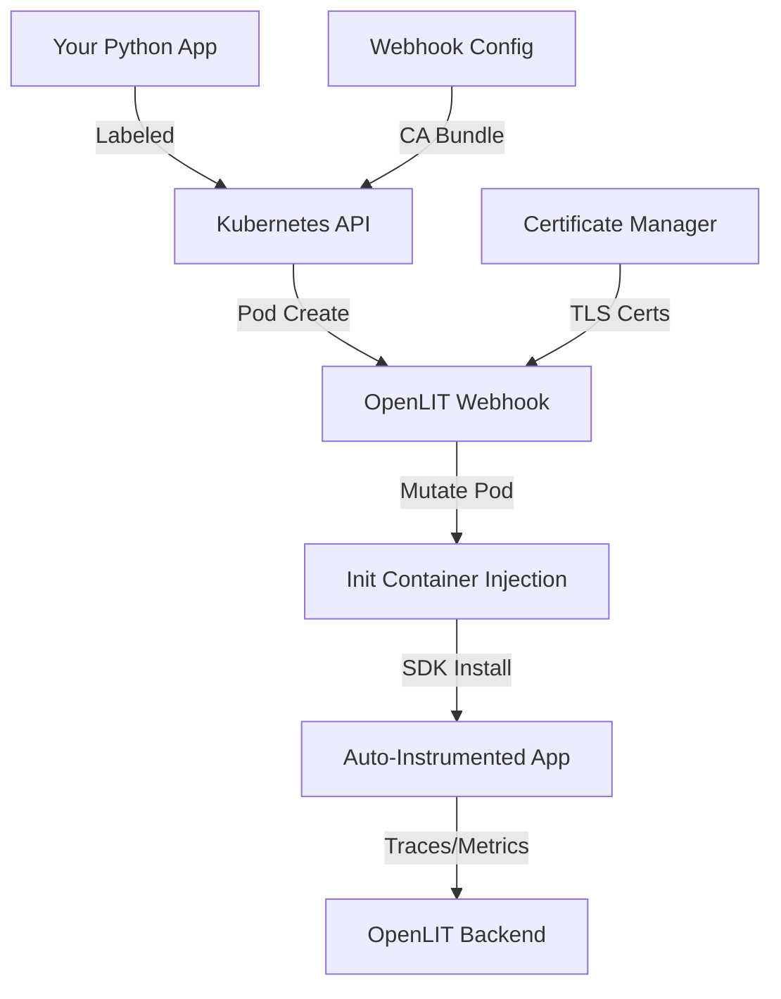

# OpenLIT Zero-Code Instrumentation Operator

[](https://opensource.org/licenses/Apache-2.0)
[](https://golang.org/)
[](https://kubernetes.io/)

> **Production-Ready Kubernetes Operator for Zero-Code Python Application Instrumentation**

## 🎯 **What It Does**

The OpenLIT Operator automatically instruments **existing Python applications** in your Kubernetes cluster with comprehensive observability - **without changing a single line of application code**.

## ✨ **Key Features**

### 🚀 **Zero-Code Instrumentation**
- **No application restarts** required for existing workloads
- **No code changes** - just add a label to your pods
- **Runtime injection** using admission controller webhook
- **Automatic OpenLIT SDK** installation and configuration

### 🔐 **Production-Ready Security**
- **Automatic TLS certificate management** following [Velotio best practices](https://www.velotio.com/engineering-blog/managing-tls-certificate-for-kubernetes-admission-webhook)
- **Self-signed certificates** with automatic rotation
- **RBAC** with minimal required permissions
- **Secure webhook** with configurable failure policies

### ⚙️ **Fully Configurable**
- **Environment-based configuration** - no hardcoded values
- **Flexible OTLP endpoints** for any backend
- **Customizable service names** and environments
- **Configurable certificate validity** and rotation
- **Multiple failure policy options**

## 🚦 **Quick Start**

### Prerequisites
```bash
# 1. OpenLIT backend deployed
helm repo add openlit https://openlit.github.io/helm/
helm repo update
helm install openlit openlit/openlit

# 2. Kubernetes cluster (1.20+)
kubectl version --client
```

### Deploy the Operator
```bash
# Single command deployment - everything included!
kubectl apply -f https://raw.githubusercontent.com/openlit/openlit/main/operator/deploy/openlit-operator.yaml
```

### Instrument Your Applications
```bash
# Just add a label to your existing deployments
kubectl patch deployment your-python-app -p '{"spec":{"template":{"metadata":{"labels":{"openlit.io/instrument":"true"}}}}}'

# Or add to your YAML:
# metadata:
#   labels:
#     openlit.io/instrument: "true"
```

## 🎭 **How It Works**

### Architecture Overview


### 🔄 **Instrumentation Process**

1. **Pod Creation**: Kubernetes API receives pod creation request
2. **Webhook Interception**: OpenLIT webhook intercepts pods with `openlit.io/instrument: "true"`
3. **Init Container Injection**: Adds init container to install OpenLIT SDK
4. **Runtime Configuration**: Sets environment variables and Python path
5. **Automatic Initialization**: SDK auto-initializes via `sitecustomize.py`
6. **Zero-Code Tracing**: Application runs normally with full observability

### 🔐 **TLS Certificate Management**

The operator automatically handles TLS certificates using the [Velotio approach](https://www.velotio.com/engineering-blog/managing-tls-certificate-for-kubernetes-admission-webhook):

- ✅ **Self-signed CA generation** on startup
- ✅ **Server certificate creation** with proper SANs
- ✅ **Kubernetes Secret storage** for certificate persistence
- ✅ **Automatic webhook registration** with CA bundle
- ✅ **Certificate rotation** based on configurable thresholds

## ⚙️ **Configuration**

### Environment Variables

| Variable | Default | Description |
|----------|---------|-------------|
| `OPENLIT_OTLP_ENDPOINT` | `http://openlit.default.svc.cluster.local:4318` | OpenLIT backend OTLP endpoint |
| `OPENLIT_DEFAULT_ENVIRONMENT` | `kubernetes` | Default environment tag |
| `WEBHOOK_SERVICE_NAME` | `openlit-webhook-service` | Webhook service name |
| `WEBHOOK_PORT` | `9443` | Webhook server port |
| `CERT_VALIDITY_DAYS` | `365` | Certificate validity period |
| `CERT_REFRESH_DAYS` | `30` | Certificate refresh threshold |
| `WEBHOOK_FAILURE_POLICY` | `Ignore` | Webhook failure behavior (`Ignore`/`Fail`) |

### ConfigMap Customization
```yaml
apiVersion: v1
kind: ConfigMap
metadata:
  name: openlit-operator-config
  namespace: openlit
data:
  OPENLIT_OTLP_ENDPOINT: "http://your-backend:4318"
  OPENLIT_DEFAULT_ENVIRONMENT: "production"
  OPENLIT_CAPTURE_MESSAGE_CONTENT: "true"
  OPENLIT_DETAILED_TRACING: "false"
```

## 📋 **Examples**

### Basic Python Application
```yaml
apiVersion: apps/v1
kind: Deployment
metadata:
  name: my-python-app
spec:
  replicas: 1
  selector:
    matchLabels:
      app: my-python-app
  template:
    metadata:
      labels:
        app: my-python-app
        # 🎯 This label triggers automatic instrumentation
        openlit.io/instrument: "true"
    spec:
      containers:
      - name: app
        image: python:3.11-slim
        command: ["python", "-c"]
        args:
        - |
          # 🚨 ZERO OpenLIT imports - completely vanilla code!
          import requests
          import time
          
          while True:
              response = requests.get("https://httpbin.org/json")
              print(f"Response: {response.status_code}")
              time.sleep(10)
```

### LangChain Application
```yaml
apiVersion: apps/v1  
kind: Deployment
metadata:
  name: langchain-app
spec:
  template:
    metadata:
      labels:
        openlit.io/instrument: "true"  # 🎯 Auto-instrumentation
    spec:
      containers:
      - name: langchain-app
        image: python:3.11
        command: ["python", "-c"]
        args:
        - |
          # Pure LangChain code - no OpenLIT imports!
          from langchain.llms import OpenAI
          llm = OpenAI(api_key="your-key")
          response = llm("Hello, world!")
          print(response)
```

## 🔍 **Verification**

### Check Operator Status
```bash
# Operator health
kubectl get pods -n openlit
kubectl logs -n openlit deployment/openlit-operator

# Webhook configuration
kubectl get mutatingwebhookconfigurations openlit-instrumentation-webhook

# TLS certificates
kubectl get secrets -n openlit openlit-webhook-certs
```

### Verify Instrumentation
```bash
# Check if pods are instrumented
kubectl get pods -l openlit.io/instrument=true
kubectl describe pod <pod-name> | grep openlit

# Check application logs for SDK initialization
kubectl logs <pod-name> | grep "OpenLIT instrumentation initialized"
```

### Validate Traces
- 🌐 **OpenLIT Dashboard**: http://localhost:3000 (after `kubectl port-forward`)
- 📊 **Check traces** from your instrumented applications
- 🔍 **Monitor metrics** and performance data

## 🐛 **Troubleshooting**

### Common Issues

#### Operator Not Starting
```bash
# Check operator logs
kubectl logs -n openlit deployment/openlit-operator

# Common causes:
# - Missing RBAC permissions
# - TLS certificate generation failure
# - Webhook configuration issues
```

#### No Instrumentation Applied
```bash
# Verify label is present
kubectl get pods --show-labels | grep openlit

# Check webhook logs
kubectl logs -n openlit deployment/openlit-operator | grep "pod not marked"

# Verify webhook is registered
kubectl get mutatingwebhookconfigurations openlit-instrumentation-webhook -o yaml
```

#### Application Fails to Start
```bash
# Check init container logs
kubectl logs <pod-name> -c openlit-init

# Check main container logs
kubectl logs <pod-name> -c <main-container>

# Common causes:
# - Python path issues
# - SDK installation failure
# - Missing dependencies
```

### Debug Mode
```bash
# Enable verbose logging
kubectl set env deployment/openlit-operator -n openlit LOG_LEVEL=debug

# Check detailed webhook processing
kubectl logs -n openlit deployment/openlit-operator -f
```

## 🚀 **Production Deployment**

### High Availability
```yaml
# Scale operator for HA
spec:
  replicas: 2
  
# Add anti-affinity
affinity:
  podAntiAffinity:
    preferredDuringSchedulingIgnoredDuringExecution:
    - weight: 100
      podAffinityTerm:
        labelSelector:
          matchLabels:
            app: openlit-operator
        topologyKey: kubernetes.io/hostname
```

### Resource Limits
```yaml
resources:
  limits:
    cpu: 500m
    memory: 512Mi
  requests:
    cpu: 100m
    memory: 128Mi
```

### Custom Backend Configuration
```yaml
# For external OpenLIT backend
env:
- name: OPENLIT_OTLP_ENDPOINT
  value: "https://your-openlit-backend.com:4318"
```

## 🔄 **Migration from Manual Instrumentation**

If you have applications already instrumented with OpenLIT SDK:

1. **Remove OpenLIT imports** from your application code
2. **Add the instrumentation label** `openlit.io/instrument: "true"`
3. **Redeploy** - the operator will handle everything automatically
4. **Verify traces** continue flowing to your backend

## 📚 **Reference**

### Supported Applications
- ✅ **Any Python application** (3.8+)
- ✅ **LangChain applications**
- ✅ **OpenAI API clients**
- ✅ **Requests/HTTP clients**
- ✅ **Database libraries** (SQLAlchemy, psycopg2, etc.)
- ✅ **Web frameworks** (FastAPI, Flask, Django)

### Kubernetes Compatibility
- ✅ **Kubernetes 1.20+**
- ✅ **All distributions** (EKS, GKE, AKS, k3s, etc.)
- ✅ **ARM64 and AMD64** architectures

### OpenLIT SDK Features
- 🔍 **Distributed tracing** across all instrumented services
- 📊 **Custom metrics** and performance monitoring  
- 💰 **Cost tracking** for LLM API calls
- 🔒 **Privacy controls** for sensitive data
- 🎯 **Business intelligence** and analytics

## 🤝 **Contributing**

1. **Fork** the repository
2. **Create** a feature branch (`git checkout -b feature/amazing-feature`)
3. **Commit** your changes (`git commit -m 'Add amazing feature'`)
4. **Push** to the branch (`git push origin feature/amazing-feature`)
5. **Open** a Pull Request

## 📄 **License**

This project is licensed under the Apache License 2.0 - see the [LICENSE](LICENSE) file for details.

## 🆘 **Support**

- 📖 **Documentation**: [docs.openlit.io](https://docs.openlit.io)
- 💬 **Community**: [OpenLIT Slack](https://join.slack.com/t/openlit/shared_invite/zt-2etnfttwg-TjP_7BZXfYg84oAukY8QRQ)
- 🐛 **Issues**: [GitHub Issues](https://github.com/openlit/openlit/issues)
- 📧 **Email**: [support@openlit.io](mailto:support@openlit.io)

---

**Built with ❤️ by the OpenLIT team | Production-ready zero-code observability for Kubernetes**